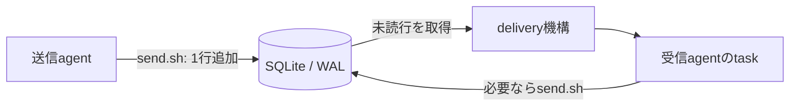
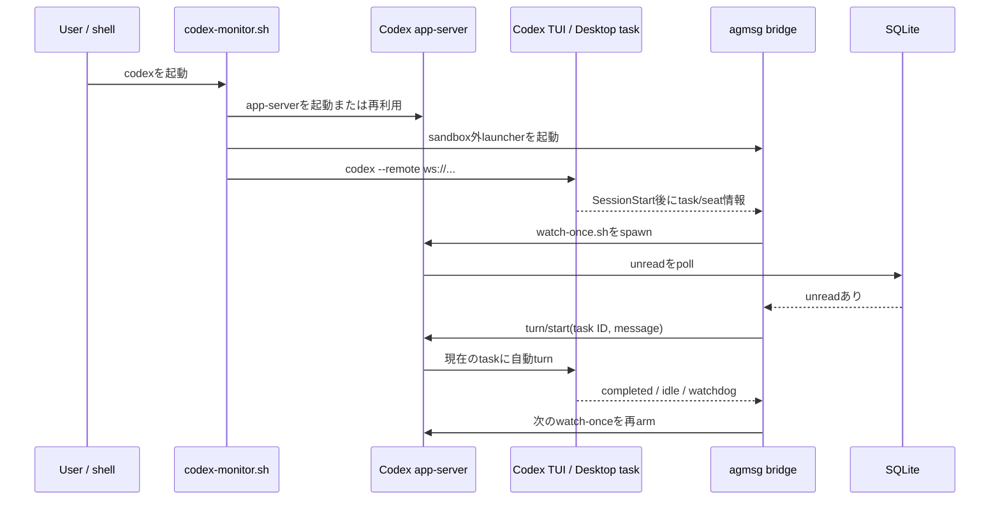
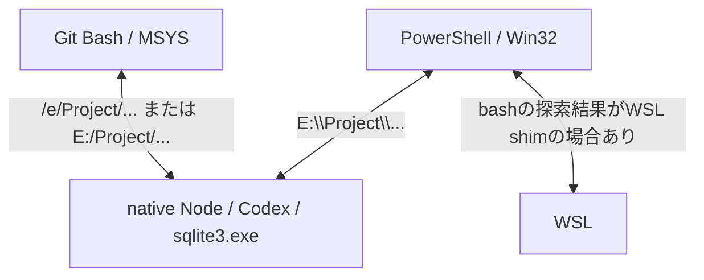

# agmsg / Codex monitor Windows障害の調査・修正記録

最終更新: 2026-07-14

対象環境: Windows、Git Bash、Codex Desktop / CLI、`hameln-hozon`、`hameln/codex1`

基準ソース: agmsg `v1.1.7` (`baa064e`) + 未コミットのローカル修正

## 1. 先に結論

今回の一連の問題には、単一の根本原因があったわけではない。少なくとも次の問題が、別々の段階で重なっていた。

1. `turn` モードのStop hookがプロジェクト全体に作用し、別のCodexタスクにもメッセージを注入した。
2. Windows上で `bash`、パス、PID、SQLite実行権限の扱いが食い違い、状態表示やスクリプト実行が誤った。
3. `codex` と `codex1` が重複登録され、どのidentityを使うかが曖昧だった。
4. `hameln/codex1` の配送先seatが古いCodex taskを指し、メッセージが現在の画面ではなく古いtaskに配送された。
5. seatを直した後にも、Codex app-serverの `turn/start` が実行済みにもかかわらず応答だけ返らない場合、bridgeが再監視に戻れない問題があった。
6. bridgeが正常でも、Windowsパス表記とネイティブNode PIDの判定差によって `delivery status` が誤ってstale/off相当に見える問題があった。

添付メモの「古いseatが原因で、現在のtaskへ記録し直したら届いた」という説明は、その時点の障害と復旧確認については正しい。ただし、一連の作業全体を説明する結論として「原因はseatだけ」「agmsg本体は変更していない」とすると不完全である。その後、このリポジトリのbridge本体、Windows状態判定、テストにもローカル修正を加えている。

現在は `monitor` のまま、自己宛てメッセージが現在のtaskに届くこと、メッセージ処理後にwatchdogで再監視へ戻ることまで確認できている。ただしローカル修正はまだコミットされておらず、全テストスイートも完走していない。

## 2. この文書での確度の表し方

複数のClaude/Codex taskをまたいだため、担当者名を推測で断定しない。

| 表示 | 意味 |
|---|---|
| **確認済み** | Git履歴、差分、ログ、コマンド結果、実配送で直接確認した事実 |
| **強い推定** | 複数の状況証拠が一致するが、作業者や実行時点を一意に証明できないもの |
| **未確認** | 会話上の記憶・説明はあるが、現在残るログやコミットだけでは証明できないもの |

## 3. agmsgは何をする仕組みか

agmsgは、Claude Code、Codex、Gemini CLIなどのagent同士がローカルでメッセージを渡すための薄いtransportである。ネットワークサーバーや常駐brokerを中心にした仕組みではなく、共有SQLite DBがメッセージの置き場になる。

基本要素は次のとおり。

| 用語 | 意味 |
|---|---|
| team | agentが参加する会話の部屋。今回なら `hameln` |
| agent / identity / role | team内の宛名。今回なら `codex1` |
| project registration | どのprojectに、どの種類のagentが、どのidentityで参加するかという登録 |
| message row | SQLiteに保存される送信元、宛先、本文、時刻などの記録 |
| unread / read cursor | どこまで受信側が読んだかを示す状態。手動inboxでも進む |
| delivery mode | `monitor`、`turn`、`both`、`off` の配送方法 |
| seat | roleが現在どのCodex session/taskを担当しているかという対応付け。本書ではCodex thread IDとの対応を指す |
| bridge | unreadメッセージをCodex app-serverの自動turnへ変換するプロセス |

SQLiteはWALモードで、複数readerと単一writerが共存する。履歴はtask終了後もDBに残る。ただし、SQLiteが保証するのはログの保存順であり、agent間の会話手順や二重実行防止まで自動で保証するわけではない。

根拠: [README: transportとSQLite](../README.md#how-it-works)、[storage.sh](../scripts/lib/storage.sh)

## 4. delivery modeの違い

### `turn`

assistantの応答終了時にprojectのStop hookが `check-inbox.sh` を実行する。Codex task固有の設定ではなくproject hookなので、同じprojectで開いている別taskにも作用し得る。今回、これが「関係ないCodex taskにもagmsg本文が出る」原因になった。

### Claude Codeの`monitor`

Claude Code側のMonitor機構とwatcherを使い、SQLiteの新着を待って現在のsessionへ届ける。`actas` の排他lockや受信対象の絞り込みもClaude側のwatcherモデルを前提に設計されている。

### Codexの`monitor` beta

CodexにはClaude Codeと同じMonitor toolがないため、agmsgは実験的なCodex app-server bridgeで似た挙動を作る。

重要な性質:

- interactive Codexは `codex --remote ...` でagmsg管理のapp-serverへ接続する。
- SessionStartはCodexを開いた瞬間ではなく、最初のturn後に発火する。
- bridgeは `watch-once.sh` で未読を待ち、見つけたときだけ `turn/start` を発行する。
- 一つのtask上のturnは直列化され、現在のturn実行中に届いたメッセージは次回へ残る。
- Codex app-serverは `turn/completed` を常に確実に通知するとは限らないため、`thread/status=idle` とwatchdogも再armの契機になる。
- betaには、TUI終了後のorphan bridge、project当たり一つのCodex identity、実験的app-server APIへの依存という既知の弱点がある。

根拠: [Codex monitor beta](codex-monitor-beta.md)、[codex-monitor.sh](../scripts/drivers/types/codex/codex-monitor.sh)、[codex-bridge.js](../scripts/drivers/types/codex/codex-bridge.js)

## 5. なぜWindowsで壊れやすいのか

Windowsでは、同じ処理の中に少なくとも三つの実行環境が混在する。

### 5.1 `bash` がGit Bashとは限らない

PowerShellでbare `bash` を実行すると、`C:\Windows\System32\bash.exe` やWindowsApps側のWSL shimが選ばれることがある。WSL distributionがなければ起動自体が失敗する。起動してもGit Bashとは `$HOME` やpath表現が異なり、別のDBを参照する危険がある。今回も最初はWSL shimが選ばれ、後から `C:\Program Files\Git\bin\bash.exe` を明示した。

### 5.2 同じprojectに複数のpath表記がある

同一projectが以下のように表現される。

- `E:\Project\hameln-hozon` — native Windows
- `E:/Project/hameln-hozon` — mixed form
- `/e/Project/hameln-hozon` — Git Bash / MSYS

文字列のまま比較すると、正常なbridge metadataを別projectと判断する。今回のローカル修正では比較前に正規化するようにした。

### 5.3 Git Bashの`kill -0`ではnative Node PIDを正しく見られない

bridgeはnative WindowsのNode processとして動く。一方Git Bashのprocess tableはMSYS process中心なので、`kill -0 <PID>` が失敗してもnative Nodeが死んだとは限らない。`tasklist` を使うWindows fallbackが必要である。

### 5.4 native `sqlite3.exe`はMSYS pathをそのまま開けない

Git Bash上の `/e/...` をnative `sqlite3.exe` やSQLiteの `readfile()` に渡すと失敗する場合がある。このため `cygpath` 等でWindowsが理解できるpathへ変換する必要がある。

### 5.5 `.sh` をnative processから直接spawnできない

Windowsには `.sh` の一貫したnative実行規約がない。NodeやCodex hookから起動するときはGit Bash executableを明示し、スクリプトを引数として渡す必要がある。

### 5.6 MSYSの自動引数変換

`/` から始まるboot promptなどがUnix pathと誤認され、Windows pathへ変換される場合がある。v1.1.7にはこれを抑止する修正が入った。

### 5.7 sandboxとSQLite WAL

受信、既読化、WAL、pidfile、team metadataはproject外の `~/.agents/skills/agmsg/` に書く。Codex sandboxのwritable rootsに含まれなければ、`sqlite3: Permission denied` 等になる。さらにエラーをstderrごと捨てるコード経路では「未読なし」「off」に見えるため、transport障害と状態表示障害が混同される。

根拠: [README: Windows](../README.md#windows-git-bash--codex)、[storage.shのWindows path処理](../scripts/lib/storage.sh)、[resolve-project.sh](../scripts/lib/resolve-project.sh)

## 6. 段階別の問題・対応・結果

### 段階A: v1.1.6環境の確認と`turn`問題

**確認済み**

- 当初のinstalled versionは1.1.6で、1.1.7への更新候補を調査した。
- `turn` modeのStop hookがproject-wideに設定されていた。
- そのため同じprojectの別Codex taskにもagmsg inboxが挿入された。
- 最初に「別taskへの注入は異常」と扱った説明があったが、後にproject-wide Stop hookの仕様どおりだと訂正した。
- userの希望はtaskを切り替える回避ではなく、monitorのまま直すことだったため、一時的にdeliveryを`off`にして不要注入を止めた。DB、team、PostToolUse等は維持した。

**教訓**

`turn` は「このCodex taskだけ」の設定ではない。複数taskを同じprojectで開く運用では、意図しないtaskにも作用し得る。

### 段階B: v1.1.7更新内容の確認

1.1.7では、今回の周辺に関係するWindows/Codex修正が複数入った。主なものは、roleに記録されたCodex taskへのbridge固定、project解決の過剰な祖先探索停止、MSYS prompt変換抑止、Windows psmuxでのlogin shell、role/session affinityである。

ただし、1.1.7へ上げるだけで今回の全問題が直ったわけではない。古いseat、identity重複、`turn/start` ACK timeout、statusのpath/PID判定は別途扱う必要があった。

### 段階C: monitor有効化とWindows shell問題

**確認済み**

- 複数のCodex taskで `$agmsg set monitor` を実行し、shell functionと再起動案内が表示された。
- bare `bash` がWSL shimを指し、WSL distribution不在で失敗した。
- Git Bashの絶対pathを使うことでagmsg scriptを正しい環境から実行した。
- `codex-record-session.sh hameln codex1 "$(pwd)"` は成功時にも無出力になり得るため、exit codeだけではseat記録成功を保証できなかった。

### 段階D: identity重複の整理

**確認済み**

- `hameln` に `codex` と `codex1` が重複登録されていた。
- userの選択により `codex1` へ統一し、古い `codex` 登録を公式reset scriptで削除した。
- Codex monitor betaはproject当たり一つのidentityという制約があり、重複は配送先診断を難しくした。

identityの重複自体が、後述する古いtaskへの配送を直接証明するわけではない。しかし、どのroleのseatとread cursorを調べるべきかを曖昧にしたため、独立した構成不良として整理する。

### 段階E: bridge aliveだが現在のtaskに表示されない

**確認済み**

- `delivery.sh status` は `mode: monitor`、bridge aliveを表示していた。
- `codex → codex1: test 2 from grok-build codex` は履歴にあった。
- 手動inboxは `No new messages.` だった。これはbridgeがread cursorを進めたためで、送信されていないという意味ではなかった。
- bridge logは、現在画面とは別の古いtaskで `started turn on thread ...` を記録していた。
- 現在のCodexはすでに `codex --remote ws://...` とapp-server/launcher経由で動いていた。

ここで最初に出た「monitor wrapper経由で再起動すれば直る」という説明は不正確だった。すでにwrapper経由だったためである。

### 段階F: stale seatの修正とend-to-end確認

**確認済み**

- `codex1` のseatを現在のCodex taskへ `codex-record-session.sh` で記録し直した。
- 自己宛ての `[monitor diagnostic] verify current seat after record-session` を送った。
- その診断メッセージが現在のtaskへ自動配送された。
- 後続のClaudeからのレビュー依頼も現在のtaskへ届き、返信まで行えた。

したがって、添付メモが説明する「古いseat」は、この段階のalive-but-invisible障害の直接原因として確認できている。

ただし、`record-session.sh` の終了コード0、bridge alive、inbox 0件だけでは復旧証明にならない。現在のtaskへの自己メッセージ実配送をもって初めてend-to-endの復旧確認になる。

### 段階G: ACK待ちでbridgeがaliveのまま再監視しない

seat修正後、このチャットでさらにlogを確認した。

**確認済み**

- bridgeは古いtaskに対するwake 1でturnを開始したが、60秒以内にcompletionがなくwatchdogで再armした。
- 次のwakeでは、unreadを既読にした後に処理が止まる挙動があった。
- `turn/start` はapp-server側で受理・実行されても、JSON-RPC ACKだけ返らない可能性がある。
- 旧実装はACK後にwatchdogを開始していたため、ACK待ちで止まるとbridge processはaliveでも再監視へ戻れなかった。
- `pendingWake` をACK前まで残すことで、idle/completed通知とACKの順序によって二重startや状態競合が起き得た。

**ローカル修正**

- wakeを `turn/start` 送信前にconsumeする。
- watchdogをACK受信後ではなくrequest送信時に開始する。
- `turn/start` timeoutを「失敗確定」ではなく「受理された可能性がある曖昧な状態」として扱い、通知またはwatchdogで再armする。
- watchdog無効時にも即時復旧できるfallbackを入れる。
- `CodexBridge` classをexportし、単体テスト可能にする。

対象: [codex-bridge.js](../scripts/drivers/types/codex/codex-bridge.js)

### 段階H: Windowsのstatus誤判定

**確認済み**

- bridge metadataのprojectと現在projectが、`E:\...` / `E:/...` / `/e/...` の違いだけで不一致になり得た。
- Git Bashの `kill -0` だけではnative Windows Node PIDをdeadと誤判定し得た。

**ローカル修正**

- metadataのproject pathと現在project pathを正規化して比較する。
- liveness判定を `kill -0` 直書きから既存の `_agmsg_pid_alive` helperへ変更し、Windowsでは`tasklist` fallbackを利用する。

対象: [_delivery.sh](../scripts/drivers/types/codex/_delivery.sh)

## 7. 誰が何をしたか

会話の担当名とGit commit authorは別物である。また、作業中にinstalled copyだけを変えた場合はrepository履歴から担当者を復元できない。そのため、以下は証拠の強さを併記する。

| 担当・場所 | 主な役割 | 結果 | 確度 |
|---|---|---|---|
| Claude側 | v1.1.6と更新内容の確認、レビュー依頼・応答、別agentとの連携。`claude/vigilant-dirac-bad42e` worktreeも存在 | 現在そのworktreeはcleanで追加commitなし。repository差分だけからClaudeが書いた行を断定できない | 確認済み／一部未確認 |
| 古いCodex task | identity確認、`actas codex1`、Git Bash明示、session記録、status/inbox/history調査 | Windows shell問題と運用上の不整合を発見。途中の「status off」「再起動だけで直る」判断は後で訂正 | 確認済み |
| seat診断を行った別Codex task | `codex`/`codex1`整理、old taskへの配送log確認、seat再記録、自己宛て診断 | stale seatを直し、現在taskへの実配送を証明 | 確認済み |
| このCodex task | bridge logの継続調査、ACK/rearm state machine修正、Windows status path/PID修正、テスト追加、installed runtime更新、live検証 | seat以外のsource-level不具合を修正。monitorは切り替えず維持 | 確認済み |
| user | `codex1`を正と決定、task切替や`turn`への恒久回避を拒否、現在画面での配送可否を確認 | 正しいidentityと「monitorのまま直す」という受入条件を明確化 | 確認済み |

### 帰属を断定できない変更

`thread/resume` がrollout不在で失敗した場合に、特定のnot-found系エラーだけfail-openする変更が現在のlocal diffに含まれる。この考え方はCodex 0.142対応のupstream PR #237と関連するが、現在の行をClaude・別Codex・このCodexの誰が最初にinstalled copyへ入れたかは、残存するGit履歴だけでは一意に証明できない。したがって「複数task間で引き継いだlocal compatibility patch、初出担当は未確認」と記録する。

## 8. 関連するGitHub PRと、今回どう扱ったか

「PRを取り込んだ」には、releaseに含まれる、直接mergeした、考え方を参照した、localで同等修正をした、の違いがある。本件ではこれらを分ける必要がある。

### 8.1 Codex monitor / Windowsの基盤PR

| PR | 内容 | 状態 | 今回との関係 |
|---|---|---|---|
| [#148](https://github.com/fujibee/agmsg/pull/148) | Codex monitor bridge beta、app-server、re-arm、fresh-session launch | merged | monitor機構の基盤 |
| [#174](https://github.com/fujibee/agmsg/pull/174) | Codex 0.141 WebSocket transport、loaded-thread discovery | merged | app-server接続とtask発見の基盤 |
| [#179](https://github.com/fujibee/agmsg/pull/179) | Git Bash互換、portable hash、bash経由実行 | merged | Windows shell互換の基盤 |
| [#196](https://github.com/fujibee/agmsg/pull/196) | native Windows PIDを`tasklist`で確認 | closed / unmerged | PR自体は未merge。ただし同等のliveness helperは別commitでmainへ入っており、今回status側から再利用 |
| [#226](https://github.com/fujibee/agmsg/pull/226) | SQLiteへWindowsが理解できるDB pathを渡す | merged | native sqlite3 path問題の基盤 |
| [#232](https://github.com/fujibee/agmsg/pull/232) | delivery statusにbridge livenessを表示 | merged | 今回誤判定を直したstatus機能の導入元 |
| [#237](https://github.com/fujibee/agmsg/pull/237) | Codex 0.142対応、fail-open、stale app-server再利用対策 | merged | local `thread/resume` compatibility patchと関連。ただし今回のexact diffをそのまま取り込んだとは断定しない |

### 8.2 v1.1.7に含まれる主なPR

| PR | 内容 | 本件への意味 |
|---|---|---|
| [#344](https://github.com/fujibee/agmsg/pull/344) | role-to-session affinity、role別resume | seat/session設計の土台 |
| [#353](https://github.com/fujibee/agmsg/pull/353) | loaded taskではなくroleに記録されたtaskへbridgeをbind | stale/wrong task問題に直接関係 |
| [#358](https://github.com/fujibee/agmsg/pull/358) | `/`始まりpromptのMSYS自動path変換を抑止 | Windows spawnのprompt破損対策 |
| [#359](https://github.com/fujibee/agmsg/pull/359) | ancestor project解決の過剰到達を停止 | `$HOME`や別team/projectへの誤解決対策 |
| [#363](https://github.com/fujibee/agmsg/pull/363) | Windows psmux起動を`bash -l`でwrap | Windows terminal起動対策 |
| [#376](https://github.com/fujibee/agmsg/pull/376) | v1.1.7 release | 現在の基準tag |

これらは個別にこの作業ツリーへcherry-pickしたのではなく、`v1.1.7`へ更新したことで取り込まれた。

### 8.3 今回のlocal-only修正

以下は2026-07-14時点でupstream PRとして取り込まれたものではなく、`v1.1.7`上の未コミット差分である。

| ファイル | 修正 |
|---|---|
| `scripts/drivers/types/codex/codex-bridge.js` | `turn/start` ACK timeout/rearm、wake競合、watchdog開始時点、限定的`thread/resume` fail-open、test export |
| `scripts/drivers/types/codex/_delivery.sh` | project path正規化、native Windows PID liveness helper利用 |
| `tests/test_codex_bridge.bats` | ACK欠落時に再armする単体・結合テスト |
| `tests/test_delivery.bats` | 同一projectの異表記とnative Node PIDをaliveと判定するテスト |

差分規模は4ファイル、146 insertions、21 deletionsである。

## 9. 原因と症状の対応表

| 見えた症状 | 実際の原因 | 修正・判断 |
|---|---|---|
| 別のCodex taskにも本文が出る | `turn`のStop hookがproject-wide | 仕様を理解した上で一時off。最終的にはmonitorを修復 |
| statusがoff/0件に見える | sqlite3実行権限失敗が握り潰された | stderr/権限も確認し、statusだけで判断しない |
| `bash`が失敗する | WSL shimを起動、distributionなし | Git Bash executableを明示 |
| monitor enabledだが動かない | 最初のturn前、または既存sessionを再起動していない | SessionStart/remote接続/bridge processを個別確認 |
| `codex`と`codex1`が出る | project registrationの重複 | `codex1`へ統一し旧登録をreset |
| historyにはあるが現在画面にない | bridgeが既読化し、古いseat/taskへturnを開始 | seatを現在taskへ記録し直す |
| bridge aliveなのに次のmessageへ進まない | `turn/start` ACK欠落時、watchdog未開始で再arm不能 | request時にwatchdog開始、timeoutを曖昧な成功として回復 |
| aliveなbridgeがstale表示 | Windows path文字列の違い | project pathを正規化して比較 |
| aliveなnative Nodeがdead表示 | Git Bash `kill -0`のprocess visibility | `_agmsg_pid_alive` / `tasklist` fallback |
| 再起動後も古いprocessが残る | monitor betaのorphan/stale app-server | pidfileだけでなくcmdline、socket、task bindingを確認 |

## 10. 実施した検証と、その検証が証明する範囲

### 合格した確認

- `node --check scripts/drivers/types/codex/codex-bridge.js`
- `git diff --check`
- targeted test: `codex-bridge: recovers when a turn/start acknowledgement times out`
- targeted test: `delivery status (codex): equivalent project path spelling reports alive`
- `./install.sh --update` でinstalled runtimeへsource差分を反映し、team/DBを維持
- monitor modeを維持したままbridgeを再接続
- 自己宛て `[monitor fix validation]` がreadになり、現在taskでwakeup 3を確認
- 60秒後にwatchdogで再armし、bridgeがaliveを維持することを確認

### まだ証明していないこと

- `test_codex_bridge.bats` 全件の完走。Windowsでunsupported/skip対象とslow/hangがあり中断した。
- Linux/macOSを含む全platformでの回帰なし。
- 長時間運用、連続message、TUI終了、app-server再利用、複数restartの耐久性。
- local修正がupstreamで受理されること。

したがって現在の判定は「今回観測した障害経路に対するtargeted fixとlive確認は成功」であり、「monitor beta全体が完全に安定した」という意味ではない。

## 11. 添付メモのレビュー

### 正しい点

- `codex` / `codex1`重複の記録。
- bridge aliveは現在taskへの正常配送を保証しないという指摘。
- historyにあるのにinboxが空なのは、monitorがread cursorを進めた可能性があるという説明。
- old taskへの `started turn` logを根拠にstale seatを特定したこと。
- wrapper再起動だけで直るという初期説明を訂正したこと。
- seat再記録後、自己宛てmessageを現在taskへ実配送して復旧判定したこと。
- monitor検証時に手動inboxを先に読まない、という注意。

### 修正した方がよい点

1. **「今回直したのはagmsg本体ではなくseatだけ」**
   seat修正時点の説明として限定すれば正しい。その後のsource-level修正まで含む総括としては誤り。

2. **「根本原因はstale seat」**
   old taskへの配送の根本原因ではあるが、project-wide turn、Windows shell/path/PID、ACK timeout/rearmは独立した原因。

3. **「PowerShellやcmdから直接実行してはいけない」**
   より正確には、agmsgの`.sh`をnative shellの解釈に任せず、正しいGit Bash executable経由で実行する。PowerShellからGit Bashを明示して呼ぶこと自体は正しい。

4. **「DBや設定の直接編集は禁止」**
   通常運用では公式scriptを使うべき、という安全規則として妥当。ただしread-only診断まで禁止する技術仕様ではない。直接writeは整合性を壊すため避ける、と表現する方が正確。

5. **`actas`の説明**
   Claude watcherの`actas`とCodexのseat記録は完全に同じ仕組みではない。v1.1.7のCodex skill flowはbest-effortでsessionを記録するが、`docs/actas.md`にはCodex receive-side narrowingの制約も記載されている。`actas`成功だけで配送先が正しいとみなさず、end-to-endで確認する。

## 12. 現在の状態と残るリスク

### 現在の状態

- repository: `E:\Project\agmsg`
- branch: `codex/monitor-teardown`（`v1.1.7`を基点とするstacked branch）
- 既存local diff: `codex/preserve-monitor-local-fixes`の`acb0b83`として保護済み
- teardown実装: `91b0e81`、`5a60f5a`、`f6d5186`の3段階コミット
- installed agmsg: このbranchの最終実装はまだ再installしていない
- target project: `E:/Project/hameln-hozon`
- team / identity: `hameln/codex1`
- mode: `monitor`
- live test: 現在taskへの配送とwatchdog再armを確認

### 残るリスク

1. **remote未保存**
   修正はlocal branchとcommitには保護されたが、まだpush/PR作成はしていない。local repository自体の消失には備えていない。

2. **installed runtimeとrepository実装の差**
   現在インストール済みのruntimeは今回の最終teardown実装より古い。実運用検証前に明示的な再installが必要。

3. **full suiteのWindows固有flaky**
   Codex対象testと新規testは成功した。full `test_delivery.bats`ではwatcher process管理の既存Windows flakyが失敗したため、suite全体greenの保証はCI（Linux/macOS/Windows各leg）で再確認する。

4. **experimental API依存**
   Codex app-serverのnotification/response順、rollout、loaded thread APIが変わると再び壊れ得る。

5. **spawn→marker間の狭いorphan窓**
   lease/ref teardownは実装済みだが、app-server spawn成功後からspawning marker書き込み前にstarterが死亡する極短時間の未追跡窓は既知の制約として残る。

6. **experimental APIと実機差**
   `docs/codex-monitor-beta.md`は今回のlease/at-least-once方式へ更新したが、Codex app-server API更新時には実機acceptance testを再実行する必要がある。

## 13. 次にやるべきこと

優先順は以下を推奨する。

1. `v1.1.7`から `codex/...` branchを作り、現在の4ファイルをcommitして消失を防ぐ。
2. 修正を二つの論理単位に分けてreviewする。
   - bridge: ACK timeout / rearm / wake race
   - Windows status: path normalization / native PID liveness
3. Linux CIでBats full suite、Windowsでtargeted/manual matrixを実行する。
4. upstream PRを分割して出す。挙動修正とdiagnostics/docs修正を分けるとreviewしやすい。
5. `delivery status` を単なるPID表示から、seat/task ID、last wake、last successful rearm、last errorまで見えるdoctor機能へ拡張する。
6. Codex用runbookと`actas`文書を、role registration、seat recording、receive cursorの三つを区別する内容へ更新する。

## 14. 再発時の短い診断手順

1. `whoami.sh`でteam/identity/projectを確認する。
2. identityが複数なら、正しいroleを決めて公式scriptで整理する。
3. `delivery.sh status`でmode、bridge PID、metadataを確認する。ただしaliveだけで正常判定しない。
4. Codexが `--remote ws://...` で起動しているか確認する。
5. 自己宛て診断messageを一通だけ送る。
6. 現在のturnを終了し、自動turnを待つ。先に手動inboxを読まない。
7. 届かなければhistory、read state、bridge logの `thread ID`、`wakeup`、`turn/start`、watchdog/rearmを照合する。
8. historyにありread済みで画面にないならseat/task mismatchを疑う。
9. `turn/start`後に次のwatchがないならACK timeout/state machineを疑う。
10. WindowsではGit Bash path、native PID、sqlite3 permission、sandbox writable rootsを個別に確認する。

復旧条件は「bridgeがalive」ではなく、**現在表示中の同じCodex taskへ自己診断messageが自動配送され、その後bridgeが次のwatchへ再armしたこと**である。

## 15. Codex taskの監査用対応表

Codexの表示名は変更され得るため、後からlogを追えるようtask IDも残す。短縮表記のものは、取得できたlog断片だけでは完全なIDと担当範囲を確定できない。

| task ID | この調査で確認した役割 |
|---|---|
| `019f5929-4973-7290-b7d6-0287a4c47110` | v1.1.6→1.1.7更新調査、project-wide Stop hook、status誤表示、delivery一時off |
| `019f5aaf-a868-7353-8471-f0b6c4591dfb` | `$agmsg set monitor`を実施したtaskの一つ |
| `019f5d76-bf90-7152-bceb-28397ce4175f` | `$agmsg set monitor`を実施した別task |
| `019f5991-9981-7d51-8f9e-41f598e35daa` | `actas codex1`、WSL shim失敗、Git Bash明示、session記録、古い配送先になったtask |
| `019f5d92-...` / `019f5da6-...` / `019f5daa-...` / `019f5dae-...` | identity重複とseat/thread mismatchを追跡した周辺task群。完全な対応はlog断片だけでは未確定 |
| `019f5d93-07a1-7541-8b8d-2371d3230486` | 本書作成元の現在task。ACK/rearm、Windows status修正、targeted test、live validation |

この表は担当者の所有権を示すものではなく、診断事実がどのtaskに残っているかを探すための索引である。

## 16. 参照資料

- [agmsg README](../README.md)
- [Codex monitor betaの内部設計](codex-monitor-beta.md)
- [`actas` / `drop`の仕組み](actas.md)
- [Codex bridge本体](../scripts/drivers/types/codex/codex-bridge.js)
- [Codex monitor launcher](../scripts/drivers/types/codex/codex-monitor.sh)
- [Codex delivery status](../scripts/drivers/types/codex/_delivery.sh)
- [SQLite storage helper](../scripts/lib/storage.sh)
- [project path解決](../scripts/lib/resolve-project.sh)
- [bridge tests](../tests/test_codex_bridge.bats)
- [delivery tests](../tests/test_delivery.bats)
