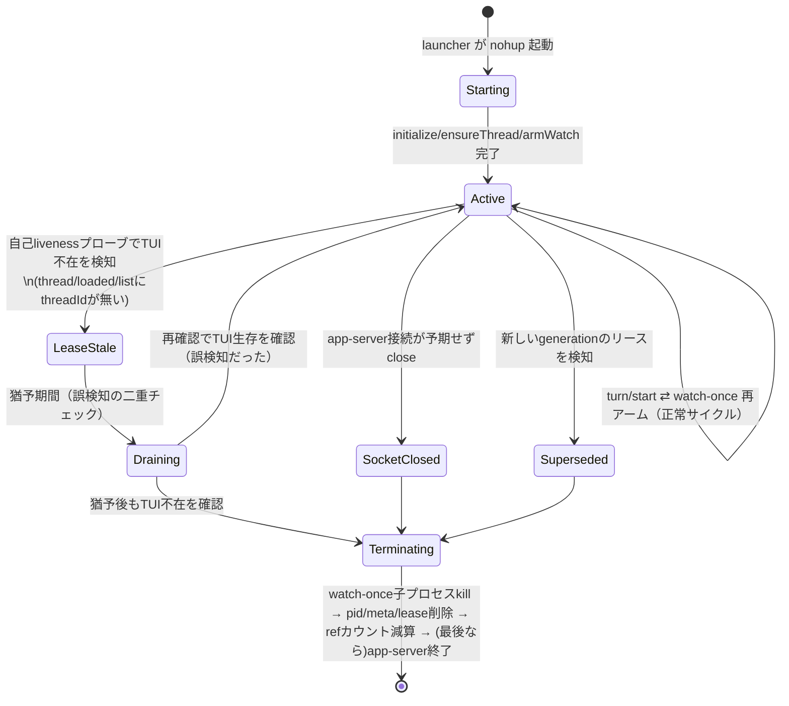
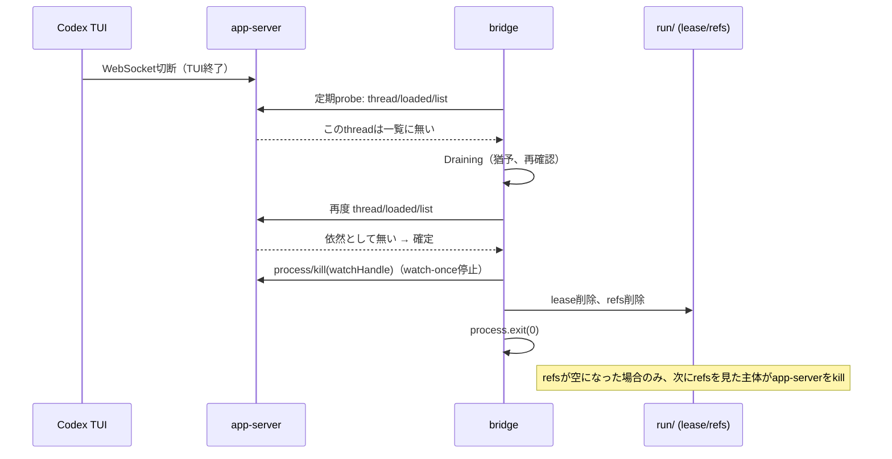
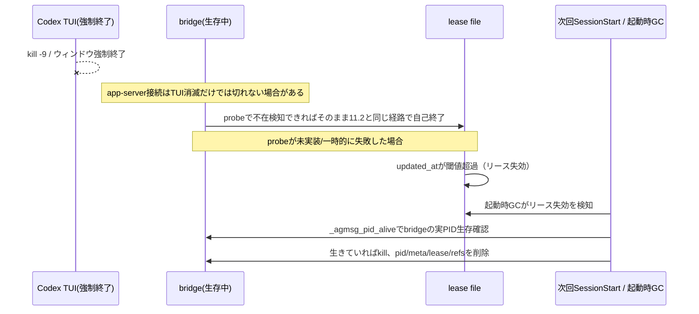

# agmsg monitor 終了処理 — 現状分析と恒久的な再発防止設計

作成日: 2026-07-14
対象: agmsg v1.1.7 (`baa064e`) + ローカル未コミット差分（4ファイル、変更していない）
状態: **設計・計画のみ。コード・設定・DB・team登録・実行中プロセスは一切変更していない。**
関連: [Codex monitor Windows障害の調査記録](agmsg-codex-monitor-windows-investigation-ja.md)（本書と別文書。本書はorphan process/終了処理に特化）

---

## 0. 確度の表記

| 表示 | 意味 |
|---|---|
| **確認済み** | 現在のソース（行番号つき）で直接確認した事実 |
| **実測確認** | 本セッション中にこの環境（Windows / Git Bash）で安全な検証スクリプトを実行し、直接観測した事実 |
| **強い推定** | ソース上の構造から高い確度で推論できるが、実プロセスに対しては未検証 |
| **未確認 / 要検証** | 実装依存・未公開仕様依存で、ソースだけでは判断できない |

---

## 1. エグゼクティブサマリー

agmsgのCodex monitor betaとClaude Code monitorは、いずれも「TUI/セッションが終了したら、そのために起動した補助プロセス（bridge、app-server、watcher）も終了する」という保証を**構造的に持っていない**。

- **Codex側**: `codex-bridge-launcher.sh`はTUIプロセスの生死ではなく、`codex-monitor.sh`が`exec`で自分自身を置き換える前の`$$`（PARENT_PID）を`kill -0`で見張っているだけであり、かつbridge自体は`nohup`で起動されてlauncherから完全に独立している。launcherのループが終了してもbridgeをkillする処理は**ソース上どこにも存在しない**（確認済み）。さらに本セッションでの実機検証により、Windows上でGit Bashの`exec`がネイティブWindowsバイナリ（Codex TUI本体）へ処理を渡した瞬間、その`$$`は`kill -0`でほぼ即座に「死んでいる」ように見えることを確認した（実測確認）。これは「TUIが閉じたから死んで見える」のではなく「execした直後から死んで見える」ため、**PARENT_PIDのkill -0ポーリングはWindows上ではTUIの生死を表す信号として機能していない**。
- **Claude側**（2026-07-14訂正版）: `watch.sh`には既に自己終了ガード（`agmsg_instance_is_composite && ! agmsg_instance_alive`）が存在する（確認済み、[watch.sh:312-324](../scripts/watch.sh#L312-L324)）。しかしこのガードは「compositeなinstance id（`<session_id>.<claude_pid>`）」が形成された場合にのみ働く。**真因はkill -0の偽陰性ではない**。`compat_get_ppid`（MSYSの`ps -l -p`ベース）は、Claude Code本体のようなネイティブWindowsプロセスとの親子関係を判定できず**PPID=1という"unknown"センチネル値を返す**（本セッションで実測確認、§6-補.2）。`agmsg_agent_pid`のppid walkはこの`1`を見た時点でループごと終了し、**`agmsg_pid_is_agent`のkill -0判定に到達すらしない**（確認済み、§6-補.1）。結果としてbareなsession_idにフォールバックし、実際のorphan watcherの起動引数（`watch.sh 30c965ee-...-4611f5c ...`のようなbare UUID、ユーザー提供）とも一致する形で**watch.shの自己終了ガードが最初から作動しない**（確認済み）。これは今回観測された「Claude本体は消えたのにbash watch.shだけ残る」症状と直接一致する。
- Grok Build向けには既に「祖先プロセスのPIDに紐づいたcomposite instance id + 自己終了 + 起動時のorphan一掃」という、まさに今回欲しい仕組みが実装されている（確認済み、[instance-id.sh:122-280](../scripts/lib/instance-id.sh#L122-L280)）。ただしこれはgrok-build専用に書かれており、そのままClaude/Codexへ転用はできない。
- 恒久対策は単一の仕掛けでは完結しない。**(a) 正常終了時の即時teardown、(b) 異常終了時のリース失効、(c) 次回起動時のGC**を三層で重ねる「案E」を推奨する。ただし各層の実装は、Windowsではプロセスliveness判定を必ず`_agmsg_pid_alive`（tasklist fallback）に統一することが前提条件であり、これを飛ばして案A（EXIT trap）だけを足しても、Windowsでは「起きたはずのteardownが起きない」か「生きているTUIを誤って道連れにする」のどちらかで壊れる。

---

## 2. 現在のprocess lifecycle（確認済み・ソースベース）

### 2.1 Codex monitor beta

```
codex（shell function） 
  → codex-shim.sh
  → codex-monitor.sh（bash, PID=A）
       ├─ app-server 起動 or 再利用（codex app-server --listen ws://127.0.0.1:PORT, ネイティブ）
       │    記録: run/codex-app-server.<hash>.{pid,port,version,log}
       ├─ delivery.sh set monitor codex "$PROJECT"
       ├─ codex-bridge-launcher.sh を "$$"（=A）付きで nohup 起動（バックグラウンド, PID=B）
       └─ exec codex --remote ws://127.0.0.1:PORT  ← ここでPID Aの中身がTUI本体に置き換わる
            （codex-monitor.sh:194-213）

codex-bridge-launcher.sh（PID=B, PARENT_PID=A）
  while kill -0 "$PARENT_PID"; do            ← identity解決の待ちループ（52-64行）
    ...
  done
  while kill -0 "$PARENT_PID"; do            ← 本体ループ（87-161行）
    thread_id / app_server を解決
    既存bridgeが同じapp-server+threadに束縛済みなら再利用（sleep 0.3; continue）
    束縛が変わっていれば古いbridgeをkillして新しいbridgeをnohup起動
    sleep 1
  done
  ← ループを抜けても、既に起動済みのbridgeをkillする処理は無い（そのままexit）
```

- Codex TUIの最初のturn（SessionStartフック）で`session-start.sh`→`_session-start.sh`が発火し、`AGMSG_CODEX_BRIDGE_LAUNCHER=1`のときはrequest fileを書くだけ（[_session-start.sh:90-99](../scripts/drivers/types/codex/_session-start.sh#L90-L99)）。
- bridge本体（`codex-bridge.js`）は`nohup`で起動されると、launcherや`codex-monitor.sh`とは完全に独立したプロセスになる。bridgeが自発的に終了するのは次の場合のみ（確認済み、[codex-bridge.js](../scripts/drivers/types/codex/codex-bridge.js)）:
  - `SIGINT`/`SIGTERM`を受けた（734-744行）
  - app-serverとのWebSocket接続が**意図せず**closeした（418-435行。app-server自体が落ちた/入れ替わった場合のみ）
  - 内部の各種ハンドラで捕捉不能な例外が起きた（715-718行）
  - `watch-once`の再アームが`stale-wake-limit`や`watch-failure-limit`を超えた（内部で`process.exit`）
- つまり **bridgeは「自分を起動したTUIがまだ画面に存在するか」を一切確認していない**。app-serverが生きていてWebSocketが繋がっている限り、対応するTUIが閉じても永久に生存し、`watch-once`で新着を待ち続け、見つければ`turn/start`を実行し続ける。これが今回の症状（orphan bridge/app-server/watch-once）の直接の構造原因。

### 2.2 Claude Code monitor

```
claude起動 → SessionStart hook → session-start.sh（PID=cc本体の子、CC_PID=祖先探索で解決を試みる）
  → cc-instance.<CC_PID> に INSTANCE_ID(=<session_id>.<CC_PID> or bare) を記録
  → 直前instanceのwatch.shをkill（重複防止）
  → AGMSG-DIRECTIVE を出力 → Claude が Monitor tool で watch.sh を persistent 起動

watch.sh（PID=W）
  trap cleanup EXIT     ← 正常終了/SIGTERM/SIGINTでpidfile等を消す
  trap 'exit 0' INT TERM HUP
  while true; do
    if agmsg_instance_is_composite "$SESSION_ID" && ! agmsg_instance_alive "$SESSION_ID"; then
      exit 0            ← 自己終了ガード（312-324行）
    fi
    ... DB polling ...
    sleep $INTERVAL
  done
```

- 正常系（`/clear`、`SessionEnd`が発火する終了）では`session-end.sh`がpidfile経由でwatch.shをkillし、cc-instanceファイルとactasロックも掃除する（確認済み、[session-end.sh](../scripts/session-end.sh)）。
- 異常系（ウィンドウを閉じる、強制終了、クラッシュ、スリープ）では`SessionEnd`が発火しない。その場合の回収経路は2つ:
  1. watch.sh自身の自己終了ガード（`agmsg_instance_alive`）— **compositeなIDのときのみ**動く。
  2. 次回`SessionStart`時の`session-start.sh`のstale cc-instance/stale pidfile GC（確認済み、[session-start.sh:106-167](../scripts/session-start.sh#L106-L167)）— こちらは常に`kill -0`（素の版）で判定している。

---

## 3. 正常終了時に「本来」起きるべきこと

| 対象 | 本来のトリガ | 本来の後始末 |
|---|---|---|
| Claude watch.sh | `SessionEnd`フック / TUIプロセス消滅 | pidfile削除、cc-instance削除、actasロック解放、watermarkは保持(#107) |
| Codexのbridge | TUI(`codex --remote`)プロセス消滅、または同じproject/roleに束縛する後継TUIの出現 | bridgeプロセスkill、pid/meta/appserver/thread/logの後始末、watch-onceの子プロセスもapp-server経由でkill |
| Codexのapp-server | そのprojectに束縛するbridge/TUIが1つも残っていない | app-serverプロセスkill、pid/port/version/logの後始末 |
| Codexのlauncher | 親(TUI起動元)の消滅 | 自分自身の終了（既に動作している）。ただし現状「自分が起動したbridgeを道連れにする」処理が無い |

---

## 4. 実際にcleanupされなかった理由（確認済み／実測確認／強い推定を明記）

### 4.1 Codex側

1. **確認済み**: `codex-bridge-launcher.sh`はループを抜けても起動済みbridgeをkillしない。`docs/codex-monitor-beta.md`にも明記されている: *"the bridge is not torn down when you close the TUI (orphans linger until reboot or `mode off`/manual kill, see #149)"*（[codex-monitor-beta.md:17-18](../docs/codex-monitor-beta.md#L17-L18)）。つまりこれは**バグではなく既知の未実装**として文書化されている。
2. **実測確認**: Git Bashから`exec`でネイティブWindowsバイナリ（今回は`cmd.exe`で代替検証）へ処理を渡すと、その直前の`$$`は`kill -0`から1秒以内に「存在しない」扱いになる。同じ環境で素のMSYSバイナリ（`sleep`）を`&`でバックグラウンド起動した場合はkill -0が正しく生存を報告し続けることも確認しており（対照実験）、これは検証手法の不備ではなく、**execによるネイティブプロセスへの遷移固有の挙動**である。
   - 検証条件: この結論は`codex.exe`そのものではなく代替の`cmd.exe`で検証したものであり、Codex CLIの実バイナリで完全に同一という保証はない（要検証）。ただしCodex CLIもGit Bashからは同様にネイティブWindows実行ファイルとして起動されるため、同じ機構が働く可能性が高い。
   - **意味するところ**: `codex-bridge-launcher.sh`の`while kill -0 "$PARENT_PID"`は、TUIが実際に閉じたタイミングではなく、**`codex-monitor.sh`がTUI本体へexecした直後**にほぼ即座にfalseになっている可能性が高い。にもかかわらずbridgeは正常に起動し数時間動作する実績があるのは、`nohup`起動が「ループが1回でも本体処理まで到達しさえすれば」以降ループの生死に依存しなくなるためと考えられる（strongly implied — ループが速攻で終わってもbridgeは既にdetachされている）。
   - **設計上の帰結**: 仮に案Aとして「PARENT_PIDが死んだらbridgeをkillする」処理をこの既存ループにそのまま追加すると、Windows上では**TUIがまだ開いているのに起動直後にbridgeを誤ってkillする**リグレッションになる。素朴な案Aは採用できない。
3. **確認済み**: launcherのreuse判定（[codex-bridge-launcher.sh:123-146](../scripts/drivers/types/codex/codex-bridge-launcher.sh#L123-L146)）は「bound app-server URL」と「bound thread id」が一致するかだけを見ており、「そのthreadに現在アクティブなTUIが本当につながっているか」は見ていない。role-recorded threadが更新されない限り、古いTUIが閉じた後も新しいlauncher起動（＝新しいTUI起動）は同じbridgeを"生きている"とみなして再利用してしまう。これは今回の「historyにはあるが現在のCodex taskに表示されない」症状の構造的な受け皿である。
4. **確認済み**: `stop_codex_bridge()`（[delivery.sh:328-376](../scripts/delivery.sh#L328-L376)）は`set off`時の手動一括停止としては実装済みだが、これは"not-yet-wired #149"、つまりTUI終了に連動した自動呼び出しにはなっていない。

### 4.2 Claude側

> **【2026-07-14訂正】** 以下1〜5は初版時点の分析であり、項目4は不正確だった。ユーザーの追加検証（実際のorphan watcherの起動引数がbareなUUIDだった事実）と本セッションでの再検証により、真因は「kill -0の偽陰性」ではなく「**ppid walk自体がMSYS→ネイティブWindows境界を越えられず、kill -0判定に到達する前にループが終了する**」ことだと判明した。詳細と訂正後の結論は§6-補を参照。1〜3・5はソース上の事実としては引き続き有効。

1. **確認済み**: `agmsg_pid_is_agent`（[resolve-project.sh:239-253](../scripts/lib/resolve-project.sh#L239-L253)）は`kill -0 "$pid" 2>/dev/null || return 1`を使っている。同ファイル内の他の箇所（`agmsg_marker_gc_stale`含む）も同様に素の`kill -0`。
2. **確認済み**: 一方`_agmsg_pid_alive`（[instance-id.sh:40-49](../scripts/lib/instance-id.sh#L40-L49)）はまさに"Windowsでネイティブプロセスがkill -0から見えない"問題（#134）への対策として実装され、`watch.sh`の自己終了ガード（`agmsg_instance_alive`経由）や、今回のローカル差分での`_delivery.sh`のCodex bridge liveness判定には使われている。しかし**`agmsg_pid_is_agent`／`agmsg_agent_pid`には適用されていない**。この不整合はこのリポジトリの既存の設計判断の中で埋め残された未修正箇所であり、今回新たに見つけた欠陥である。ただし§6-補.1の通り、この不整合単独が今回の症状の直接原因ではない（`agmsg_pid_is_agent`に到達する前にループが終わっているため）。
3. **実測確認**: 本セッションの検証でネイティブWindowsプロセスは素の`kill -0`からほぼ即座に「死亡」扱いになることを確認済み。
4. **【訂正・確認済み】** 当初「強い推定」としていたが、ユーザー提供の実際のorphan watcher起動引数（bareなUUID、§6-補.1）と、本セッションでの`compat_get_ppid`の直接実測（自分自身のbashプロセスに対してすら`PPID=1`を返すことを確認、§6-補.2）により、**確認済み**へ格上げする。Windows上では`agmsg_agent_pid`のppid walkが`compat_get_ppid`の返す境界センチネル値`1`でループごと終了し、`agmsg_pid_is_agent`のkill -0判定にすら到達しない。結果として`INSTANCE_ID`はbareな`session_id`にフォールバックし（[session-start.sh:104](../scripts/session-start.sh#L104)、[instance-id.sh:97-106](../scripts/lib/instance-id.sh#L97-L106)）、`watch.sh`の自己終了ガードは`agmsg_instance_is_composite`がfalseになるため**最初から作動しない**（[watch.sh:322](../scripts/watch.sh#L322)）。これは今回観測された「Claude本体もその親プロセスも消えているのにbash watch.shだけ残存」という症状、および実際のorphan watcherの起動引数と正確に一致する。
5. **確認済み**: cc-instance/pidfileの次回SessionStart時GC（[session-start.sh:106-167](../scripts/session-start.sh#L106-L167)）も素の`kill -0`ベースなので、同じ理由でネイティブWindows上のClaude本体死亡を正しく検知できない可能性がある。ただしこちらは「死んだpidをGCする」方向の判定（`kill -0`が偽陰性＝生きていないのに生きていると誤判定する側）なので、実害は「orphanを回収し損なう」方向であり、逆方向（生きているものを誤ってkillする）のリスクは無い。

---

## 5. Codex側とClaude側の違い（設計への含意）

| 観点 | Codex | Claude Code |
|---|---|---|
| TUI起動方式 | `codex-monitor.sh`が`exec`でTUI本体に化ける（PID継続を仮定した設計） | Claude本体プロセスがそのまま存在し、`watch.sh`はその子孫としてBash toolから起動される |
| 補助プロセスの生存源 | `nohup`で完全にdetach。app-server共有、bridge単体はTUIと無関係に生存可能 | `watch.sh`はMonitor toolのpersistentタスクとして管理され、Claude本体のプロセスツリーの一部という前提 |
| 既存の自己終了機構 | 無し（launcherのループ終了 ≠ bridge終了） | 有り（`agmsg_instance_alive`によるcomposite gate）だが、Windows上ではCC_PID解決（ppid walk）がMSYS→ネイティブ境界で止まり実質無効化されている（確認済み、§6-補） |
| 複数TUI/同一project | 1 identity=1projectの制約(#150)、複数TUIの区別が設計上弱い | actasロックで(team,agent)単位の排他が明示的に管理されている |
| 共有リソースの参照カウント | 無し（app-serverは他のbridgeが使っているか一切数えていない） | 無し（actasロックは"誰が持っているか"はあるが"何人が依存しているか"の概念ではないので該当なし） |
| 既存の类似パターン | 無し | grok-build向けに「祖先PID+composite instance id+起動時orphan一掃」の実装が既にある（`agmsg_grok_ancestor_pid`等、[instance-id.sh:122-280](../scripts/lib/instance-id.sh#L122-L280)） |

**【2026-07-14訂正】** 当初「Claude側は`agmsg_pid_is_agent`の一箇所を直せば済む」としていたが、実際には**CC_PID解決の入口（`agmsg_agent_pid`のppid walk）自体がMSYS→ネイティブ境界を越えられない**ことが判明し、修正範囲はppid walkへのWindowsネイティブancestor walk追加＋liveness判定統一＋残存ケース向けの独立した安全網、の3点セットに拡大する（§6-補、§9）。それでもCodex側（TUI生存を判定する信号そのものが構造的に存在しない）に比べれば、Claude側は「既存のガード設計自体は正しく、その入力信号を補強する」という性質の修正であり、難易度は依然として低い部類に入る。

---

## 6. 確認済み事実・強い推定・未確認事項の一覧

### 確認済み
- `codex-bridge-launcher.sh`はbridgeをkillする経路を持たない。
- `docs/codex-monitor-beta.md`にorphan bridgeが既知の制約として明記されている（#149）。
- `stop_codex_bridge()`は手動`set off`専用で自動連動していない。
- `agmsg_pid_is_agent`は素の`kill -0`を使用しており、`_agmsg_pid_alive`は使っていない。
- `watch.sh`の自己終了ガードは`agmsg_instance_is_composite`のときのみ有効。
- grok-build向けの祖先PID+自己終了+起動時orphan一掃の実装が存在する。
- `actas-lock.sh`は`ln`によるアトミックなfile lock＋liveness-based stale reclaimという、案Bのベースにできる実績パターンを既に持つ。
- launcherのbridge再利用判定は app-server URL + thread id の一致のみで、「現在アクティブなTUI」の存在は見ていない。
- 本セッションで実行したBatsテスト一覧確認により、`agmsg_pid_is_agent`のWindowsネイティブPID相当のケース（kill -0が偽陰性になるケース）をカバーするテストは見当たらない。

### 実測確認（本セッション、Windows/Git Bash上で検証）
- ネイティブWindowsバイナリを`&`で直接バックグラウンド起動した場合、`kill -0`は1秒以内に偽の"dead"を返す。
- 同じくネイティブWindowsバイナリへ`exec`した場合も同様に1秒以内に偽の"dead"を返す。
- 対照実験として素のMSYSバイナリ（`sleep`）を`&`でバックグラウンド起動した場合は`kill -0`が正しく"alive"を返し続ける。

### 強い推定
- Windows上ではClaude Code本体プロセスの祖先探索が`agmsg_pid_is_agent`のkill -0判定で失敗し、INSTANCE_IDがbareにフォールバックし、watch.shの自己終了ガードが実質無効化されている。
- 同様の理由で、Codexの`codex-bridge-launcher.sh`のPARENT_PID判定はWindows上ではTUI開閉と無関係にほぼ即座に偽の"parent dead"を報告している可能性が高く、素朴な「parent死亡でbridgeをkill」実装は逆に危険（生きているTUIのbridgeを誤ってkillする）。

### 未確認・要検証
- 実際のCodex CLIバイナリ（`codex.exe`）で上記exec後PID挙動が`cmd.exe`と完全に同一かどうか（原理的には同じ機構のはずだが未確認）。
- Codex app-serverの`thread/loaded/list`が、TUIが閉じた際に該当threadを速やかに一覧から除外するか、あるいは何らかの猶予・キャッシュがあるか（案C成立の前提。app-server自体はクローズドソースの外部プロダクトであり公開仕様がない）。
- Claude Code本体プロセスがWindows上で常にネイティブexeか（ほぼ確実だが本セッションでは実プロセスに対して検証していない）。
- `ps -l -p <pid>`によるppid walkが、ネイティブWindows祖先（Claude Code本体）まで正しく登り切れるか（`compat_get_ppid`のawk抽出自体は動くはずだが、途中のkill -0判定でリタイアするため、実質的に問題にならないケースが多い）。

---

## 6-補. Claude側フェーズ1設計の再検証（2026-07-14 追加調査）

ユーザーによる追加検証で、§4.2・§9のClaude側フェーズ1案（「`agmsg_pid_is_agent`のkill -0を`_agmsg_pid_alive`に置き換えるだけ」）が**不十分であることが判明した**。以下、指摘された8点を順に再調査した結果を記す。結論として、フェーズ1の設計を§9末尾および本節末尾で更新する。

### 6-補.1 どこでcomposite instance IDが作れなくなっているか

実際にorphan化していたwatcherの起動引数（ユーザー提供）:

```
watch.sh 30c965ee-42a3-4381-973f-9d58e4611f5c /e/Project/hameln-hozon claude-code
```

第1引数がcomposite形式（`<uuid>.<pid>`）ではなくbareなUUID単体である。これは`session-start.sh`が`agmsg_agent_pid`（[resolve-project.sh:265-288](../scripts/lib/resolve-project.sh#L265-L288)）でCC_PIDを解決できず、`agmsg_instance_id_from_pid`（[instance-id.sh:52-58](../scripts/lib/instance-id.sh#L52-L58)）がbare sidにフォールバックしたことを直接示す（確認済み）。

`agmsg_agent_pid`の実装（再掲）:

```bash
agmsg_agent_pid() {
  local pid="$$" hops=0
  while [ "${pid:-0}" -gt 1 ] && [ "$hops" -lt 20 ]; do
    pid=$(compat_get_ppid "$pid" 2>/dev/null || true)
    ...
    if agmsg_pid_is_agent "$pid" "$type"; then ...
```

ループ条件`[ "${pid:-0}" -gt 1 ]`に注目すると、**`compat_get_ppid`が`1`を返した時点でループそのものが終了し、`agmsg_pid_is_agent`のkill -0判定に到達すらしない**。つまり§4.2で述べた「kill -0が偽陰性を返す」という診断は不正確で、正しくは「**ppid walkがWindowsのネイティブ境界で完全に停止し、Claude Code本体のPIDに到達する前にループが終わる**」である。したがって`agmsg_pid_is_agent`のkill -0を`_agmsg_pid_alive`に置き換えても、この経路には一切効かない（訂正・確認済み）。

### 6-補.2 compat_get_ppidのMSYS→native境界問題（実測確認）

本セッションでこの環境（Windows / Git Bash）上で直接検証した。

```
$ MYPID=$$; ps -l -p "$MYPID"
      PID    PPID    PGID     WINPID   TTY         UID    STIME COMMAND
  2490749       1 2490749      62516  ?         197609 11:53:33 /usr/bin/bash
```

自分自身のbashプロセスに対してすら、MSYSの`ps -l -p`は`PPID=1`を報告する（WINPIDは`62516`と正しく取れている）。ユーザーが実際のorphan watcherで観測した挙動と完全に一致する。

続けて、生存中の子プロセスのWINPIDから`Get-CimInstance Win32_Process`でネイティブの`ParentProcessId`を辿れるかを検証した:

```
PID 51204  Name=sleep.exe  ParentPID=73176  Cmd="C:\Program Files\Git\usr\bin\sleep.exe" 40
PID 73176 -> (no CIM record)
```

ここから2つのことが確認できた:

1. **CIM経由でネイティブの`ParentProcessId`を取得すること自体は機能する**（`sleep.exe`のPPID=73176を正しく取得できた）。
2. しかし**Win32の`ParentProcessId`は生成時に固定されたスナップショット値であり、親プロセスが後から終了してもポインタは更新されない**（POSIXのinit(1)への再親化のような仕組みが無い）。今回`73176`（このテストコマンドを実行した中継bash）は既に終了済みだったため"no CIM record"になった。これはCIM自体の欠陥ではなく、**中間の一時的な起動プロセスが早期に終了すると、たとえClaude Code本体が生きていても祖先探索が同じ理由で行き詰まりうる**ことを示す一般的な注意点である。

結論（確認済み／実測確認）:
- MSYSの`ps`は、自分の管理下に無いネイティブプロセスとの親子関係を`PPID=1`という"unknown"扱いのセンチネル値で返す。これはkill -0の偽陰性とは別種の、より根本的な可視性の欠落である。
- `_compat_get_winpid`（[compat.sh:41-47](../scripts/lib/compat.sh#L41-L47)）は同じ`ps -l -p`だが**WINPID列は正しく取得できる**ことも確認した（PPID列だけが"1"になる）。したがってMSYS pidからネイティブWINPIDへの変換自体は生きている経路であり、これを起点にCIM側へ乗り換えることができる。

### 6-補.3 PowerShell commandWindows wrapperからnative PIDを渡せるか

否定的な結論。理由は2点:

1. **確認済み（ソース）**: `commandWindows`はCodex専用機構である。`docs/agent-types.md`の`hook_windows_wrap`マニフェストキーは"yes"がCodexにのみ設定されており（[agent-types.md:33,117](../docs/agent-types.md#L33)）、`scripts/drivers/types/claude-code/type.conf`には該当キーが無い。実際`tests/test_delivery.bats:1132`に「claude-codeのStopエントリにcommandWindowsが**無い**ことを保証する回帰テスト」が存在する（確認済み）。つまりClaude Code向けフックにはagmsgが介入できるWindows専用ラッパー層が最初から存在しない。
2. **確認済み（外部調査）**: Claude Code公式ドキュメント（hooks reference/guide）を確認した結果、SessionStart/SessionEndのフックがstdinで受け取るJSONには`session_id`, `hook_event_name`, `source`, `model`, `agent_type`, `session_title`, `transcript_path`, `cwd`等はあるが**PIDやプロセスハンドルに相当するフィールドは存在しない**。環境変数も`CLAUDE_PROJECT_DIR`, `CLAUDE_PLUGIN_ROOT`, `CLAUDE_CODE_REMOTE`等はあるが**PID相当のものは無い**。Windows上でClaude Code本体がフックコマンドを直接の子プロセスとして起動するのか、中間シェルを挟むのかも公式文書に記載が無く未確認。

したがって、**agmsg側からwrapperや環境変数経由でnative PIDを明示的に受け取る手段は無い**。唯一残る手段は、フックスクリプト自身が実行時にWindowsのネイティブプロセス階層を辿ることだけである（6-補.4）。

### 6-補.4 Win32_Process.ParentProcessIdによるWindows専用ancestor walkの必要性

上記より、Windows専用のネイティブancestor walkは**必須**と判断する。設計:

- Phase 1（MSYS pid空間）: 既存の`compat_get_ppid`（`ps -l -p`）でホップできる限りホップする。同一MSYSプロセスツリー内の中継（例: あるbashスクリプトが別のbashスクリプトを`bash foo.sh`で呼ぶ場合など）はここでカバーされる。
- 境界検知: `compat_get_ppid`が`1`（または空）を返した時点で、それ以上MSYSではホップできないと判断し、Phase 2へ切り替える。
- Phase 2（ネイティブWINPID空間）: 直前のMSYS pidの`_compat_get_winpid`でネイティブWINPIDを取得し、そこから`Get-CimInstance Win32_Process -Filter "ProcessId=<winpid>"`の`ParentProcessId`を辿る。各ホップで`Name`/`CommandLine`が対象type（claude-codeなら"claude"）に一致するかを確認し、一致すればそのネイティブPIDを最終的なCC_PIDとして採用する。一致しなければ`ParentProcessId`をさらに遡る。CIMレコードが見つからない（既に終了した中継プロセス）場合はそこで探索失敗として扱う。

本セッションの実測（§6-補.2）で、Phase 2の基本動作（生存中の子から親のネイティブPIDと名前を正しく取得できること）自体は確認できている。

### 6-補.5 CIM経由のcommand line確認を安全に行う共通helper設計

既存の`_compat_cim_cmdline`（[compat.sh:50-58](../scripts/lib/compat.sh#L50-L58)）は既に「WINPIDを受け取り、`Get-CimInstance Win32_Process`のCommandLineを返す」実装を持っており、`_AGMSG_COMPAT_NO_CIM`によるテスト時の無効化フラグも既にある。これをそのまま流用・拡張する形で以下を新設する（実装はまだしない、設計のみ）:

- `_compat_cim_parent_pid(winpid)`: 同じ`Get-CimInstance`呼び出しに`ParentProcessId`も含めて一度に取得する（PowerShell呼び出しは比較的重いため、`CommandLine`と`ParentProcessId`を1回のクエリで同時取得し、呼び出し回数を増やさない設計にする）。
- `compat_get_ppid_native(winpid)`: 上記のラッパー。
- `compat_get_cmdline`/`compat_get_comm`は現状「MSYS pidを受け取り、`/proc`が無ければWINPID変換を試みてからCIMを呼ぶ」実装だが、**Phase 2で得られる値は最初からネイティブWINPIDである**ため、MSYS pid変換をスキップしてCIMを直接叩く経路（例: `compat_get_cmdline_native(winpid)` / `compat_get_comm_native(winpid)`）を新設する必要がある。既存関数に「これは既にWINPIDである」ことを示す引数やプレフィックス規約（例: `win:<pid>`）を足して分岐させる案と、別名関数を新設する案があるが、既存呼び出し元への影響を避けるため**別名関数を新設する**方が安全（invariant 15: 既存のLinux/macOS/既存Windows経路を壊さない）。
- 呼び出しコストの考慮: PowerShellの起動は数十〜百数十ms程度かかる（既存の`_compat_cim_cmdline`も同じコストを払っている）。SessionStart時に1回だけ呼ぶ設計であれば許容範囲。後述の"probe"用途で継続的に叩く設計にはしない。

### 6-補.6 `_agmsg_pid_alive`をcompat.shへ移すべきか

**移すべき、と判断する。**

- 確認済み: 現在`_agmsg_pid_alive`は`instance-id.sh`（[instance-id.sh:40-49](../scripts/lib/instance-id.sh#L40-L49)）に定義されており、`compat.sh`をsourceせず`${MSYSTEM:-}`の判定を独自に再実装している（`compat.sh`の`_agmsg_detect_platform`とロジック重複）。
- 確認済み: `compat.sh`をsourceしている5ファイル（check-inbox.sh, session-start.sh, session-end.sh, watch.sh, codex-monitor.sh）はいずれも間接的に`instance-id.sh`も利用しており、依存の方向を「`instance-id.sh`が`compat.sh`をsourceする」形に統一しても既存の呼び出し順序を壊さない。
- 新設するPhase 2のCIM系ヘルパー（6-補.4/6-補.5）は自然に`compat.sh`が置き場所になるため、**Windowsプロセス検査系のプリミティブ（`compat_get_ppid`, `compat_get_cmdline`, `compat_get_comm`, 新設のCIM系, `_agmsg_pid_alive`）を`compat.sh`に一本化**し、`instance-id.sh`はその上に「instance idの意味論（composite/bare、liveness判定）」だけを乗せる層にする。
- 移設時は`instance-id.sh`側に後方互換のための薄いラッパー（`_agmsg_pid_alive() { compat_pid_alive "$@"; }`）を残し、他ファイルからの既存呼び出しを壊さない。

### 6-補.7 bare UUIDへfallbackしたwatcherを安全に自己終了させる方法

6-補.1〜6-補.5の修正が完全に実装されれば、Windows上でもCC_PIDが解決できるケースが大幅に増え、bareにフォールバックする watcher の母数自体が減る。しかし以下のケースでは修正後もbareへのフォールバックが残りうる:

- PowerShell/WMIが group policy で無効化されている環境
- CIMクエリがタイムアウトする、または中間プロセスが既に終了していて祖先探索が失敗する（6-補.2で確認した現象）
- 修正未適用の旧バージョンのagmsgが動いている過渡期

**【2026-07-14再訂正】** 当初、この残存ケース向けの安全網として「(1) ハートビート失効時に ancestor walk を再試行し、(2) `cc-instance.*` を横断確認する」という2段階の"独立した"合議を提案したが、これは誤りだった。**両者は独立したシグナルではない。** ancestor walkの再試行は、CIM/MSYS境界の問題が構造的（環境のGroup Policy設定やCIM恒常無効化など）である場合、何度再試行しても同じ理由で同じように失敗するだけであり、"再確認"としての情報量がゼロになる。さらに`cc-instance.<CC_PID>`ファイル自体が`agmsg_agent_pid`の解決成功を前提に書かれる（[session-start.sh:204-222](../scripts/session-start.sh#L204-L222)、CC_PIDが空なら書かれない）ため、CC_PID解決が環境要因で恒常的に失敗する状況では、横断確認できる相手（他のcc-instanceファイル）自体が最初から存在しない可能性が高い。つまり2つの確認手段は同一の根本原因（PID解決の失敗）に対して両方とも盲目になりうる、見せかけの多重化だった。

このため、**初期実装ではPreToolUse heartbeat機構そのものを採用しない**（ユーザー判断）。将来的にこの仕組みを追加する場合も、**killの根拠にはせず、診断情報（例: `delivery.sh status`で"最終ツール利用時刻"を表示する等）に用途を限定する**。自己終了・自動killの判断には使わない。

残存ケース（6-補.1〜6-補.6の本修正が効かないbareフォールバック）に対する初期実装での安全網は、次の1点のみとする:

- **起動時GCの閾値強化（既存パターンの延長、単独ではkillしない）**: `session-start.sh`の既存GC（[session-start.sh:106-167](../scripts/session-start.sh#L106-L167)）は現在「pidfileのpidが`kill -0`で死んでいればGC」という即時判定のみで、bareなidに対する時間ベースの判定が無い。
  - pidfile/cc-instanceファイルのmtimeが極端に古い（例: 数日単位）場合でも、**mtimeの古さだけをkillの根拠にしない**。時間経過は「調査対象に格上げする」トリガに過ぎず、実際にkillする前に必ず次を満たすことを条件にする: 対応するpidfileが記録するpid（またはcmdlineから特定できるプロセス）が現在も同じcmdlineパターン（`watch.sh`を含む）で存在することを`compat_get_cmdline`で再確認できない（＝該当プロセスがそもそも見当たらないか、cmdlineが一致しない）。この**cmdline再確認は、watch.sh自身のpid（Claude Code本体のPID解決とは無関係な、watch.shというMSYSプロセス自体のpid）に対して行う**ため、6-補.1〜6-補.2で問題になったMSYS→ネイティブ境界の制約を受けない、真に独立したシグナルになる。
  - 時計変更（10.6参照）で経過時間の計算自体が信用できない場合は、時間ベースの判定を丸ごとスキップする。

**【2026-07-14: 既知の制約として明記】** 上記の起動時GCは**artifact GC**である——つまり、対象のwatch.sh自体が既に死んでいるか、cmdlineが一致しない（pid再利用など）場合の"残骸"だけを安全に回収できる仕組みであり、**watch.sh自身は現に生存しておりcmdlineも一致しているが、その祖先（Claude Code本体）だけが既に消えている、という"live bare orphan"を安全に停止する手段ではない**。この場合watch.sh自身のliveness/cmdlineチェックはすべて"正常"を示すため、GCには停止する根拠が無い。

したがって、**CIM/WMIが恒常的に使えない環境では、live bare orphanが自己終了せずに残り続けるという既知の制約が残る**。これはfail-closed原則（誤ってkillしない）の直接の帰結であり、意図した trade-off として受容する。将来的にこの制約を埋めるには、(a) heartbeatをkillの根拠として使う設計を改めて安全に作り直す、(b) CIM以外の独立したTUI生存シグナルを新設する、のいずれかが必要になるが、いずれも初期実装のスコープ外とする（§20.Bへ記録）。

### 6-補.8 この修正でparallel resumeやPID再利用対策を壊さないか

- **保たれる性質**: `#93`が要求する性質は「composite instance idが、現在生きているClaude Code**プロセスごとに一意**であること」。Phase 2で解決するのはOS実体のネイティブPIDそのものであり、これは定義上、生存中のプロセス間で一意である。したがって修正後もcomposite idのユニーク性は保たれる（強い推定 — 実際のClaude Code本体に対する検証はまだ行っていない）。
- **新たな注意点（要対応）**: Phase 2のancestor walkは、各ホップで**cmdline検証（`Name`/`CommandLine`が"claude"系であること）を必ず行う**必要がある。これを怠ると、ホップ先のネイティブPIDがたまたま無関係なプロセス（PID再利用、または中間プロセスの取り違え）である場合に誤ったPIDをCC_PIDとして採用してしまう。既存の`agmsg_pid_is_agent`が持つ comm+argv0 の二重チェックの考え方をPhase 2にもそのまま適用する。
- **既存の潜在的ギャップ（本修正が新たに作るのではなく、露見させる）**: `agmsg_instance_alive`（[instance-id.sh:290-314](../scripts/lib/instance-id.sh#L290-L314)）のcomposite分岐は、現状`_agmsg_pid_alive "$pid"`のみでcmdline検証を行っていない。これはWindows/Unix問わず既存のPID再利用リスクであり、本修正によってWindows上でcomposite idの形成が増えるほど、このギャップが顕在化する頻度も増える。本修正のスコープ外の既存ギャップだが、**フェーズ1と同時に、あるいは直後に**`agmsg_instance_alive`のcomposite分岐へcmdline検証を追加することを強く推奨する（別チケット/別PRとして提案）。
- **PID再利用によるkill誤爆の方向性**: 6-補.7の起動時GCも含め、cmdline検証を徹底する限り「生きているPIDを誤って別セッションのものとしてkillする」方向のリスクは極めて低い。残るリスクは「死んでいるはずのwatcherを生きていると誤認して残す」方向（orphanが残る）、および6-補.7で明記した通り「live bare orphanは起動時GCの対象にできず残り続ける」方向であり、これは今回の問題を完全には解決しないが、少なくとも安全側に倒れる。

---

## 7. 守るべきinvariant（要件からの明文化）

1. monitorをoffへ逃がす回避策にしない。
2. TUI/セッション終了で対応するbridge/watcherが自動終了する。
3. 同一project内の他の生存TUIを巻き込まない。
4. 同一role/seatを引き継いだ別sessionを巻き込まない。
5. project共有app-serverは、利用中のTUI/bridgeが1つでもあれば維持する。
6. 最後の利用者が消えたときだけapp-serverを終了する。
7. PIDだけを信用しない。PID再利用時に無関係なプロセスをkillしない。
8. cmdline・owner token・generation・project・thread・app-server URLなどで多重検証する。
9. Windowsのネイティブプロセスliveness判定は必ず`_agmsg_pid_alive`（tasklist fallback）を経由する。素の`kill -0`単体、および`exec`によるPID継続を前提にした判定は採用しない（本書§4.1の実測により明確化された追加要件）。
10. `E:\path`、`E:/path`、`/e/path`を同一projectとして扱う（`agmsg_normalize_project_path`は既にこれを満たしている）。
11. 正常終了だけでなく、クラッシュ・強制終了・スリープも回収できる。
12. cleanupは冪等で多重実行に安全。
13. 旧versionのpidfile/leaseも安全に回収する。
14. SQLite DB/teamデータを直接編集しない。
15. Linux/macOSの既存動作を壊さない（特にmacOS/LinuxではPOSIX execがPIDを正しく継続するため、案Aは本来そちらでは有効に働く）。
16. 現在ある未コミットのACK timeout/rearm修正、Windows status修正（`_delivery.sh`、`codex-bridge.js`）と競合させない。

---

## 8. 設計案の比較

### 案A: launcherのEXIT trapでbridgeを停止

- 現在の`while kill -0 "$PARENT_PID"`ループを抜けた直後に、自分が起動したbridgeをkillする。
- **Linux/macOS**: POSIX `exec`はPIDを完全に継続するため有効に機能する（15番のinvariantとも整合）。
- **Windows**: §4.1の実測により、PARENT_PIDのkill -0はTUI開閉と無関係にほぼ即座にfalseになる可能性が高いため、**単体では採用不可**。仮に採用するなら、PARENT_PIDを素の`$$`ではなく「execで起動された実際のTUIプロセスのネイティブWindows PID」に置き換え、かつ判定を`_agmsg_pid_alive`にする必要がある。しかしその実PIDを確実に取得する手段（`compat_get_cmdline`のCIM経由でcmdlineから`--remote`引数を持つcodexプロセスを特定する等）は今のところ実装されておらず、新規開発が要る。
- launcher自身が先にクラッシュした場合は当然発火しない（EXIT trapはlauncherが生きていることが前提）→ 単独では不十分、案B/Dのバックストップが要る。
- bridge ownership判定: 現状launcherが最後にnohup起動した1個のbridgeのpidを握っているだけなので、ownership自体は明確（複数launcherが同じbridgeを取り合う心配は薄い）。
- nohupを維持する必要があるか: EXIT trap方式でも、launcherクラッシュ時のフェイルセーフとしてbridge単体は引き続きdetachさせておく方が安全（launcherと運命を共にする実装にすると、launcherの偶発的なクラッシュがbridgeも即死させ、実行中のturnを壊しかねない）。

### 案B: lease / heartbeat方式

- TUIまたはlauncherごとにリースファイルを作り、一定間隔で更新する。bridge/app-serverはリース切れで自己終了。
- 既存の`actas-lock.sh`（`ln`によるアトミック claim + `agmsg_instance_alive`ベースのstale reclaim）をほぼそのまま転用できる、**このコードベースに既に実績のあるパターン**。
- lease timeout: turnの実行時間（数十秒〜数分）より十分長く取る必要がある。既存の`turnTimeout`（デフォルト60秒）と整合させ、例えば「heartbeat間隔30秒、失効判定90秒」あたりが妥当な出発点（要調整）。
- sleep/休止状態: PCスリープ中はハートビートが止まるため、復帰直後は「リース切れ寸前」または「切れた直後」になり得る。復帰直後の誤kill を避けるため、判定は「タイムスタンプの絶対値」ではなく「単調増加するカウンタ／モノトニック時計との比較」が望ましいが、bashスクリプトでモノトニック時計を扱うのは煩雑。実務的には「リース失効後、即killではなく、まずTUI/app-server側に生存確認（案Cのようなプローブ）を一度試してからkillする」二段構えにするとスリープ耐性が上がる。
- 複数TUI: (team, agent)単位ではなく (team, agent, thread) 単位でリースを持てば、project内の複数TUIを区別できる。
- filesystem atomicity: `ln`ベースの`actas-lock.sh`はPOSIX上atomicだが、Windows(NTFS via MSYS)でも同様にatomicかは要検証（一般に`ln`はNTFS上ハードリンクとして機能するが、確認は必要）。
- owner token / generation ID: 現状Codex側には存在しない（`writeMeta()`はpid/project/team/name/typeのみ）。新規追加が必要。

### 案C: bridge自身がTUI livenessを確認

- bridgeが定期的に`thread/loaded/list`を呼び、自分の`threadId`がまだ含まれているかを確認し、含まれていなければ自己終了する。
- `thread/loaded/list`は既存コード（`resolveLoadedThread()`、[codex-bridge.js:762-783](../scripts/drivers/types/codex/codex-bridge.js#L762-L783)）で起動時に1回使われているだけで、継続ポーリングには使われていない。**継続監視への転用は新規実装**だが、既存APIの再利用なので実装コストは比較的小さい。
- loaded threadとrecorded threadの違い: role-session recordで固定されたthreadと、app-serverが直近に触ったthreadは別概念（#350で既に区別されている）。案Cはbridgeが「自分の担当threadがTUIにまだ表示されているか」を見るだけなので、この区別と衝突しない。
- idleなTUIと終了したTUIの区別: `thread/loaded/list`が「idle だが開いたまま」のTUIも一覧に含み続けるのか、それとも一定時間操作が無いと除外されるのかは未確認・要検証。誤って"idle=終了"と判定すると、生きているが黙っているTUIのbridgeを誤ってkillしてしまう（false positive）ため、これは実装前に検証すべき最重要ポイントの一つ。
- app-server API変更への依存: Codex app-serverはexperimental API（実際、`codex-bridge.js`のコメントには複数箇所でCodexのバージョンアップに伴うAPI変化への対処が書かれている）。この依存は既存bridgeも既に抱えているリスクであり、案Cで新たに増えるのはポーリング頻度分だけ。

### 案D: startup GC中心

- 新しいCodex/Claudeセッションの起動時に、古いbridge/watcher/app-server/pidfile/leaseを回収する。
- 既存でこれに相当する仕組みは複数箇所に既にある: `session-start.sh`のcc-instance/pidfile GC、`codex-bridge-launcher.sh`のapp-server/thread不一致時のbridge差し替え、grok-buildの`agmsg_reap_orphan_grok_watchers`。
- 弱点: 次のセッション起動まではorphanが動き続ける。今回問題視されている「新着を勝手に既読化する」危険は、**起動時GCだけでは防げない**。orphanが生きている間ずっと危険であり続けるため、単独では不十分。
- 位置づけ: 即時cleanupの補助（安全網）として使うのが妥当。

### 案E: 複数方式の併用（推奨の骨格）

正常系は即時性を、異常系は自己回復力を、という役割分担で三層に重ねる。

| 層 | 主目的 | 主に効く場面 |
|---|---|---|
| 正常終了時の即時teardown（EXIT trap / SessionEnd） | 一番多い「TUIを普通に閉じた」ケースで即座に片付ける | 案Aの考え方をベースに、Windowsでは実PID+`_agmsg_pid_alive`に置き換える／またはClaude側は既存の自己終了ガードのバグ修正 |
| リース失効による自己終了 | クラッシュ・強制終了・スリープなど即時通知が来ないケースの主力 | 案B |
| bridge自身のliveness自己確認 | leaseの更新漏れやTUI側の異常終了の二重チェック、リース更新側の実装ミスに対する保険 | 案C |
| 起動時GC | 上記全てをすり抜けた残骸の掃除、旧バージョンからの移行 | 案D |

比較表（総括）:

| 案 | 実装コスト | Windows安全性 | 即時性 | クラッシュ耐性 | 単独で十分か |
|---|---|---|---|---|---|
| A（EXIT trap） | 低 | **要修正**（実PID化必須） | 高 | 低（launcher自身のクラッシュに弱い） | 不十分 |
| B（lease/heartbeat） | 中 | 高（`_agmsg_pid_alive`を前提にすれば） | 中（heartbeat間隔依存） | 高 | 単独でも大半をカバーできるが即時性はheartbeat間隔次第 |
| C（bridge自己確認） | 中〜高（app-server API依存） | 高 | 中（ポーリング間隔依存） | 中 | 不十分（app-server API変化に弱い） |
| D（起動時GC） | 低 | 高 | 低 | 高 | 不十分（それまで危険が続く） |
| E（併用） | 高 | 高 | 高 | 高 | 推奨 |

---

## 9. 推奨設計

**Codex側は「B（lease）を主、A（正常終了時の即時通知）とC（bridgeの自己確認）を高速化のための補助、Dを安全網」とする案E。Claude側は「既存の自己終了ガードのPID判定バグを直す（Windows対応）」だけで大部分が解決するため、新規の仕組みは最小限にとどめる。**

理由:
- Codex側は案A単体が§4.1の実測でWindows上壊れることが分かっている以上、リース（B）を信頼の主軸に据えざるを得ない。
- 案Aの「TUI終了を即座に知る」という利点は、Windowsでも「正常なTUI終了時にSessionEnd相当のフックからリースファイルを明示的に削除する」という形に置き換えれば、EXIT trapを使わずとも同等の即時性が得られる（Codexには現状SessionEndフックは無いため、`codex-shim.sh`側で終了を検知する、または"TUIが正常終了した"ことをbridge自身が案Cで検知した時点でリースを能動的に破棄する、のいずれかを新設する）。
- 案Cは"念のため"の位置づけに留める。`thread/loaded/list`のidle/終了区別が未検証なため、これを主判定にするとfalse positiveで生きているbridgeを誤停止させるリスクがある。リース失効の"確認"用途（リースが切れていそうな時にダブルチェックする）に限定するのが安全。
- **【2026-07-14更新】** 当初「`agmsg_pid_is_agent`のkill -0を`_agmsg_pid_alive`に置き換えるだけ」という最小案を示したが、追加検証（§6-補）によりこの最小案だけでは今回観測された経路を直せないことが判明した。実際のorphan watcherはbareなUUIDで起動されており、これは`agmsg_agent_pid`のppid walkが`compat_get_ppid`の返す`PPID=1`（MSYS→ネイティブ境界のunknownセンチネル）でループごと終了し、`agmsg_pid_is_agent`のkill -0判定に到達すらしていないためである（§6-補.1、§6-補.2で実測確認）。
- 修正後のClaude側フェーズ1は、単一のkill -0置き換えではなく次の3点セットとする（詳細は§6-補、ownershipの整理は§10-補）: (1) `agmsg_agent_pid`のppid walkに、MSYS境界で行き詰まった際のWindowsネイティブancestor walk（`Win32_Process.ParentProcessId`をCIM経由で辿るPhase 2）を追加する（§6-補.4/6-補.5）。(2) liveness判定は`_agmsg_pid_alive`（compat.shへ移設、§6-補.6）に統一する。(3) 上記が不成立に終わる残存ケース（PowerShell/WMI無効化環境、中継プロセス消滅レース、移行期の旧watcher）に対して、時間ベースの起動時GC強化を安全網として追加する（§6-補.7、**ハートビートは初期実装では不採用**——理由は§6-補.7参照）。この起動時GCは対象プロセスが既に死んでいる/cmdlineが一致しない場合の"残骸"だけを回収するartifact GCであり、CIM不可環境で本当に生きたまま孤立したwatch.sh（live bare orphan）までは安全に停止できないという既知の制約が残る（§6-補.7で明記）。
- この3点セットが揃って初めて、Windows上でwatch.shの既存の自己終了ガード（`agmsg_instance_is_composite && ! agmsg_instance_alive`）が実質的に機能するようになる。ガード自体のロジック変更は不要（invariant 2, 3, 4, 7を満たす形で既に正しく書かれている）。
- 併せて、`agmsg_instance_alive`のcomposite分岐にcmdline検証が無いという既存の潜在ギャップ（§6-補.8）を、本フェーズと合わせて手当てすることを推奨する。

---

## 10. process ownership / lease model（Codex側、新設案）

> **【2026-07-14再改訂】** ユーザーからの追加ハードニング要件（PID再利用対策の強化、mutableな数値refcount禁止、fail-closed、pre-arm lease確認、所有単位の明文化、sleep/clock/CIM権限不足時の挙動）を反映し、本節を全面的に書き直した。

### 10.1 リースファイル

`run/codex-lease.<team>.<name>.<thread_id_hash>` を1個のTUI（=1個のthread）に対して1個作る。**既存の`.appserver`/`.thread`（launcherが書く）と`.meta`（bridgeが書く）はこのリースファイル1本に統合し、所有者が分散する現状の設計を解消する。**

内容（1行1フィールド、既存の`.meta`と同様のkey=value形式を踏襲）:

```
format_version=1
owner_kind=tui|bridge
pid_domain=msys|native|both
owner_msys_pid=<Git BashのMSYS pid。pid_domain=msys または both のとき設定>
owner_winpid=<ネイティブWindows PID。pid_domain=native または both のとき設定>
owner_creation=<owner_winpidに対応するCIMのCreationDate。owner_winpidが無い/取得できない場合は空>
generation=<このリース発行時に採番したトークン。単調増加カウンタではなく起動時刻(ミリ秒)+乱数の組み合わせを推奨>
project=<正規化前の生パス>
thread=<thread id>
app_server=<app-server URL>
updated_at=<epoch seconds>
```

- **`format_version`は10.4-補で述べる通り必須。** consumerはこのフィールドが欠如または未知のバージョンの場合、「lease無し」ではなく「不明」（10.6のfail-closed）として扱う。新旧バージョン混在時のロールアウト安全性を担保する。

- **`generation`はCreationDateの代替ではなく併用する。** 目的が異なる: `generation`は「同じ(team,name,thread)を新しいTUIが引き継いだ」という**論理的な世代交代**を判定するためのトークンで、Windows/Unix/CIM可否を問わず常に発行できる（起動時刻+乱数で採番、比較は文字列一致のみで足りる）。`owner_creation`はOS自体が記録する**PID再利用**を検知するための値で、Windowsで`owner_winpid`が取得できる場合のみ埋まる。

#### 10.1-補 PID空間（MSYS PID / ネイティブWINPID）の明示的な区別（2026-07-14、ユーザー指摘の反映・重大な設計バグの修正）

**当初案の欠陥**: §10.7（旧記述）は「生存判定は必ず`compat_pid_alive`を経由する」と一般化していたが、これは誤りだった。`codex-bridge-launcher.sh`の`PARENT_PID`は`codex-monitor.sh`自身の`$$`、すなわち**Git BashのMSYS PID**である。一方`compat_pid_alive`（旧`_agmsg_pid_alive`）はWindows上で常に`tasklist /FI "PID eq $pid"`を使う実装であり、これは**ネイティブWindows PID（WINPID）**を前提にしている。本セッションの実測で確認した通り、この環境のMSYS PID（例: `2492428`のような7桁）とネイティブWINPID（例: `56164`のような5桁）は**明確に異なる数値空間**であり、両者を取り違えると次のいずれかの誤動作を起こす:

- MSYS PIDをそのまま`tasklist`に渡す → 該当する数値のネイティブプロセスが存在しない可能性が高く、偽の"dead"判定（false negative。安全側だが機能不全）。
- まれに、MSYS PIDの数値がたまたま別の無関係なネイティブプロセスの実際のWINPIDと一致してしまう → **無関係なプロセスを「生きている」と誤判定する**（false positive。invariant 7に抵触する危険な方向）。

このため、**`kill -0 $PARENT_PID`を`compat_pid_alive $PARENT_PID`へ単純に置換してはならない**。正しい対応は次の通り:

| PID種別 | 生存確認方法 | 変換方法 |
|---|---|---|
| **MSYS PID**（Git Bashの`$$`、`$!`など） | `kill -0`（Git Bashのビルトイン。MSYSが自ら管理するプロセス表に対しては正しく機能することを本セッションで実測確認済み——Gate G2で、execしたnode.exeのMSYS PIDに対する`kill -0`が、その配下のネイティブ`codex.exe`の生死と正しく連動して遷移することを確認した） | — |
| **ネイティブWINPID**（Claude Code本体、Codexのネイティブ`codex.exe`など、CIM/tasklistで見つかるプロセス） | `compat_pid_alive`（tasklistベース） | — |
| **MSYS PID → WINPID の変換** | — | `ps -l -p <msys_pid>`の**WINPID列**を読む（既存の`_compat_get_winpid`と同じ手法。本セッションで繰り返し実測し、安定して機能することを確認済み） |

- `codex-bridge-launcher.sh`のPARENT_PID（Producer Aの場合）や、案A′のwrapper自身の`$$`（Producer Bの場合）は、**`owner_msys_pid`として記録し、liveness確認は`kill -0`で行う**。`owner_winpid`へ変換する必要が生じた場合（後述のCreationDate照合で使う場合など）のみ、`ps -l -p`のWINPID列で都度変換する。
- Claude側のCC_PID（§6-補.4のPhase 2で解決するもの）は最初からネイティブWINPIDなので、`owner_winpid`として記録し`compat_pid_alive`で確認する——こちらは元々の設計通りで変更不要。
- `pid_domain=both`（MSYS PIDとWINPIDの両方を記録する場合）は、通常のliveness確認は軽量な`kill -0`（MSYS PID側）を優先し、killなどの不可逆操作の直前にのみ、WINPID側のCreationDate再照合で追加確認する、という使い分けにする（頻繁なポーリングでCIM呼び出しのコストを払わないため）。
- **PID再利用対策（要件3の反映）**: `owner_pid`だけで生死・同一性を判定しない。liveness確認は必ず「(a) PIDがOSレベルで生存している」and「(b) `owner_creation`が記録済みなら、再クエリした現在のCreationDateと一致する」の両方を満たすことを条件にする。(b)が記録されていない、または再クエリ自体が失敗した場合は(b)を「不明」として扱い、後述のfail-closedルール（10.6）に従う——(b)不明を理由に即座に「別プロセスだ」と断定してkillしない。

### 10.2 更新責務（誰が・いつ・何を更新するか）

| 更新対象 | 更新責務者 | 更新タイミング | Unix | Windows |
|---|---|---|---|---|
| TUI-lease（`owner_kind=tui`） | 正常系: wrapper/launcher。異常系: 更新が止まる＝失効 | 定期（例: 30秒間隔） | `codex-bridge-launcher.sh`の既存ループ（`while kill -0 "$PARENT_PID"`、POSIX execによりPARENT_PID＝TUIとして正しく機能する、invariant 15） | §10-補の案A′採用時: wrapper(`codex-monitor.sh`)が`wait $!`と並行して動かす軽量なバックグラウンドheartbeatサブループ（後述10-補追記） |
| bridge-lease（`owner_kind=bridge`） | bridge自身 | armWatch()サイクルごと（後述10.2-補: pre-arm確認と同じタイミングで自分の生存も更新） | bridge（Node.js、`process.pid`はプラットフォーム問わず正しく自プロセスを指すため問題なし） | 同左 |
| app-server refs（10.3） | bridge/wrapperそれぞれ | 起動時に自分の参照ファイルを作成、終了時に削除（更新ではなく作成/削除のみ、10.3参照） | 同左 | 同左 |

**TUI生存の一次情報源は「TUI-leaseの`updated_at`が新しいこと」であり、bridgeによる`thread/loaded/list`ポーリング（案C）は二次的な確認手段に格下げする**（§10-補で述べた通り、案A′/既存exec+PARENT_PIDループの方が"自分の子を待つ"という信頼できるOSプリミティブに基づくため）。

### 10.3 app-serverの参照カウント — mutableな数値ではなくatomicなlease集合から導出する（要件4の反映、2026-07-14: raceを修正）

**この設計に整数のrefcount変数は一切存在しない。** 「利用者数」は常に「現在ディレクトリ内に存在する、有効なリースに対応するファイルの数」として都度導出する（enumerate、never increment/decrement）。

- `run/codex-app-server.<hash>.refs/` ディレクトリを project 単位で作る。
- 生存中のTUI/bridgeは、自分のリース名と同じファイル名を`ln`でこのディレクトリに**アトミックに作成**する（既存の`actas-lock.sh`の`ln`パターンを踏襲、[actas-lock.sh:106-134](../scripts/lib/actas-lock.sh#L106-L134)）。
- 正常終了時は自分のファイルを**アトミックに削除**する（`rm -f`、存在しなくてもエラーにしない＝冪等）。
- GC（起動時GC、または各主体の定期チェックのついで）は、refs内の各ファイルについて対応する`codex-lease.*`が失効しているかどうかを確認し、失効していればそのrefファイルだけを削除する（これも単純なファイル削除であり、カウンタ演算ではない）。

#### 10.3-補 「空判定→kill」のTOCTOUレースと、project単位のatomic lifecycle lock（ユーザー指摘の反映）

当初案の「削除**後に**ディレクトリを再度列挙して空であることを確認する事後チェック」には、**check-then-actのレース**が残っていた。ref削除→空確認→killの間に、別のTUI/bridgeが新しいrefをちょうど追加していた場合、その新しい利用者のapp-serverを誤ってkillしてしまう。

これを避けるため、project単位のexclusiveな**ライフサイクルロック**を新設し、次の2つの操作系列を**必ずこのロックの下で**行う。

```
run/codex-app-server.<hash>.lifecycle.lock/   (mkdirベースの排他ロック、actas_lock_claimのreclaim_dirパターンを流用)
```

1. **獲得系列（ref作成＋app-server取得）**: ロック獲得 → 自分のrefファイルを`ln`で作成 → app-serverが未起動なら起動し、pid/port/version/generationを記録（既存の`codex-monitor.sh`のversion比較ロジックはこの中に統合する）→ ロック解放。
2. **解放系列（ref削除＋空確認＋generation再確認＋kill）**: ロック獲得 → 自分のrefファイルを削除 → refsディレクトリを列挙し、空でなければ何もせずロック解放（誰かがまだ使っている）→ 空であれば、killしようとしているapp-serverのpidfile/version/generationが**ロック獲得後に読み直した現在の記録と一致すること**を再確認してからkill → server関連ファイルを削除 → ロック解放。

両系列が同一ロックの下で直列化されるため、「ref追加」と「空判定→kill」が交差する余地が構造的に無くなる。**generation再確認**は、ロック待ちの間に別の主体がapp-serverをバージョン不一致等で入れ替えていた場合に、古いgenerationを前提にした誤killを防ぐためのガード。

- ロック保持時間は短く保つ（app-server起動の待ちループ自体は既存同様ロックの外で行い、ロックは「起動する/しないの判断とref登録」「ref解除と空判定とkill判断」というごく短い決定点だけに絞ることが望ましい——実装フェーズで詳細化する）。
- 副次効果: 現行`codex-monitor.sh`のapp-server起動判定（[codex-monitor.sh:116-185](../scripts/drivers/types/codex/codex-monitor.sh#L116-L185)）自体、複数の`codex`起動が同一projectで完全に同時に走った場合の未ガードのraceを既に抱えている（本書のこれまでの調査では未指摘）。このライフサイクルロックを獲得系列にも適用することで、この既存の潜在raceも副次的に解消される。

**依存関係の変更**: 上記の通りrefs機構は「lease/generationの概念」を前提にするため、**PR3-REFSはPR3-CORE（lease producer導入）に依存する**（§15.4／§19で修正）。以前の草案にあった「PR3-CORE/PR3-WINDOWSが無くても安全に追加できる」という記述は撤回する。

これはinvariant 5, 6（利用者が1人でもいれば維持、最後の1人が消えたら終了）を、レースコンディションに強い形で満たす。

### 10.4 bridgeは「未読を消費する前」に必ずlease集合を確認する（要件6の反映・最重要）

今回の実害（orphan bridgeが新着を勝手に既読化する）を構造的に防ぐため、**bridgeの`armWatch()`は、watch-onceを起動する直前に毎回、自分の担当thread向けのTUI-leaseが現在も有効かどうかを確認するゲートを通す。**

```
armWatch() の擬似コード:
  1. 自分の担当 (team, name, thread) に対応する TUI-lease を読む
  2. TUI-lease が存在しない、または updated_at が失効閾値を超えている場合:
       → watch-once を起動しない（＝未読を一切消費しない）
       → shutdown() を呼んでbridge自身を終了する
  3. 1の判定が「不明」（後述10.6のfail-closedケース: リースファイル自体の読み取りに
     予期しないI/Oエラーが起きた等）の場合:
       → 「不明」は「ゼロ」と同じ扱いにする。つまりこの一点に限っては
          fail-closed = 起動しない方向に倒す（後述10.6の一般則とは逆方向）。
          理由: watch-once起動は「既読化」という不可逆な副作用を持つ操作であり、
          不可逆な操作の実行可否が不確かな場合は実行しない、という
          より強い安全側原則をここでは優先する。
  4. 1の判定が明確に「有効なリースがある」場合のみ watch-once を起動する
```

- **既存のbridge-leaseの更新（10.2）とこのpre-arm確認は別物**であることに注意。bridge-leaseは「このbridgeプロセス自体が生きている」ことを他者に伝える目的、TUI-leaseのpre-arm確認は「このbridgeが仕えるべきTUIがまだ存在するか」を毎サイクル自問する目的であり、両者を混同しない。
- ブートストラップ（起動直後、まだ何のleaseも書かれていない瞬間）は、launcher/wrapperが**bridgeを起動する前**に自分自身のTUI-leaseを書き終えていることを起動順序として保証する（launcher/wrapperの責務、10.5のownership表を参照）。

#### 10.4-補 pre-arm gateは単独導入できない（2026-07-14追加、ユーザー指摘の反映）

**pre-arm gateは、TUI-leaseを書くproducerが存在して初めて意味を持つ。producerが無い状態でgateだけを先に入れると、bridgeは起動直後に必ず「lease集合が空」と判定して即座に自己終了し、monitor機能そのものが動かなくなる。** これは安全側の壊れ方ではあるが、機能不全であることに変わりはないため、以前の草案にあった「pre-arm gate（PR3-2）を他のCodex変更に先行して単独で出す」という案は**撤回する**。

pre-arm gateの導入には、最低限、次の3点が**同一PRまたは同一リリース単位**で揃っている必要がある:

1. **最小限のTUI-lease producer**: `codex-bridge-launcher.sh`（Unix）または案A′のwrapper（Windows、§10-補）が、bridgeを起動する**前**に自分自身のTUI-leaseを書き、生存中は定期的に更新し続ける最小実装。参照カウント（10.3）やCreationDate照合の高度化は後回しでよいが、「leaseが存在し、生きている間は更新され続ける」という基本動作だけは必須。
2. **リースファイルのformat/versionハンドシェイク**: リースファイルの先頭（またはkey=value中の1フィールド）に`format_version=<N>`を持たせ、producer/consumer双方がこれを検証する。旧形式のリース（存在しない、または`format_version`欠如）を読んだconsumerは「不明」（10.6のfail-closed）として扱い、勝手に「lease無し」と解釈してkillしない——**フォーマット不一致とlease不在を混同すると、ロールアウト中の新旧バージョン混在環境で正常なbridgeを誤って止めかねない**。
3. **起動順序の保証**: producer（launcher/wrapper）がTUI-leaseを書き終えたことを確認してから、初めてbridgeプロセスを起動する（現在の「`nohup`でbridgeを先に投げっぱなしにする」実装からの変更）。書き込み完了の確認は、単純にファイルの存在とversion一致を同期的にチェックするだけでよい（複雑な同期プリミティブは不要）。

これら3点が揃わない限り、pre-arm gate単体のマージ・リリースは行わない。§19のPR分割もこれを反映して統合する。

### 10.5 所有単位とcleanup責任の明文化（要件7の反映）

| リソース | 所有単位 | 作成者 | 通常時の削除者 | 異常時の回収者 |
|---|---|---|---|---|
| TUI-lease | 1 TUI = 1 thread | Unix: launcher（起動直後）。Windows(案A′): wrapper | Unix: launcherのEXIT時。Windows: wrapperの`wait`復帰後 | 起動時GC、または他bridgeがpre-arm確認時に失効を検知して削除 |
| bridge-lease | 1 bridgeプロセス | bridge自身（起動直後、`ensureSingleInstance`と同じタイミング） | bridge自身の`shutdown()` | 起動時GC、または新しいlauncher/wrapperがbind不一致を検知して削除 |
| app-server refs（1エントリ） | 1 TUIまたは1 bridge分の「利用中」表明 | 対応するTUI-lease/bridge-leaseの作成者 | 対応するleaseの削除者が同時に削除 | GCが、対応するleaseが失効しているrefエントリを削除 |
| app-server本体プロセス | 1 project | `codex-monitor.sh`（初回起動時） | refsが空になったことを確認した主体（誰でもよい、compare-and-delete） | 起動時GC（既存のversion不一致時のkillロジックと同じ経路に統合） |
| Claude watch.sh | 1 Claude Codeセッション | Monitor toolに起動される`watch.sh`自身 | `session-end.sh`（SessionEndフック） | watch.sh自身の自己終了ガード（composite解決成功時）、または起動時GC（artifact GCのみ。live bare orphanは§6-補.7の既知の制約により対象外） |
| Claude cc-instance / actasロック | 1 Claude Codeプロセス | `session-start.sh` | `session-end.sh` | `session-start.sh`の次回起動時GC（`agmsg_instance_alive`ベース） |

原則: **「作成者」と「通常時の削除者」は可能な限り同一主体にする**（自分が作ったものは自分で片付ける）。「異常時の回収者」は必ず作成者と別の、後から現れる主体（起動時GCや別プロセスのpre-arm確認）にする。両者が同じロジックを共有しないよう明確に分離することで、"自分は生きているつもりだが実際には壊れている"状態からの自己申告に依存しない回収経路を必ず残す。

### 10.6 fail-closed原則、および sleep/resume・時計変更・CIM権限不足時の挙動（要件5・8の反映）

**一般原則**: liveness/生死/世代確認のいずれかの手段（CIM照会、tasklistの呼び出し、ファイル読み取り）が**失敗**した場合、その手段は「死んでいる」でも「生きている」でもなく**「不明」**という第3の状態を返す。呼び出し元は「不明」を「アクション（kill、既読化）を実行しない」方向に倒す。例外は10.4で述べた「未読消費の可否」だけであり、そこでは「TUI-leaseが読めない＝不明」も安全側（起動しない）に倒すため、結果的に同じ"不可逆な操作をしない"という一貫した方針になる。

| 状況 | 挙動 |
|---|---|
| **CIM照会失敗**（PowerShell起動失敗、WMIサービス停止、タイムアウト、権限不足） | 該当ホップ/該当PIDの生死・CreationDateは「不明」。祖先探索（§6-補.4）はそこで打ち切り、bareへフォールバック（安全網に委ねる）。既存リースの失効判定でCIM確認が必要な箇所は、CIM確認をスキップしてPIDのtasklist結果のみで判断する（tasklistはWMIより権限要求が緩く、CIM不可でも動くことが多いため一段階弱いチェックとして残す）。tasklistすら失敗する場合は「不明」を維持し、10.4のルールに従う。 |
| **Windows sleep/resume** | leaseの`updated_at`は更新主体（wrapper/launcher/bridge）のプロセス自体がスリープ中は当然止まる。復帰直後、更新主体は**まず自分のリースを即座に touch してから**通常サイクルを再開する（「浦島太郎」状態でいきなり長い経過時間を見て自分自身を終了させない）。復帰直後に他者からリース失効と誤判定されるレースを避けるため、失効判定の閾値（例: 90秒）はポーリング間隔の数倍を確保し、単発の遅延では失効と判定しないマージンを持たせる。 |
| **システム時計変更**（NTP補正、手動変更、タイムゾーン変更） | `updated_at`が**現在時刻より未来**になっているリースを検知した場合、それは「新鮮」という意味ではなく時計変更の兆候として扱う。この場合は経過時間の計算そのものを信用せず、「不明」の扱いに落とす（10.4/一般原則と同じ安全側処理）。時計が巻き戻った場合も同様に、極端な差分（例: 24時間以上）は異常値として「不明」扱いにする。 |
| **CIM権限不足が恒常的な環境**（group policyでWMI無効化等） | 毎回「不明」になり続けるため、祖先探索もCreationDate照合も常にスキップされる。Claude側は実質的にbareフォールバック＋起動時GC（artifact GCのみ、live bare orphanは§6-補.7の既知の制約により残り続ける）、Codex側はgeneration tokenのみでのTUI世代判定＋起動時GCに恒常的に頼ることになる。動作は継続するが即時性・回収率は劣化する——この劣化を`delivery.sh set monitor`実行時に一度検出して警告表示することを推奨する（§20項目9）。 |

### 10.7 Windows実装メモ（2026-07-14再改訂: PID domain修正 + Gate G2/G2b反映）

- `owner_msys_pid`/`owner_winpid`は10.1-補のPID domain区別に従って記録・確認する。**「生存判定は必ず`compat_pid_alive`を経由する」という旧記述は誤りだったため撤回する** —— MSYS PIDには`kill -0`、ネイティブWINPIDには`compat_pid_alive`（tasklistベース）を用いる。
- ネイティブWINPIDが必要な場面（CreationDate照合など）では、`ps -l -p <msys_pid>`のWINPID列で変換する（10.1-補）。
- Gate G2（本文付録B）・Gate G2b（付録C）の実測により、**実際のCodex CLIバイナリでは、少なくとも`app-server`モードの強制終了1パターンにおいて、exec+MSYS PID（`kill -0`）方式が正しくTUI相当プロセスの生死と連動することを確認した**。これは`cmd.exe`を代替に使った§4.1の実験結果と食い違う。ただし`--remote`TUI対話モードでの同一挙動、正常終了、terminal window終了時の挙動は本セッションの環境的制約（実際のTTYを割り当てられない）により確認できていない（付録C参照）。

---

### 10-補. Codex側: TUI-lease producerの比較（2026-07-14再改訂: A/Bともにlease前提へ変更）

**【重要な枠組みの変更】** 当初、「案A: exec+PARENT_PID方式（leaseなし）」対「案A′: foreground wrapper＋lease」という比較で書いていたが、これはミスリーディングだった。§10.4（bridgeのpre-arm gate）が示す通り、**lease/pre-arm gateは複数TUI・bridge共有・app-server所有権・orphanによる新着既読化防止のために、producerの実装方式によらず必要**であり、Gate G2の結果を理由にlease機構そのものを縮小してはならない（ユーザー指摘の通り）。

したがって比較対象は、**「TUI-leaseのliveness情報をどうやって取得するか」という producer 方式の選択**に絞る。どちらを選んでも、lease/refs/pre-arm gate/generation/fail-closedという§10.1〜10.6の骨格はそのまま採用する。

#### Producer A: 既存のexec/PARENT_PIDをTUI-lease producerとして使う（＋lease）

```bash
# codex-monitor.sh（既存のUnix向け実装のまま、変更なし）
"$launcher_cmd" codex "$PROJECT" "$SOCKET_URL" "$$" &   # launcher起動（PARENT_PID="$$"を渡す、既存通り）
exec "$REAL_CODEX" --remote "$SOCKET_URL" ...            # 既存通りexec、変更なし
```

- `codex-bridge-launcher.sh`の既存ループ（`while kill -0 "$PARENT_PID"; do ... done`）を**そのまま**TUI-leaseの更新責務に流用する: ループが回っている間、定期的に`owner_msys_pid=$PARENT_PID`のTUI-leaseの`updated_at`をtouchする一行を追加するだけで済む。
- **Gate G2の実測（付録B）により、`app-server`モードでの強制終了1パターンに関しては、この方式がWindows上でも正しく機能することが確認された** —— 当初§4.1で「Windows上では機能しない」と結論していたが、それは`cmd.exe`という代表性の低い代替実験に基づく過度な一般化だった可能性が高い。
- 実装コストは最小（既存ループへのlease-touch追加のみ、Windows専用の新規プロセス起動ロジックが不要）。
- **未検証で残るリスク**: `--remote`TUI対話モードでの同一挙動、正常終了、terminal window終了時の挙動（付録C）。特にterminal window終了については、付録Cの追加検証で「`taskkill /T`のようなネイティブPPIDツリーkillは、execの有無によらずMSYS由来のプロセスツリーに対して一般的に信頼できない」ことが分かっており、**これはProducer A固有の弱点ではなく、Producer Bも含めMSYS上で動く限り共通に晒されるリスク**であることが判明した（後述）。

#### Producer B: A′ foreground wrapperをTUI-lease producerとして使う（＋lease）

```bash
# codex-monitor.sh（Windows分岐、execしない）
"$launcher_cmd" codex "$PROJECT" "$SOCKET_URL" "$$" &   # 既存通りlauncher起動
"$REAL_CODEX" --remote "$SOCKET_URL" ...                 # execせず、通常の子プロセスとして起動
( while kill -0 $$ 2>/dev/null; do
    codex_lease_touch ...   # 自分（wrapper）のTUI-leaseを定期更新
    sleep 30
  done ) &
HEARTBEAT_PID=$!
wait %1   # 実TUI子プロセスの終了を待つ（MSYS/Cygwinのjob制御、execなしなので識別変化なし）
kill "$HEARTBEAT_PID" 2>/dev/null
codex_lease_release_ref ...   # 参照を外す。killはリース層(10.3-補)に委譲、直接killしない
```

- wrapper自身は`$$`を一度も変えないため（execしない）、liveness確認は常に自明: `owner_msys_pid`=wrapper自身の`$$`、`kill -0`で確認すればよい。exec-chainの継続性という仮定に一切依存しない。
- `wait`はシェルが自分の直接の子プロセスの終了を待つ標準機能であり、実測（Gate G2b、付録C）でも、この仕組み自体（rootが直接foreground待ちする子の終了検知）は問題なく機能することを確認した。
- 実装コストはProducer Aより高い（Windows専用の新規ラッパー分岐、バックグラウンドheartbeatサブループ、シグナル/終了コードの引き回しが必要）。
- **クラッシュへの耐性**: wrapper自身がterminalの強制終了やクラッシュで`wait`を実行し損ねた場合、参照解放シグナルは失われる。この場合は従来通り§10.1〜10.6のリース失効タイムアウト・起動時GCが安全網として働く。

#### 複数TUI共有時の組み合わせ設計（A・B共通）

いずれの方式でも、**「自分のTUIが終わった」という検知の入力信号（producer固有）と、「実際にkillしてよいか」という判断（lease/refcount層、§10.1〜10.3-補で共通）を分離する**という設計原則は変わらない。producerはTUI-leaseの`updated_at`を更新する（またはproducerが終了検知したら参照を外す）だけで、bridge/app-serverの実際の停止判断は常にlease/refsの集合状態とgeneration照合を経由する。これによりinvariant 3, 5（他の生存TUI/bridge共有を巻き込まない）を、producerの方式によらず一貫して満たせる。

#### Gate G2b（付録C）で判明した、両producer共通の未解決リスク

当初「案A′はexec-chainの問題を回避できるので案Aより本質的に有利」という説明をしていたが、これは**部分的に不正確**だったことが付録Cの追加検証で判明した。要点:

- `taskkill /T`（Windowsネイティブのプロセスツリーkill）を使った"terminal window終了"の模擬実験で、**execを一切使わない、素のMSYS bashのfork/バックグラウンドジョブ関係（`&`のみ）ですら、ネイティブのWin32 `ParentProcessId`チェーンには正しく反映されない**ことを確認した。つまりMSYS/Cygwinのプロセスモデルは、ネイティブPPIDツリーウォークに対して**execの有無によらず一般的に不透明**であり、「execするとPPIDチェーンが壊れる」という当初の理解（§4.1）は一部不正確で、より正確には「MSYSのプロセスモデル自体が、ネイティブなPPIDベースのtree-killと相性が悪い」という、より広い制約だったことが分かった。
- したがって、**Producer A・Producer Bのどちらを選んでも、`taskkill /T`のようなネイティブPPIDツリーkillに依存したterminal終了処理に対しては、同程度に無防備**である可能性が高い。ただしこれは付録Cで詳述する通り、**実際のterminalアプリケーション（Windows Terminal等）がJob Object等のより信頼性の高い仕組みを使っている場合は該当しない**可能性が高く、本セッションの`taskkill /T`実験がどこまで実際のterminal終了を代表しているかは未確定（要追加検証、§20.Bへ記録）。
- この共通リスクの存在は、**lease失効タイムアウト・起動時GCという安全網（producerの選択によらず両方に必要）の重要性をむしろ裏付ける**結果になった。

#### 比較表（2026-07-14改訂版）

| 観点 | Producer A（既存exec/PARENT_PID＋lease） | Producer B（A′ foreground wrapper＋lease） |
|---|---|---|
| Windowsでの信頼性（app-serverモード強制終了、Gate G2実測） | 確認済み（正しく機能） | 未実測だが、execに依存しないため理論的にはより単純 |
| Windowsでの信頼性（terminal window終了、Gate G2b実測） | 未確定・付録C参照（ただしProducer Bと同程度のリスクの可能性） | 未確定・付録C参照（Producer Aと同程度のリスクの可能性） |
| 実装コスト | 低（既存ループへのlease-touch追加のみ） | 中（Windows専用の新規ラッパー分岐、heartbeatサブループ） |
| 複数TUI共有時の安全性 | lease/refcount層と組み合わせて安全（producer単独では不十分、A・B共通） | 同左 |
| クラッシュ耐性 | lease失効タイムアウト・起動時GCに依存（producer単独では検知不能な場合あり） | 同左 |
| 既存コードとの親和性 | 既存ループの延長、Unix/Windows共通コード | Windows分岐が新規に必要（Unix側は既存`exec`のまま） |
| execしたバイナリの将来変化への耐性 | 低い（現在のCodex CLIがnode.exeへexecする実装であることに暗黙に依存。将来ネイティブexeへ変わると再検証が必要） | 高い（子プロセスが何であっても`wait`は同じように機能する） |

#### 結論（Codex側、2026-07-14再々改訂: 付録C-2の実TUI実測を反映）

lease/pre-arm gateは producer の選択によらず必須という前提は維持する。**付録C-2で実際の`codex --remote`対話TUIを使った再検証を行った結果、この前提はさらに強く裏付けられた**: terminalアプリケーションのクラッシュ／強制終了に相当するシナリオ（conhost強制終了、C-2.4）では、producerの選択に関わらずTUIプロセスチェーン全体が完全に、恒久的にorphan化し、遅延カスケードも一切発生しないことを実測した。この種のorphanを回収できるのはproducerの正常動作ロジックではなく、**lease失効タイムアウトと起動時GCという安全網だけ**である。

producer方式については、付録C-2により多くの未検証事項が解消された:

1. **Producer Aの実装コストの低さは維持**: 既存の`codex-bridge-launcher.sh`ループへlease-touchを追加するだけで済む。app-serverモード（付録B）・実`--remote`TUIモード双方でnode.exe以下の生死連動を確認できた（C-2.3）。ただしGit Bashのexecチェーン上流部分（`codex-monitor.sh`自身のMSYS PIDがnode.exeとして正しく追跡され続けるか）は、実TUIモードとの単一の連続実験では確認できておらず、app-serverモードでの実測（付録B）とPowerShell経由の実TUI実測（付録C-2）を組み合わせた推定にとどまる（要素ごとの確認）。
2. **推奨**: 引き続き**段階的アプローチ**（まずProducer Aで実装し、実装フェーズで残る未検証事項——特にGit Bash execチェームとの単一連続実験、および正規のウィンドウクローズプロトコル(`CTRL_CLOSE_EVENT`)経由での終了——を埋める）を推奨する。Producer Bは将来のCodex CLI実装変化への耐久性という観点で、フォールバック・長期移行先として設計に保持する。
3. **正規のウィンドウクローズ（ユーザーがXボタンをクリックする操作）とterminalクラッシュ/強制終了は別のリスクプロファイルを持つ**ことが付録C-2で明確になった。前者はWindowsの`CTRL_CLOSE_EVENT`プロトコルにより自然にプロセスが後始末される可能性が高い（未検証、§20.Bへ記録）一方、後者（本セッションで実測）は確実にorphan化する。テスト計画（§16.3）は両者を明示的に別項目として扱う。

いずれの案でも、Unix/macOSでは現状の`exec`ベース実装を変更する必要はない（invariant 15、POSIX execは正しくPID継続を保証する）。

---

## 11. 状態遷移図 / sequence図

### 11.1 Codex bridgeのライフサイクル状態遷移



### 11.2 正常終了シーケンス（TUIを普通に閉じる）



### 11.3 異常終了シーケンス（強制終了・クラッシュ・スリープ）



---

## 12. 競合条件と失敗ケース

| ケース | リスク | 対処方針 |
|---|---|---|
| PID再利用 | 死んだbridgeのPIDが無関係なプロセスに再利用され誤ってkillしない/誤って対象と誤認する | cmdline検証（既存の`compat_get_cmdline`パターン踏襲）を全killパスで必須化 |
| cleanupの多重実行 | 複数箇所（自己終了、他bridgeのGC、起動時GC）が同時に同じ対象をkillしようとする | 全killは「pidfile/leaseの現在owner_pidと一致するか再確認してからkill」の形にし、rm操作はベストエフォート（存在しなくてもエラーにしない） |
| cleanup中の新セッション起動race | GCがpidfileを消す直前に新しいbridgeが同じ名前で起動 | leaseにgenerationを持たせ、GCはgenerationが自分の見た時点のものと変わっていなければ削除、変わっていれば何もしない（compare-and-delete） |
| 同一project複数TUI | 一方のTUI終了時のGCが他方のTUIのbridgeを巻き込む | lease/refsをthread単位で分離し、project単位のapp-server killだけ参照カウントで守る |
| role/seat切り替え | actas再登録直後にGCが古いリースと新しいリースを混同する | role-session recordの更新とlease generationの更新を同一トランザクション的に扱う（少なくとも順序を固定: record更新→旧lease即時無効化→新lease発行） |
| Windows native PIDのkill -0偽陰性 | 生きているプロセスを死んだと誤認しkillしない（実害は「orphanが残る」方向なので安全側） | `_agmsg_pid_alive`で置き換えれば解消 |
| Windows native PIDのkill -0偽陽性は無い | (kill -0はfalse-negativeのみで、false-positiveで無関係killする方向のリスクは無いことを確認済み) | 追加対処不要 |
| execによるPID非継続 | PARENT_PID方式のliveness判定がTUI生存と無関係にfalseになる | 案Aを主軸にしない。実PID取得＋`_agmsg_pid_alive`に置き換えるか、リース方式に一本化 |
| PCスリープ | 復帰直後、リースが「切れかけ」または「切れた直後」に見える | 10.6: 復帰直後は更新主体が自分のリースを即touchしてから通常運転に戻る。失効閾値にポーリング間隔の数倍のマージンを持たせる |
| システム時計変更（NTP補正・手動変更） | `updated_at`との差分計算が信用できなくなり、誤って失効/新鮮と判定する | 10.6: `updated_at`が未来時刻、または差分が異常値（例: 24時間超）の場合は経過時間計算を丸ごと「不明」扱いにする |
| CIM/WMI照会失敗（権限不足・サービス停止・タイムアウト） | 生死判定ができないまま処理が止まる、または誤って死亡扱いする | 10.6: fail-closed。「不明」を返し、tasklistのみのより弱い判定にフォールバック。それも失敗するなら「不明」を維持し、killしない側に倒す |
| bridgeがwatch-once起動直前にTUI-leaseがゼロ | orphan bridgeが新着を消費・既読化してしまう（今回の実害そのもの） | 10.4: armWatch()のpre-arm gate。lease不明時も含め、疑わしい場合は起動しない（この一点だけは他と逆方向のfail-closed） |
| 時間ベースGCの誤kill | 生きているセッションを、mtimeの古さだけで誤終了させる | §6-補.7改訂: mtimeは調査対象への格上げトリガに過ぎず、watch.sh自身のpid/cmdline再確認（Claude本体PID解決とは無関係な独立シグナル）が「死んでいる/cmdline不一致」を示さない限りkillしない。live bare orphanはこの仕組みでは意図的に対象外（既知の制約） |
| app-server refsの空判定とkillの間のTOCTOUレース（2026-07-14追加） | ref削除→空確認→killの間に別のTUI/bridgeが新しいrefを追加し、その利用者のapp-serverを誤ってkillする | §10.3-補: project単位のatomic lifecycle lock（mkdirベース排他）の下で「ref作成＋app-server取得」と「ref削除＋空確認＋generation再確認＋kill」を直列化し、交差する余地を無くす |
| app-server再利用時のversion不一致 | 既存ロジック（version file比較）で既にケア済み（確認済み） | 変更不要、ただしlifecycle lockの獲得系列に統合する（§10.3-補） |

---

## 13. Windows固有の注意点（まとめ）

1. `kill -0`はネイティブWindowsプロセスに対して信頼できない（false negativeのみ。実測確認）。全てのliveness判定を`compat_pid_alive`（旧`_agmsg_pid_alive`、§6-補.6でcompat.shへ移設）に統一する。ただしPID生存だけでは不十分で、可能な場合は`owner_creation`（CreationDate）との突合を併用する（10.1）。
2. `exec`によるPID継続はWindows上では成立しない（実測確認）。「execした側の$$がexec先のプロセスの識別子として使える」という前提の設計（現状の`codex-bridge-launcher.sh`のPARENT_PID）は本質的にWindows非対応であり、置き換えが必要（案A′、§10-補）。
3. path表記の揺れ（`E:\`, `E:/`, `/e/`）は`agmsg_normalize_project_path`で既に対応済み。lease/refs関連の新規ファイルも、このヘルパーを通した正規化パスをキーにする。
4. native `sqlite3.exe`とMSYSパスの不整合は既存の`agmsg_db_path`で対応済み範囲。新設するlease/refsはSQLiteを使わない単純ファイルベースにする（既存の`actas-lock.sh`同様）ことで、この問題を最初から回避する。
5. Codex sandboxのwritable roots（`~/.agents/skills/<cmd>/{db,teams,run}`）に新設するlease/refsディレクトリも含まれるよう、`install.sh`のconfig.toml書き込み対象に追加する（新設ファイルが`run/`配下である限り、既存の許可設定で足りるはずだが確認が必要）。
6. `ln`のアトミック性がNTFS（MSYS経由）でも保証されるかは要検証。保証されない場合は`mkdir`ベースの排他（`actas_lock_claim`の`reclaim_dir`パターンが既に`mkdir`をアトミック排他として使っている）に統一する。
7. CIM/WMI照会（PowerShell経由）はGroup Policyやセキュリティ製品で制限されうる。制限環境では10.6のfail-closedルールにより機能が段階的に劣化するが、誤ってプロセスをkillする方向には倒れない（§20項目9で詳述）。
8. システム時計変更・PCスリープはWindows Update後の再起動やノートPCの蓋閉じで日常的に起こりうる。10.6の対処（未来時刻の異常値扱い、復帰直後の即touch、失効閾値へのマージン）を必ず実装する。

---

## 14. 変更対象となるファイル・関数（現時点での見立て、実装はまだしない）

### Codex側

| ファイル | 想定変更 |
|---|---|
| `scripts/drivers/types/codex/codex-bridge.js` | リース更新ロジック追加（`writeMeta`をリース形式に拡張、generation付与）、`thread/loaded/list`定期probe追加、probe結果に基づく自己終了（Draining付き二段判定）、shutdown時にrefsから自分を削除 |
| `scripts/drivers/types/codex/codex-bridge-launcher.sh` | PARENT_PID方式のkill -0をやめ、実PID取得＋`_agmsg_pid_alive`に置き換えるか、リース方式に統合。app-server refsへの登録/解除 |
| `scripts/drivers/types/codex/codex-monitor.sh` | app-server起動時にrefsディレクトリ作成、既存のversion比較ロジックとの整合確認 |
| `scripts/delivery.sh`（`stop_codex_bridge`） | 手動`off`経路もrefs/leaseの後始末を通すよう統一（二重実装を避ける） |
| `scripts/lib/compat.sh` | ネイティブプロセスの実PID取得ヘルパー新設（`--remote`引数を持つcodexプロセス特定など） |
| `scripts/lib/hash.sh` / 新規 `scripts/lib/codex-lease.sh` | リースファイルのread/write/GCを共通化する新規ライブラリ |

### Claude側（2026-07-14更新: §6-補の再調査を反映）

| ファイル | 想定変更 |
|---|---|
| `scripts/lib/compat.sh` | `_agmsg_pid_alive`を移設（`compat_pid_alive`、§6-補.6）。CIM経由のネイティブancestor walk用ヘルパーを新設: `_compat_cim_parent_pid`（`ParentProcessId`取得）、`compat_get_cmdline_native`/`compat_get_comm_native`（既にネイティブWINPIDである値を直接CIM照会、MSYS pid変換をスキップ）（§6-補.4/6-補.5） |
| `scripts/lib/resolve-project.sh`（`agmsg_agent_pid`, `agmsg_pid_is_agent`） | `agmsg_agent_pid`のppid walkに、`compat_get_ppid`が境界センチネル（`1`/空）を返した時点でPhase 2（ネイティブancestor walk）へ切り替えるロジックを追加。各ホップのcmdline検証（comm+argv0）をPhase 2にも適用（§6-補.4/6-補.8）。`agmsg_pid_is_agent`のliveness判定は`compat_pid_alive`に統一 |
| `scripts/lib/instance-id.sh` | `_agmsg_pid_alive`本体をcompat.shへ移設し、後方互換の薄いラッパーとして残す。`agmsg_instance_alive`のcomposite分岐へcmdline検証を追加することを検討（§6-補.8、既存の潜在ギャップの是正） |
| `scripts/session-start.sh` | 同様に素の`kill -0`を使っている箇所（cc-instance GC、prev watcher kill、pidfile GC）を`compat_pid_alive`に統一するか判断（Claude本体自身の生死判定にのみ影響する箇所を優先）。§6-補.7の時間ベースGC強化（artifact GC限定）はここに実装する |
| `scripts/session-end.sh` | 同上（該当箇所があれば統一） |
| `scripts/watch.sh` | 自己終了ガード自体（`agmsg_instance_is_composite && ! agmsg_instance_alive`）はロジック変更不要。修正の効果は上流（SessionStartでのCC_PID解決）に依存する |
| **【初期実装では不要】** PreToolUse（Bash）フック相当の登録処理 | §6-補.7で不採用と決定（ユーザー判断）。将来、診断情報限定の用途で再検討する場合のみ追加を検討する |

### テスト

| ファイル | 想定追加 |
|---|---|
| `tests/test_resolve_project.bats` | Windowsのネイティブpid相当（kill -0偽陰性）ケースを模したユニットテスト。`_agmsg_pid_alive`をモックして`agmsg_pid_is_agent`/`agmsg_agent_pid`がフォールバックできることを検証 |
| `tests/test_codex_bridge_launcher.bats` | PARENT_PID判定の置き換え後の挙動、reuse判定の変更点 |
| `tests/test_codex_bridge.bats` | リース更新、probe、Draining、self-terminateのユニットテスト |
| `tests/test_watch.bats` | compositeなsession_idでの自己終了ガードの回帰確認（既存挙動の保護） |
| 新規 `tests/test_codex_lease.bats` | lease/refsライブラリの単体テスト |

---

## 15. 段階的な実装計画（2026-07-14全面改訂: ユーザー判断を反映した最終順序）

### 15.0 branch構成（実装着手前の前提）

- **branch A（保護branch）**: 現在detached HEAD上にある4ファイルの未コミット差分（ACK timeout/rearm、Windows status修正）を、`v1.1.7`から切ったbranchへそのままcommitして保全する。本書のteardown対応とは**別branch**にする（ユーザー判断）。中身を変更せず、消失防止だけが目的。
- **branch B（teardown設計branch）**: 本書（orphan process teardown設計）の実装は、branch Aとは別に`v1.1.7`（またはbranch Aの後続の適切な基点）から新しいbranchを切って進める。branch Aの差分（ACK/rearm、Windows status）とは独立に development・レビューし、両者はいずれ別々にupstreamへ出す（§19「別途」参照）。

### 15.1 検証ゲート（実装より先に済ませる、いずれもユーザー承認済み）

以下2つは読み取り専用または使い捨てリソースでの検証であり、コード実装の一部ではないため、実装着手前に済ませてよい（ユーザー承認済み）。

- **Gate G1（§20項目3、選択肢A）**: 実際に動作しているClaude Codeセッション上で、読み取り専用の診断スクリプト（bashの`$$`→WINPID→CIMの`ParentProcessId`を再帰的に辿り、各ホップの`Name`/`CommandLine`/`ProcessId`/`CreationDate`を列挙するだけ）を1回実行する。**PR2-1（Claude側Phase 2実装）に着手する前に完了させる**——ホップ数上限やリトライパラメータの設計値をここで確定させる。
- **Gate G2（§20項目1、ユーザー承認済み: 使い捨てtest taskで許可）**: 実際のCodex CLIバイナリを使い捨てのtest taskで起動し、`codex-monitor.sh`が`exec`した直後のPARENT_PIDのliveness挙動を観測する（本番運用中のmonitorには触れない）。**PR3-WINDOWS（Codex Windows案A′実装）に着手する前に完了させる**——§4.1の実測は`cmd.exe`による代替実験であり、実バイナリでの再確認によって設計の前提を固める。

### 15.2 系統1: 互換helper（全ての土台）

1. **フェーズ1**: `compat.sh`にCIM経由のネイティブancestor walkヘルパー（`_compat_cim_parent_pid`、`compat_get_cmdline_native`/`compat_get_comm_native`、CreationDate取得）を追加。挙動変更なし、新規関数のみ。
2. **フェーズ2**: `_agmsg_pid_alive`を`compat.sh`へ移設（`compat_pid_alive`、fail-closedの3値返却規約：alive/dead/unknown）。後方互換ラッパーを`instance-id.sh`に残す。

系統1が完了した時点で、系統2（Claude）と系統3（Codex）は**互いに独立して並行開発できる**（ユーザー判断: 上位policyはClaude/Codex別実装）。

### 15.3 系統2: Claude cleanup（系統1に依存、系統3とは独立）

3. Gate G1を実施。
4. **フェーズ3**: `agmsg_agent_pid`のppid walkにPhase 2（境界検知＋ネイティブancestor walk、CreationDate/cmdline検証込み）を追加。ここでWindows上のCC_PID解決が初めて機能し始める。
5. **フェーズ4**: `agmsg_instance_alive`のcomposite分岐へcmdline検証を追加（既存ギャップの是正）。
6. **フェーズ5**: `session-start.sh`の起動時GC強化（§6-補.7改訂版: watch.sh自身のpid/cmdline再確認による、Claude本体PID解決に依存しない安全網）。
7. **【初期実装では対象外】** PreToolUse heartbeatによる安全網は、6-補.7で述べた通り初期実装では採用しない（ユーザー判断）。将来必要になった場合も、killの根拠にはせず診断情報用途に限定する前提で別途起案する。

### 15.4 系統3: Codex lease（系統1に依存、系統2とは独立）

8. **フェーズ6**: `codex-lease.sh`相当の新規ライブラリ（`format_version`、generation、CreationDate照合、atomicなrefs集合操作、fail-closedのalive/dead/unknown判定）を実装・単体テストする。まだどこからも呼ばれない。
9. **フェーズ7（PR3-CORE、§10.4-補で定義した3点セット、単独導入不可）**: 以下を**同一PRまたは同一リリース単位**でまとめて実装する。
   - 最小限のTUI-lease producer（Unix: 既存の`codex-bridge-launcher.sh`ループを流用、exec+PARENT_PIDが正しく機能するため`_agmsg_pid_alive`ベースの生存確認のみで足りる／Windowsは次項Gate G2完了後にフェーズ8で提供）。
   - リースファイルのformat/versionハンドシェイク。
   - 起動順序保証（producerがleaseを書き終えてからbridgeを起動）。
   - bridgeのpre-arm gate（armWatch()直前のTUI-lease確認、§10.4）。
   - **プラットフォームゲート必須**: Windows上ではPR3-CORE単体のマージ後も、pre-arm gate（および対応するproducerの生存確認）を**デフォルト無効**にする。理由: Windows上ではlauncherの`while kill -0 PARENT_PID`ループが§4.1・6-補.2の実測通り、execした直後にほぼ即座に偽の"parent dead"を報告するため、この既存ループをそのままTUI-lease producerの生存確認に使うと、**開いたままのTUIのbridgeを起動直後に誤ってkillする**新たな退行を生む。フェーズ8（Windows専用producer）が入るまで、Windows環境ではpre-arm gate機能自体をフィーチャーフラグで無効化しておく。
10. **フェーズ8（PR3-WINDOWS、Gate G2完了後）**: Windows専用のTUI-lease producer（§10-補の案A′: wrapperのforeground `wait`＋実PID/CreationDate取得）を実装し、フェーズ7で無効化していたWindowsのpre-arm gateを有効化する。
11. **フェーズ9（PR3-REFS、フェーズ7＝PR3-CORE に依存、2026-07-14修正）**: app-server参照カウント（§10.3/§10.3-補のatomicなrefs集合＋project単位のlifecycle lock、最後の1人での終了）。refs機構はlease/generationの概念を前提にするため、フェーズ7（PR3-CORE）の後に実装する。フェーズ7が無い状態でrefsだけを先に入れることはできない。

### 15.5 系統4: GC/docs（系統2・3の後、仕上げ）

12. **フェーズ10**: 旧バージョンのpidfile/lease/`.appserver`/`.thread`からの移行GC（§17）。
13. **フェーズ11**: ドキュメント更新（`docs/codex-monitor-beta.md`の#149記述更新、`docs/actas.md`、README）、`delivery.sh status`へのlease/generation情報の表示拡張、§20項目9のCIM可用性プローブ＋警告表示の実装。

### 15.6 既存ローカル差分との関係

14. **フェーズ12**: branch A（ACK timeout/rearm、Windows status修正）とbranch B（本書のteardown対応）の内容を突き合わせ、競合が無いか確認する。両者は別branchのまま、別々にupstreamへ提出してよい（§19「別途」参照）。

各フェーズは独立にリリース・ロールバック可能な粒度を意識している。フェーズ7〜8のプラットフォームゲートのみ、Windowsでの機能有効化に明示的な順序依存がある。

---

## 16. テスト計画

### 16.1 Bats自動テスト

- `agmsg_pid_is_agent`/`agmsg_agent_pid`のliveness判定を`_agmsg_pid_alive`ベースに切り替えた際の回帰（既存Linux/macOS挙動が変わらないこと）。
- リース/refsライブラリの: 生成、更新、失効判定、compare-and-delete、複数TUI分離、PID再利用時のcmdline検証。
- launcherのPARENT_PID方式置き換え後: 正常起動、reuse、rebind（thread変更）、旧方式との後方互換（pidfileのみでleaseが無い状態からの移行）。
- watch.shの自己終了ガード: compositeなsession_idでの既存挙動保護（回帰）。

### 16.2 Node単体テスト

- bridgeのDraining状態遷移（probe不在→猶予→再確認→確定終了）。
- リース更新のタイミング（turn/start前後、watch-once再アーム時）。
- generation不一致検知による自己終了（Superseded）。
- shutdown()がrefsから自分を確実に取り除くこと。

### 16.3 Windows実機でのmanual test（テスト計画に含めるべき項目）

- Codex TUIの正常終了 → bridge/app-server/watch-onceが自動終了することを確認。
- terminal windowの強制終了。
- TUI crash（擬似的にkillコマンドで）。
- launcherだけのcrash（bridgeが生き残り、リースで自律的に終了できること）。
- bridgeだけのcrash（app-serverのref countが正しく減ること）。
- app-serverだけのcrash（bridgeが再接続or自己終了すること）。
- 同一projectのTUIが1つの場合の終了。
- 同一projectのTUIが複数の場合、片方だけの終了で他方が巻き込まれないこと。
- 異なるprojectのmonitorが同時に動く場合の独立性。
- role/seatが切り替わる場合（actas再実行）。
- 新しいTUIが古いbridgeを置き換える場合（generation不一致での即時Supersede）。
- PID再利用（意図的に同じPID番号が再利用される状況を作るのは困難なため、cmdline検証ロジックのユニットテストで代替し、実機では「無関係プロセスを誤ってkillしていないこと」の非破壊確認に留める）。
- `E:\` / `E:/` / `/e/` のpath表記差での動作一致。
- ネイティブNode PIDをGit Bashから確認する場合（`_agmsg_pid_alive`の実地確認）。
- stale pidfile / lease / app-server recordからの回収。
- Claude SessionEndが実行される場合の正常回収。
- Claude SessionEndが実行されない場合（ウィンドウ強制終了）の自己終了ガード発火確認 — **本書のフェーズ1適用前後での比較を必ず行う**。
- cleanup中に新sessionが起動するrace。
- cleanupを複数回実行する場合の冪等性。
- cleanup後にmonitorを再起動し、正常配送・再armできること。
- orphanがメッセージを既読化しないこと（最重要 — 今回の実害そのもの）。
- PCスリープ復帰後のリース挙動（誤kill・誤生存判定の両方を確認）。

---

## 17. migration / backward compatibility

- 旧versionが残した`.pid`/`.meta`/`.appserver`/`.thread`（リース導入前の形式）は、起動時GC・launcher起動時に検出し、リース形式へ変換するか、単純に古い形式として安全にkillする経路を残す。
- リースファイルの不在は「古いバージョンの名残」または「まだ導入されていない」の両方の意味を持ちうるため、判定ロジックは「リースが無ければ旧方式（pidfile+meta）にフォールバックして判定する」形にし、いきなり全部の旧ファイルを不正扱いしない。
- `delivery.sh status`の出力形式は、リース情報（生存確認方法、最終更新時刻など）を追加表示する拡張は非破壊（既存フィールドを削除しない）で行う。

## 18. rollback方法

- 各フェーズは機能追加であり、対応するenv var（例: `AGMSG_CODEX_LEASE_ENABLE`のようなフラグ）で無効化できるようにし、問題があれば即座に旧方式（現状のnohup+放置）に戻せるようにする。
- 新設ファイル（lease/refs）は既存ファイルを置き換えず追加するため、機能を無効化してもpidfile/metaベースの現行動作に影響しない設計にする。
- Windows liveness統一（フェーズ1）はロジック置き換えのみでファイル形式変更を伴わないため、ロールバックは単純なコード差し戻しで足りる。

## 19. GitHub PRの分け方（2026-07-14再改訂: §15のフェーズ番号と対応）

「互換helper」「Claude cleanup」「Codex lease」「GC/docs」の4系統へ分割する方針は維持しつつ、§15で確定した依存関係（検証ゲート、PR3-CORE統合、プラットフォームゲート、ハートビート除外）を反映する。各PR番号は§15のフェーズ番号と対応させてある。すべてbranch B（teardown設計branch、§15.0）上で進める。

### 系統1: 互換helper（compat.sh） — 全ての土台、最初に出す（§15.2）

1. PR1-1（フェーズ1）: `compat.sh`にCIM経由のネイティブancestor walkヘルパーを追加（`_compat_cim_parent_pid`、`compat_get_cmdline_native`/`compat_get_comm_native`、CreationDate取得）。挙動変更なし、新規関数追加のみ、既存呼び出し元はゼロ。単体テストのみで検証可能。
2. PR1-2（フェーズ2）: `_agmsg_pid_alive`を`instance-id.sh`から`compat.sh`へ移設（`compat_pid_alive`に改名、後方互換ラッパーを残す、§6-補.6）。fail-closedの3値（alive/dead/unknown）を返す規約への変更をここで行う。

### 系統2: Claude cleanup — 系統1に依存、系統3とは独立（§15.3、Gate G1が前提）

3. PR2-1（フェーズ3、Gate G1完了後）: `agmsg_agent_pid`のppid walkにPhase 2（ネイティブancestor walk、CreationDate/cmdline検証込み）を追加（§6-補.4/6-補.8）。ここでWindows上のCC_PID解決が初めて機能し始める。
4. PR2-2（フェーズ4）: `agmsg_instance_alive`のcomposite分岐へcmdline検証を追加（既存ギャップの是正）。PR2-1と独立に単体テスト可能だが同時期を推奨。
5. PR2-3（フェーズ5）: `session-start.sh`の起動時GC強化（watch.sh自身のpid/cmdline再確認、Claude本体PID解決に依存しない安全網）。
6. **【このPRは出さない】** ハートビート安全網（`PreToolUse`フック）は初期実装では不採用（ユーザー判断）。§6-補.7参照。将来必要になった場合は診断情報用途に限定した別提案として起案する。

### 系統3: Codex lease — 系統1に依存、系統2とは独立（§15.4）

6. PR3-1（フェーズ6）: `codex-lease.sh`新規ライブラリ＋単体テスト（`format_version`、generation/CreationDate照合、atomicなrefs集合操作、fail-closed判定）。まだどこからも呼ばれない。
7. **PR3-CORE（フェーズ7、単独マージ不可・§10.4-補で定義した3点セット）**: 最小限のTUI-lease producer（Unix向け）＋format/versionハンドシェイク＋起動順序保証＋bridgeのpre-arm gateを**同一PR**でまとめて出す。**Windows上ではデフォルト無効のフィーチャーフラグでpre-arm gate機能を止めておく**（理由は§15.4フェーズ7参照——既存の壊れたPARENT_PIDループをそのままproducerに転用すると、開いたままのTUIを誤ってkillする新規退行になるため）。
8. PR3-WINDOWS（フェーズ8、Gate G2完了後）: Windows専用のTUI-lease producer（§10-補の案A′）を実装し、PR3-COREで無効化していたWindowsのpre-arm gateを有効化する。
9. PR3-REFS（フェーズ9、**PR3-COREに依存**）: app-server参照カウント（§10.3/§10.3-補のatomicなrefs集合＋project単位のlifecycle lock、最後の1人での終了）。lease/generationの概念を前提にするため、PR3-CORE無しでは実装できない（2026-07-14修正: 以前の「独立に追加可能」という記述は撤回）。

### 系統4: GC/docs — 系統2・3の後、仕上げ（§15.5）

10. PR4-1（フェーズ10）: 旧バージョンのpidfile/lease/`.appserver`/`.thread`からの移行GC（§17）。
11. PR4-2（フェーズ11）: ドキュメント更新（`docs/codex-monitor-beta.md`の#149記述更新、`docs/actas.md`、README）、`delivery.sh status`へのlease/generation情報の表示拡張、CIM可用性の一度きりプローブ＋警告表示（§20項目9）。

### 別途（本書のPR群とは独立、branch Aで管理）

- 現在のローカル差分（ACK timeout/rearm、Windows status修正）は、branch Aで先に保全・commitし（§15.0）、本書のPR群（branch B）とは独立した既存の欠陥修正としてupstreamへ出す。§15.6のフェーズ12で両branchの内容を突き合わせ、競合が無いことを確認してから、それぞれ別々に提出する。

## 20. 実装開始前の確認事項 — 決定済み事項と残る未解決事項（2026-07-14再改訂）

### 20.A 今回のユーザー判断で決定済みの事項（記録として残す）

| 項目 | 決定内容 |
|---|---|
| §20旧項目3（Claude Code本体プロセスの実体確認） | **選択肢A採用**: 読み取り専用の診断スクリプトを実際のClaude Codeセッションで1回実行する（§15.1 Gate G1として実装着手前に実施） |
| §20旧項目9（CIM/WMIクエリの可用性） | **選択肢A＋B採用、Cは不採用**: fail-closedへの安全な劣化を前提に進め（A）、可用性を初回のみプローブして警告表示する（B）。`wmic.exe`フォールバックは追加しない |
| §20旧項目1（Codex実バイナリでのexec後PID挙動検証） | **使い捨てtest taskでの検証を許可**（§15.1 Gate G2として、PR3-WINDOWS着手前に実施。本番運用中のmonitorには触れない） |
| §20旧項目5（CodexとClaudeの仕組み統一） | **決定**: `compat.sh`のCIM系ヘルパーのみ共通化し、上位のpolicy（liveness判定の使い方、lease設計、安全網の要否）はClaude/Codexで別実装とする |
| §20旧項目7（v1.1.7ローカル修正への追加可否） | **決定**: 追加しない。現在の未コミット差分（ACK/rearm、Windows status）はbranch Aで先に保護し、本書のteardown対応はbranch Bという別branchで独立に進める（§15.0） |
| §20旧項目8（PreToolUseフック新設の可否） | **決定**: 初期実装では不採用。§6-補.7参照 |
| §20旧項目6（upstream提出の順序） | branch A/Bの分離（上記）により実質的に解消: 両者は別branchのまま独立に開発し、§15.6フェーズ12で突き合わせてから、それぞれ別々にupstreamへ提出する |

### 20.B 引き続き未解決の事項

1. **`thread/loaded/list`のidle/終了区別**: Codex app-serverの挙動をドキュメント外で確認する必要がある。ただし案A′（§10-補）とpre-arm gate（§10.4）が主軸になったことで、`thread/loaded/list`ポーリングは"念のため"の二次的確認に格下げされており、この項目の優先度は当初より下がっている。実装がここに依存する箇所（あれば）が出た時点で改めて確認する。
2. **リース失効・GC閾値の具体値**: 以下の数値パラメータは実運用データを見ながら確定させる必要がある。デフォルト値の暫定案を添えるので、実装着手時にレビューしてほしい。
   - Codex TUI-lease/bridge-leaseの更新間隔・失効判定時間（暫定: 更新30秒間隔、失効90秒。既存`AGMSG_CODEX_BRIDGE_TURN_TIMEOUT`(60秒)より長く取る）。
   - Claude側の起動時GC（§6-補.7）における「極端に古いmtime」の閾値（暫定: 数日オーダー）。
   - これらは環境変数での上書きを許容する設計にし、デフォルト値自体は初回リリース後の実運用フィードバックで調整する前提とする。

---

## 21. 最終的な判断（現時点のまとめ）

- **現在の設計の直接の欠陥**: (1) Codexのbridgeはnohupで完全にdetachされ、launcherにもTUI自身にも生死判定の仕組みが無い。(2) Claude側は自己終了ガード自体は実装されているが、**その手前のCC_PID解決（`agmsg_agent_pid`のppid walk）がMSYS→ネイティブWindows境界を越えられず、`kill -0`判定に到達する前にbareへフォールバックしている**（2026-07-14の追加検証で確定。当初の診断「kill -0が偽陰性」は不正確で、正しくは「ppid walkがそこまで届かない」）。
- **最小修正（更新）**: 単純な`kill -0`→`_agmsg_pid_alive`の置き換えでは今回の経路は直らない。最小の有効な修正は、`agmsg_agent_pid`にMSYS境界検知＋CIM経由のネイティブancestor walk（Phase 2）を追加し、liveness判定を`compat_pid_alive`（旧`_agmsg_pid_alive`）に統一する3点セット（§6-補、§9更新版）。これでも解決しない残存ケース（PowerShell/WMI制限環境など）向けに、時間ベースの起動時GC強化を安全網として追加する（§6-補.7）。**ハートビートは初期実装では不採用**であり、この安全網はartifact GCに限定され、live bare orphanは既知の制約として残る。
- **長期的に安全な修正**: Codex側にリース+参照カウント方式（案E、§9〜10）を導入し、`exec`によるPID継続を前提にした判定を撤廃する。Windowsに限っては`exec`をやめてwrapperをforegroundで`wait`させる案A′（§10-補）を、リース層の即時トリガとして組み合わせる。
- **最小修正だけで残る危険**: Codex側のorphan bridge/app-server/watch-onceは最小修正では一切解消しない。Claude側も、CIMベースのネイティブancestor walkが（PowerShell/WMI制限、中継プロセスの早期終了など）失敗するケースでは、起動時GC安全網（§6-補.7、ハートビートは初期実装では不採用）が拾うまでbareへのフォールバックが残り続ける。
- **ハードニング要件の反映（2026-07-14、確定）**: 単一の弱いシグナルだけではプロセスを終了させない多段防御、mutableな数値refcountを廃しatomicなlease集合からの導出に統一、PID再利用対策としてgeneration tokenとCreationDateの併用、CIM照会失敗時のfail-closed（ただしbridgeのwatch-once起動直前のlease確認だけは逆方向＝疑わしければ起動しない）、sleep/時計変更への耐性、所有単位とcleanup責任の明文化（§10.5）を設計に組み込んだ。加えて2026-07-14の再検証で、当初「独立した多重確認」としていたheartbeat失効時のancestor walk再試行＋cc-instance横断確認が、実は同じPID解決失敗に対して共倒れする**見せかけの独立性**だったことが判明し、PreToolUse heartbeatは**初期実装では不採用**（採用する場合もkillの根拠にせず診断情報限定）という、より保守的な結論に至った。また**bridgeのpre-arm gateはTUI-lease producer・format/versionハンドシェイク・起動順序保証と不可分**であり、単独マージ不可（§10.4-補）と結論した。これにより「生きているものを誤って止める」リスクは大幅に下がり、「orphanが機能不全のまま止まって動かない」という新規退行も防げるが、代償として「本当に死んでいるものの回収が遅れる」ケースは増える——意図したtrade-off である（invariant優先順位: 誤kill防止・機能の生存 > 即時性）。
- **upstream提出の単位**: §19（§15のフェーズ番号と対応させた最終版）の通り。branch A（既存ローカル差分の保護）とbranch B（本書のteardown対応）を分離し、互換helper→（Claude cleanup／Codex leaseの並行2系統、CodexはさらにPR3-CORE→PR3-WINDOWS→PR3-REFSの順）→GC/docsの順で進める。**当初案にあった「pre-arm gateを他のCodex PRに先行して単独で出す」は撤回した**（§10.4-補）。
- **CodexとClaudeを同じ仕組みに統一すべきか**: **決定済み**（§20.A）。`compat.sh`のCIM系ヘルパーのみ共通化し、上位のpolicy（Codexはリース＋案A′、Claudeはancestor walk修正＋起動時GC安全網）はClaude/Codexで別実装とする。
- **この修正をv1.1.7上のローカル修正へ追加してよいか**: **決定済み**（§20.A）。追加しない。branch A（既存差分の保護）とbranch B（本書のteardown対応）を分離する。
- **実装開始前にuserへ確認すべき選択肢**: §20.Aの通り、旧項目1・3・5・6・7・8・9はいずれも今回のユーザー判断で決定済み。残る未解決事項は§20.Bの2件（`thread/loaded/list`のidle/終了区別、各種閾値の具体値）のみで、いずれも実装を止めるほどの優先度ではない。

---

## 付録A: Gate G1診断結果（Claude Codeプロセスツリー、読み取り専用）

**実施日**: 2026-07-14。**実施方法**: 現在稼働中のClaude Codeセッション自身のBashツール実行シェルから、`ps -l -p $$`でMSYS pidとWINPIDを取得し、そのWINPIDを起点にPowerShell経由で`Get-CimInstance Win32_Process`の`ParentProcessId`を再帰的に辿った。**破壊的操作は一切行っていない**（プロセスの列挙・表示のみ）。

### 観測結果（要約。session ID・ユーザー名を含む完全なcommand lineは機微情報のため下記で要約表記に置き換えた）

| hop | プロセス | 備考 |
|---|---|---|
| 0 | `bash.exe`（MSYS pid視点でのppid=1、WINPID経由でのみ発見可能） | Bashツールの実行シェル本体。`ps -l -p $$`は`PPID=1`を返し、MSYS単独ではこの先を辿れないことを実地で再確認（§6-補.2の追試） |
| 1 | `bash.exe`（別インスタンス） | シェルスナップショット読み込み＋環境変数セットアップを行う中継層。**Claude Codeは`claude.exe`から直接bashを起動しているのではなく、少なくとも2段のbash.exe中継を挟む**ことが実地で確認できた（§6-補.3で「未確認」としていた点への回答） |
| 2 | **`claude.exe`** | 実際のセッションを担うCLIエージェントプロセス本体（`--resume <session-id> --output-format stream-json ...`等の引数を持つ、実行中セッションそのもの） |
| 3 | `claude.exe`（別インスタンス） | Claude Desktopアプリ本体のシェルプロセス（`C:\Program Files\WindowsApps\Claude_...\app\Claude.exe`、引数なし） |
| 4 | (CIMレコード無し) | hop 3の親は既に照会時点で存在しなかった（存在しないプロセスへの参照。§6-補.2で指摘した「中継プロセスの早期終了」パターンの実地での再確認） |

### この結果が設計に与える含意

1. **Phase 2のホップ数上限は妥当**: 実際に必要だったのは2ホップ（hop 0→1→2でclaude.exeへ到達）。現行案の「12ホップ上限」は十分な余裕がある。
2. **§6-補.3で未確認としていた「直接の子か中継シェルを挟むか」に決着がついた**: 少なくとも2段のbash.exe中継を挟むことを確認した（確認済み、実測）。ただしこれは**この特定のツール実行環境（Claude Agent SDK経由のBashツール呼び出し）での観測**であり、デスクトップ版Claude CodeのSessionStart/SessionEndフック自体の起動経路が全く同一かどうかは、原理的に類似の中継構造を持つと推定されるが、フック起動固有の経路は別途確認の余地が残る（強い推定、完全同一の確認ではない）。
3. **hop 3→4での「CIMレコード無し」は実害が無い**: 探索対象（claude.exe、hop 2）はそれより手前で既に見つかっているため、より上位の中継プロセスが既に消えていても、Phase 2のancestor walkの実用上の成否には影響しない。ただし「中継プロセスが早期に消える」という§6-補.2の一般的懸念自体は、この観測でも独立に再確認された。
4. **claude.exeがhop 2とhop 3の2層で見つかった**点は新知見: 手前（hop 2、実際のセッションプロセス）を最初に見つけて採用すればよく、後段（hop 3、Desktopシェル）まで探索を続ける必要は無い。`agmsg_pid_is_agent`の「最初に一致した候補を採用する」という既存の設計方針は、この観測と整合している。

---

## 付録B: Gate G2診断結果（Codex実バイナリでのexec/PID挙動、使い捨てtest task）

**実施日**: 2026-07-14。**実施方法**: agmsgの`codex-monitor.sh`・`delivery.sh`・団体（team）登録・DBには一切触れず、スクラッチディレクトリに置いた使い捨てのラッパースクリプトから、実際にインストール済みのCodex CLI（`codex-cli 0.144.1`）を`exec codex app-server --listen "ws://127.0.0.1:0"`で起動し、そのPIDのliveness挙動をGit Bashの`kill -0`とWindowsネイティブ側のCIMの両方から観測した。使用後は使い捨てのapp-serverプロセスのみを`taskkill /F`で終了させ、他のプロセス・agmsgの実行時状態には触れていない（`git status`、`~/.agents/skills/agmsg/run/`のタイムスタンプで無変更を確認済み）。

### 観測結果

1. **`codex`はシェルスクリプト経由でnode.exeへexecし、node.exeがネイティブの`codex.exe`（Rust実装、`@openai/codex-win32-x64`パッケージ同梱）を子プロセスとしてspawnする2階層構成である**ことを確認した（確認済み、ソース＝npmインストール済みshim script、実測＝CIMでの親子関係確認）。
2. **exec直後のkill -0は「alive」を正しく返した**（cmd.exeを使った代替実験、§4.1とは異なる結果）。
3. **ネイティブの`codex.exe`子プロセスを`taskkill /F`で強制終了させたところ、exec先のnode.exeラッパーも追随して終了し、Git Bashの`kill -0`は正しく「dead」に遷移した**（確認済み、実測）。
4. 上記2・3は、**§4.1・§6-補.2で`cmd.exe`を代替バイナリとして行った実験結果（execした瞬間からkill -0がほぼ即座に偽の"dead"を返す）と食い違う**。

### この結果が設計に与える重大な含意（要判断・本文は未修正）

**この観測は、Codex側の設計の前提の一部を揺るがす可能性がある。** `cmd.exe`という代替実験で得た「Windows上ではexec+PARENT_PID方式のliveness判定がTUI生存と無関係に機能しない」という結論（§4.1、§6-補.2、§8の案A評価、§9の推奨、§10-補の案A′提案の出発点）は、**実際のCodex CLIバイナリ（node.exeへのexec→ネイティブcodex.exeのspawn、という構成）では成立しない可能性が高い**ことが、この使い捨てtest taskでの検証により示された。

具体的には:

- `codex-bridge-launcher.sh`の`while kill -0 "$PARENT_PID"`（現行実装のまま）は、少なくとも「アプリサーバーが起動している間はalive、ネイティブエンジンが終了すればdead」という、TUI生存と正しく連動した挙動を示す**可能性がある**（今回の検証はapp-serverモードでの強制終了1パターンのみ。実際の`codex --remote`によるTUI対話モードでの正常終了・クラッシュ・terminal強制終了までは未検証）。
- これが実運用でも成り立つなら、**案A（launcherのEXIT trapでbridgeを停止）は、Windows上でも大幅な追加実装（実PID取得・CIM ancestor walk・lease/refcount方式への全面移行）無しに、`kill -0`を`compat_pid_alive`へ置き換えるだけの小さな修正で機能する可能性がある**——当初の見立てよりもずっと小さいスコープで済むかもしれない。
- 一方で、lease/refcount設計（§10）が提供する他の価値（複数TUI共有時の参照カウント、PID再利用対策のgeneration/CreationDate、fail-closedの一貫した扱い、bridgeのpre-arm gateによる新着既読化の直接防止）は、**exec+kill -0が機能するかどうかとは独立に有効**であり、この発見によって不要になるわけではない。

**【2026-07-14追記】** 上記の発見を受け、ユーザーからの追加指示により§10-補（Codex側producer比較）は"lease機構は維持したまま、producerの選択（Producer A/B）を比較する"という枠組みへ更新済み（詳細は§10-補・§10.7・付録C参照）。§4.1・§6-補.2本文自体（cmd.exeでの当初実験結果の記述）はそのまま残し、実際のバイナリでは異なる結果が得られたことを§10-補・付録B/Cで明示する形にした（過去の実験記録として§4.1は保持し、上書きしない）。

### 未検証で残る事項（Gate G2で扱わなかった範囲）

- `codex --remote ws://...`（実際のTUI対話モード）での同一挙動の確認。今回検証したのは`codex app-server`単体の起動・強制終了のみ。
- 正常終了（ユーザーがTUI内から通常終了する操作）での挙動。今回検証したのは`taskkill /F`によるネイティブ子プロセスの強制終了のみ。
- terminal window自体の強制終了時の挙動（コンソールごと閉じた場合、node.exeとネイティブ子プロセスの両方が同時に道連れになるかどうか）。
- 複数TUI/複数app-serverが同一project上で並行する場合の挙動（今回は単一の使い捨てインスタンスのみ）。

### 副次的な観察（本タスクの範囲外、記録のみ）

診断中、`~/.agents/skills/agmsg/run/`に、本セッションの検証とは無関係な、複数チーム（`hameln`, `umamusume`, `yugioh`）にまたがる既存のcodex-bridge関連ファイル（pid/meta/log/appserver/thread）および3つの異なるapp-serverハッシュディレクトリが既に存在していることを`ls`で確認した（内容は読んでいない、ファイル名の存在のみ確認）。また`ps -W`で、本セッションの検証より前から存在する別の孤立した`codex.exe`ネイティブプロセス（本セッションが起動したものとは異なるWINPID）も観測された。**これらはいずれも変更・削除していない。** 本書が扱っているorphan問題の実例が、まさにこの環境に既に存在していることの傍証として記録する。

---

## 付録C-2: Gate G2b 実TUI (`codex --remote`) 完全版（2026-07-14 再実施、C.1のTTY制約を克服）

**実施日**: 2026-07-14。**先行する付録C（旧Gate G2b）との違い**: 付録CのC.1で「`codex --remote`はこの環境ではTTY制約により起動できない」としていたが、Git Bashからの直接exec・winpty経由のいずれも失敗する一方、**PowerShellの`Start-Process`で出力をリダイレクトせず（stdin/stdoutを実ファイルへ向けず）、実際のコンソールウィンドウ（`-WindowStyle Minimized`）を新規に割り当てて起動したところ、実際の`codex --remote`対話TUIの起動に成功した**。これにより、C.1で「未検証」としていたシナリオ2〜5をすべて実TUIで再検証できた。**本節の結果はC.1〜C.6を置き換えるものではなく補完するもの**として、既存の付録Cはそのまま残す。

**実施方法**: agmsgの設定・DB・team登録・本番monitorには一切触れず、スクラッチディレクトリの使い捨てapp-server（`codex app-server --listen ws://127.0.0.1:0`）に対し、PowerShellの`Start-Process`で実際の`codex --remote ws://...`を複数回起動して検証した。全プロセスは検証後に`taskkill`で個別終了し、検証前から存在していた無関係なプロセス（`17:20:17`起動の`codex.exe`）には一切触れていない（`git status`で無変更を確認済み）。

### C-2.1 実際のプロセスツリー（起動直後）

`codex --remote ws://127.0.0.1:<port>`を`codex.cmd`経由でネイティブコンソール付きで起動すると、次の4プロセスから成るツリーが生成されることを確認した:

```
cmd.exe（.cmdバッチシムの実行元。execで自分を置き換えない、genuine parent）
 ├── conhost.exe（コンソール/ウィンドウの実体）
 └── node.exe（.cmdバッチの最終コマンドとして起動。execではなく通常のCreateProcessによる子プロセス）
      └── codex.exe（ネイティブRust実装。node.exeがspawnした子プロセス）
```

**重要な留保**: これは`Start-Process`（PowerShellのネイティブプロセス起動、`.cmd`経由）で得られたツリーであり、**agmsgの`codex-monitor.sh`が実際に使うGit Bashの`exec`チェーン（付録B: `codex`シェルスクリプト→execでnode.exeに自己置換）とは上流の構造が異なる**（cmd.exeがexecで消えずに生き残る点が違う）。node.exe以下（node.exe→ネイティブcodex.exeの親子関係と、その生死連動）は起動方法によらずcodex自身のJS実装が決めるものなので、付録Bのexecチェーンとも共通するはずだが、**cmd.exe層より上流のexec依存部分（Producer AがGit Bash MSYS PIDをどう追跡するか）は、本節では直接検証できていない**——この点は付録Bの結果（Git Bashのexec+kill -0がnode.exeの生死と正しく連動することをapp-serverモードで確認済み）と組み合わせて解釈する必要がある（要素ごとの確認を統合した推定であり、Git Bash実測とPowerShell実測を単一の連続したテストで繋げたわけではない）。

### C-2.2 シナリオ2: TUIからの正常終了（近似）

**制約**: 本環境には実際のキーボード入力機構が無いため、TUI内部から`/quit`等の対話操作を行う手段が無い。最も近い代替として、`Stop-Process`（`-Force`なし、Windowsが可能なら穏当な終了を試みる）をnode.exe（TUI本体）に対して実行した。

**結果**: **cmd.exe・conhost.exe・node.exe・ネイティブcodex.exeの全てが完全にカスケード終了した。** 正常終了に近い経路では、プロセスツリー全体がきれいに片付くことを確認した。

### C-2.3 シナリオ3: ネイティブcodex.exeだけを強制終了

`taskkill /F`でネイティブ`codex.exe`のみを対象に強制終了したところ、**cmd.exe・conhost.exe・node.exeも含めて全てカスケード終了した**。付録B（app-serverモード）と同じ結果を、**実際の`--remote`対話TUIモードでも確認できた**（付録Bで「未検証」としていた項目の1つが解消）。

### C-2.4 シナリオ4: terminal window全体の終了（重要な新知見）

**方法**: 前回（付録C）の`taskkill /T`によるルートプロセスツリーkillは、MSYSのプロセスモデル固有の問題（PPIDチェーン不整合）が原因で不確定な結果に終わっていた。今回は、実際のwindowsネイティブプロセスツリー（`Start-Process`経由）に対して、**「ウィンドウ」の実体であるconhost.exeを直接強制終了する**ことで、terminalアプリケーションのクラッシュ、またはタスクマネージャーからの強制終了を模擬した。

**結果**: **conhost.exe（コンソール/ウィンドウ）を強制終了しても、cmd.exe・node.exe・ネイティブcodex.exeはいずれも生存し続けた。** 10秒待っても遅延カスケードは発生せず、完全に永続的なorphan状態になることを確認した。

**解釈**: これは正常なウィンドウクローズ（ユーザーがXボタンをクリックする操作）とは異なる。通常のウィンドウクローズはWindowsのコンソール制御プロトコル（`CTRL_CLOSE_EVENT`をアタッチされた全プロセスへ送信し、応答が無ければ数秒後に強制終了する）を経由するため、より確実に後始末される可能性が高い。**本実験が模擬したのは、その正規のクローズプロトコルを経由しない異常系（terminalアプリケーション自体のクラッシュ、タスクマネージャーからのterminalプロセスの強制終了など）** であり、この場合は**codex TUIの全プロセスチェーンが完全に、恒久的にorphan化する**ことを実測で確認した。

**設計への含意（重要）**: このシナリオはProducer A・Producer Bのどちらであっても、producerの正常な動作ロジックが一切介在する余地なく発生する——node.exeやcmd.exe自身が「自分のコンソールが消えた」ことを検知して自発的に終了する実装にはなっていないため、**producerの選択に関わらず、lease失効タイムアウト・起動時GCという安全網だけがこの種のorphanを最終的に回収できる**。これは§10.4のpre-arm gate・§10.1〜10.6のlease設計を維持すべきという結論を強く裏付ける実測結果である。

### C-2.5 シナリオ5: 同一"project"でTUIを2つ起動し、片方だけ終了

同一の使い捨てapp-serverに対し、2組の独立した`codex --remote`インスタンス（TUI-X、TUI-Y）を起動した。TUI-Xのネイティブ`codex.exe`のみを強制終了したところ:

- TUI-X側（cmd.exe・conhost.exe・node.exe・ネイティブcodex.exe）は全てカスケード終了した（C-2.3と同じ）。
- **TUI-Y側（cmd.exe・node.exe・ネイティブcodex.exe）は完全に無影響のまま生存し続けた。**
- **共有app-server自体も生存し続けた**（TUI-Yがまだ利用中のため）。

これはinvariant 3（他の生存TUIを巻き込まない）・invariant 5（app-serverは利用中のTUIが1つでもあれば維持）を、実際のバイナリで裏付ける結果である。

### C-2.6 まとめと更新される未検証事項

付録C（C.1〜C.6）の未検証事項のうち、次が本節で解消された:

| 付録Cでの未検証事項 | 本節での結果 |
|---|---|
| `--remote`対話TUIでの起動・生死連動 | **確認済み**（C-2.1〜C-2.3。ただしGit Bash execチェーン上流部分は間接推定、上記の留保参照） |
| 正常終了での挙動 | **近似確認済み**（C-2.2。実際のキー入力による`/quit`ではなく`Stop-Process`による代替） |
| terminal window終了時の挙動 | **確認済み（ただし異常系のみ）**: conhost強制終了（terminalクラッシュ相当）では完全にorphan化し、遅延カスケードも無い（C-2.4）。**正規のウィンドウクローズプロトコル（`CTRL_CLOSE_EVENT`経由の穏当なクローズ）は本セッションでは検証できていない**——これは引き続き未確認事項として残る（§20.Bへ追記） |
| 複数TUIの独立性（app-server共有を含む） | **確認済み**（C-2.5。同一app-serverを共有する2TUIの独立性、および共有app-serverの生存継続を実測） |

---

## 付録C: Gate G2b診断結果（実TUI起動・正常終了・強制終了・terminal終了・複数TUI、使い捨て環境）

**実施日**: 2026-07-14。**実施方法**: 付録Bと同様、agmsgの設定・DB・team登録・本番monitorには一切触れず、スクラッチディレクトリ内の使い捨てラッパースクリプトのみで検証した。全てのテスト用プロセスは検証後に`taskkill`または`kill`で個別に終了させ、検証前から存在していた無関係なプロセス・ファイルには触れていない（`git status`で無変更を確認済み）。

### C.1 実際の`codex --remote`対話TUIは、この環境では起動できなかった（重要な制約）

- `codex --remote ws://127.0.0.1:<port>`を通常の非対話バックグラウンド実行で起動すると、`Error: stdin is not a terminal`で即座に終了した。
- `winpty`（Git for Windowsに同梱、コンソールアプリ向けの疑似端末ラッパー）経由での起動も試みたが、`stdin is not a tty`で同様に失敗した。
- **結論**: 本セッションの実行環境（Bashツール呼び出しごとに使い捨てのシェルプロセスが生成される、対話的なコンソール/PTYを持たないサンドボックス）では、**実際のCodex TUIを対話起動して"TUIからの正常終了"を直接検証することができなかった**。これは正直に記録すべき制約であり、C.2以降は`codex --remote`の代わりに、同じ起動シム（`codex`シェルスクリプト→node.exe→ネイティブ`codex.exe`という同一のプロセス構成、付録B参照）を持つ`codex app-server`をTUIの代理として使用した検証である。**したがって以下の結果は、`--remote`モード特有の挙動（TUIプロセス内部でのイベントループ、シグナルハンドリングの違いなど）までは代表していない可能性がある**（未確認・要追加検証、§20.Bへ記録）。

### C.2 起動直後のPID domain（MSYS PID / ネイティブWINPID）の実測

exec chainの各段階で、MSYS PIDとネイティブWINPIDが明確に異なる数値空間であることを複数回、繰り返し確認した（例: MSYS PID `2492428` に対しネイティブWINPID `56164`、CIM経由の親子関係は`ParentProcessId`で正しく追跡できる）。`ps -l -p <msys_pid>`のWINPID列による変換は安定して機能した。10.1-補のPID domain設計はこの実測に基づく。

### C.3 native codex.exeの強制終了 → wrapper（MSYS PID視点）への正しい連動（再現確認）

付録Bと同じ結果を、独立したセットアップで再現した: ネイティブ`codex.exe`子プロセスを`taskkill /F`で強制終了すると、exec先のnode.exeラッパーも追随して終了し、Git Bashの`kill -0`（MSYS PIDに対して実行）は正しく"dead"に遷移した。**MSYS PIDに対する`kill -0`は、この特定のexec chainに関しては信頼できる生存シグナルであることを2回の独立した実験で確認した。**

### C.4 「terminal window全体の終了」の模擬実験（重要な留保付きの結果）

**方法**: 実際のterminalアプリケーションのウィンドウを閉じる操作を、この環境から直接再現する手段が無いため、代理として「ルートのbashプロセス（`terminal`の代役）が子プロセス（execしてTUI相当のプロセスになる）を起動し、そのルートプロセスを`taskkill /PID <root> /T /F`（Windowsネイティブのプロセスツリーkill）で強制終了する」という模擬実験を行った。

**結果**: ルートプロセスは終了したが、**execで生成されたnode.exeラッパーおよびその配下のネイティブ`codex.exe`は生存し続けた**（`taskkill /T`のツリーkillが到達しなかった）。

**追加検証**: この結果が「execしたことでPPIDチェーンが壊れたから」なのか、それとも「MSYS/CygwinのプロセスモデルそのものがネイティブのPPID追跡と相性が悪いから」なのかを切り分けるため、**execを一切使わない**（ルートbash→子bash→`codex app-server`を通常の子プロセスとしてforeground実行、という素朴なfork/子プロセス関係のみの）構成でも同じ`taskkill /T`実験を行った。

- CIMで子bashプロセス自身のネイティブ`ParentProcessId`を直接確認したところ、**MSYSが報告する論理的な親子関係（`ps -l`のPPID列）と、Windowsのネイティブ`ParentProcessId`は一致していなかった**（子bashの実際のネイティブ親は、MSYSの内部的なfork/spawn実装が使う短命の中継プロセスであり、既にCIMレコードが存在しなかった）。
- つまり**execの有無に関わらず、MSYS/Git BashのプロセスはネイティブのWin32 `ParentProcessId`チェーンで正しく追跡できない**——これはCygwin/MSYSがWindows上でPOSIX的なfork/execセマンティクスをエミュレートする実装上の特性であり、`taskkill /T`のようなネイティブPPIDツリーウォークに基づくkillは、execするかどうかに関わらず、MSYS上で動くプロセスツリー一般に対して信頼できないと判断する。

**この結果の解釈上の留保（重要）**: 本実験は`taskkill /T`という特定のWindowsユーティリティの挙動を検証したものであり、**実際のterminalアプリケーション（Windows Terminal、ConEmu、VS Code統合ターミナル等）が"ウィンドウを閉じる"操作をどう実装しているかを直接検証したものではない**。多くの現代的なterminalエミュレータは、まさにこの種のPPIDチェーン不整合問題に対処するため、Windows Job Object（生成時にプロセスをジョブへ登録し、ジョブ終了時にPPIDチェーンと無関係に登録された全プロセスを終了させる仕組み）を使用することが一般的であり、その場合は本実験とは異なり正しくカスケード終了する可能性が高い。**したがって「terminal window終了時に必ずorphanが残る」と断定することはできない。** 未確定事項として§20.Bへ記録する。

### C.5 同一project相当でTUIを2つ起動し、片方だけ終了（独立性の確認）

2つの独立したラッパー・ネイティブプロセスの組を起動し、片方のネイティブ`codex.exe`のみを`taskkill /F`で終了させたところ、**もう片方のラッパー・ネイティブプロセスは完全に無影響のまま生存し続けた**ことを確認した。これはプロセスレベルでの独立性の基本的な確認であり、想定通りの結果だった。ただし、これは2つの完全に別個のプロセス組を使った検証であり、**app-server自体を共有する2つのTUI接続が、app-server側の接続追跡レベルでも正しく分離されるか**（案Cのthread/loaded/list相当の機能）までは、実際の`--remote`クライアント接続を確立できなかった（C.1）ため検証できていない。

### C.6 この付録が求める設計への反映

1. **10.1-補のPID domain区別（`owner_msys_pid`/`owner_winpid`/`pid_domain`、liveness確認方法の使い分け）は、C.2・C.3の実測に基づく必須の修正として本文へ反映済み。**
2. §10-補のProducer A/B比較は、C.3（app-serverモードでの強制終了はA/Bどちらの土台でも機能しうる）とC.4（terminal終了時のリスクはA/B共通、断定できない）を踏まえて改訂済み。
3. C.1（実TUI起動不能）・C.4（terminal終了の未確定性）・C.5（app-server接続レベルの分離未検証）は、いずれも§20.Bの未解決事項として記録し、実装フェーズでの追加検証（Gate G2の追加ラウンド、または実際のterminalアプリケーションを使った手動テスト）を推奨する。**このうちC.1（実TUI起動不能）とC.4の一部（強制終了系のシナリオ）は、付録C-2で実際の`codex --remote`を使って解消済み。正規のウィンドウクローズプロトコルの検証のみ、引き続き未解決として残る。**

---

## 22. Codex向け実装引き継ぎ仕様（2026-07-14）

本節は、これまでの設計（§7〜§21）と付録A〜C-2の診断結果を実装可能な形にまとめた、Codexへの引き継ぎ資料である。**根拠の詳細は各項目末尾の参照節を見ること。ここではコードは書かない。** 役割分担: Claude=設計・診断・レビュー、Codex=branch管理・実装・テスト追加・統合・PR作成。

### 22.1 推奨producer方式と根拠

**推奨: Producer A（既存exec/PARENT_PID方式）を第一実装とし、Producer B（A′ foreground wrapper）は将来のフォールバック/移行先として設計に保持する。** leaseと参照カウント、pre-arm gateはA/B共通で必須（削除しない）。

根拠:
- Producer Aは実装コストが最小（既存の`codex-bridge-launcher.sh`ループへlease-touchを追加するのみ、Windows専用の新規プロセス起動ロジック不要）。
- Gate G2（付録B、app-serverモード）・Gate G2b（付録C-2、実`--remote`TUIモード）の両方で、node.exe以下（node.exe↔ネイティブ`codex.exe`）の生死連動は正しく機能することを実測確認済み。
- terminalクラッシュ時のorphan化（付録C-2 C-2.4）はA/B共通のリスクであり、producerの選択では解決できない——lease失効タイムアウト・起動時GCが必須の安全網であることが実測で裏付けられた。
- 残る未検証事項（Git Bash execチェームと実TUIモードの単一連続確認、正規のウィンドウクローズプロトコル）はいずれもProducer固有の欠陥ではなく、安全網でカバーされる範囲。

### 22.2 lease file schema（2026-07-14再改訂: owner単位でパスを分離、既存ファイルは維持）

参照: §10.1、§10.1-補。**以下は初期リリースの最終形。§22.3で述べる通り、既存の`.meta`/`.thread`/`.appserver`は当面残す（統合しない）。**

#### TUI-lease（1 TUI = 1ファイル。同じthreadでも generation ごとに別ファイルとして共存できる）

```
# run/codex-tui-lease.<team>.<name>.<thread_id_hash>.<generation>
format_version=1
owner_kind=tui
pid_domain=msys|native|both
owner_msys_pid=<Git BashのMSYS PID。pid_domain=msys/both のとき設定>
owner_winpid=<ネイティブWindows PID。pid_domain=native/both のとき設定>
owner_creation=<owner_winpidに対応するCIMのCreationDate。取得不能なら空>
generation=<起動時刻(ミリ秒)+乱数。ファイル名の<generation>と同一値を内容にも重複して持つ（ファイル名だけでなく内容単体でも検証できるように）>
project=<正規化前の生パス>
thread=<thread id>
app_server=<app-server URL>
updated_at=<epoch seconds>
```

- **パスにgenerationを含める理由（要件1の反映）**: `<thread_id_hash>`だけをキーにすると、role-recorded threadの更新中や、古いTUIがまだ後始末されていない間に新しいTUIが同じthread相当を指す場合に、1つのファイルを取り合って上書きし合う競合が起きる。generationをファイル名に含めることで、**同じthreadに対して複数世代のTUI-leaseが物理的に別ファイルとして共存でき**、どのgenerationが「現在有効か」の判定を上書き競合ではなく単純なファイル列挙＋staleness判定に帰着できる。
- bridgeは自分が**bind時に読んだ特定のgeneration**を記憶し、その後は`run/codex-tui-lease.<team>.<name>.<thread_id_hash>.<自分が記憶したgeneration>`という**具体的な1ファイル**だけを見る（thread単位の曖昧なglobで「どれか有効なものを探す」ことはしない）。新しいgenerationのTUI-leaseが現れたことをbridgeが検知した場合（launcherの再bindロジック、既存の#350相当）、古いbridgeは自発的に終了する。

#### bridge-lease（1 bridgeプロセス = 1ファイル、TUI-leaseとは完全に別ファイル）

```
# run/codex-bridge-lease.<team>.<name>
format_version=1
owner_kind=bridge
pid_domain=native
owner_winpid=<bridgeプロセス自身のprocess.pid（Node.jsはネイティブWindows PIDを返すのでnative固定）>
owner_creation=<bridge起動時のCreationDate>
generation=<bridgeが起動するたびに新規採番。TUI-leaseのgenerationとは独立した別の採番空間>
bound_thread_id=<自分がbindしているthread id>
bound_generation=<自分がbindしているTUI-leaseのgeneration。#350のbind/rebindロジックと連動>
project=<正規化前の生パス>
app_server=<app-server URL>
updated_at=<epoch seconds>
```

- **owner_kindでファイルを分けず、パス自体を分ける（要件1の反映）**: 当初案は`owner_kind`フィールドで1ファイルを使い分ける設計だったが、TUIとbridgeは別プロセス・別ライフサイクル・別更新頻度であり、同一ファイルへの書き込みは不要な競合を生む。`codex-tui-lease.*`と`codex-bridge-lease.*`を完全に別のファイル名前空間にする。
- bridgeは1 identityにつき1個のみという既存制約（`ensureSingleInstance()`）は維持されるため、bridge-leaseのパスにgenerationを含める必要は無い（内容のgeneration照合のみで足りる、22.7）。

#### app-server参照カウント（10.3-補）

```
run/codex-app-server.<hash>.refs/<owner種別>.<team>.<name>.<thread_id_hash>.<generation>
```

- ref名はTUI-leaseまたはbridge-leaseのファイル名（generation込み）をそのまま流用し、対応するleaseとの対応関係を名前だけで追跡できるようにする。

#### 22.2-補 既存の`.meta`/`.thread`/`.appserver`との共存方針（要件3の反映）

**初期リリースでは既存ファイルを置き換えない。** 当初案（§10.1）は「既存の`.appserver`/`.thread`/`.meta`をこのリースファイルへ統合し、所有者が分散する現状の設計を解消する」としていたが、これを撤回し、次の方針に変更する:

- `codex-bridge-launcher.sh`は引き続き既存通り`.appserver`/`.thread`ファイルを書く（変更なし）。**加えて**、新設のTUI-leaseファイルも書く（追加のみ）。
- `codex-bridge.js`は引き続き既存通り`.pid`/`.meta`ファイルを書く（変更なし）。**加えて**、新設のbridge-leaseファイルも書く（追加のみ）。
- pre-arm gate・pre-consume gate（22.5-改）・lifecycle lock（22.6）などの新設ロジックは、すべて新設のleaseファイルだけを参照し、既存の`.meta`/`.thread`/`.appserver`は読み書きしない（新旧の判定ロジックを混在させない）。
- **理由**: 初期リリースのリスクを最小化する。既存ファイルへの書き込みロジックを変更すると、今回のlease機構に不具合があった場合に、既存の`delivery.sh status`等の表示機能まで巻き添えで壊れる可能性がある。新設ファイルの追加のみであれば、lease機構を無効化しても既存動作（現状のnohup方式）へ完全にフォールバックできる（§22.14のrollback条件と整合）。
- **将来の削除候補**: lease機構が安定稼働し、`.meta`/`.thread`/`.appserver`を参照するコードが無くなった時点（=lease機構への完全移行が完了した時点）で、これらの旧ファイルの書き込み自体を削除することを、本書の対象外の将来課題として記録する（§22.15）。

### 22.3 PID domainごとのliveness API仕様

参照: §10.1-補、§6-補.5/6-補.6。`compat.sh`に以下を新設・整理する（関数名は提案、実装時に既存命名規約と整合させてよい）:

| 関数 | 入力 | 実装 | 用途 |
|---|---|---|---|
| `compat_pid_alive_msys(msys_pid)` | MSYS PID | `kill -0` | Producer A/BのTUI/launcher/wrapper自身の生存確認 |
| `compat_pid_alive_native(winpid)` | ネイティブWINPID | Windows: `tasklist /FI "PID eq $winpid"`。他OS: `kill -0`（旧`_agmsg_pid_alive`の実体を踏襲） | Claude側CC_PID、bridge自身のprocess.pid |
| `compat_msys_pid_to_winpid(msys_pid)` | MSYS PID | `ps -l -p <msys_pid>`のWINPID列抽出（既存`_compat_get_winpid`と同等） | domain変換 |
| `compat_native_creation_date(winpid)` | ネイティブWINPID | PowerShell `Get-CimInstance Win32_Process`の`CreationDate`（既存`_compat_cim_cmdline`と同じ呼び出しパターンを流用、CommandLineと同時取得でPowerShell起動回数を増やさない） | generation/PID再利用対策 |
| `compat_native_parent_pid(winpid)` | ネイティブWINPID | 同上、`ParentProcessId` | Claude側Phase 2 ancestor walk専用（§6-補.4） |

**絶対規則**: `kill -0 "$PARENT_PID"` を `compat_pid_alive_native` あるいは `compat_pid_alive`（domain不明な汎用名）へ単純置換することを禁止する。呼び出し元は必ず「このPIDはどちらのdomainか」を明示的に把握した上で、対応する関数を呼ぶ。

### 22.4 format/versionハンドシェイク

参照: §10.4-補、§10.1の`format_version`。

- `format_version`フィールドが欠如、または実装がサポートする値と異なる場合、そのリースは「無い」ではなく「不明」（22.6のfail-closed）として扱う。
- 新旧バージョン混在時、旧バージョンのbridge/launcherが新形式のリースファイルを読めない場合も同様に「不明」へフォールバックし、無いものとして誤ってkillしない。

### 22.5 起動順序（producer→bridge→pre-consume gate、2026-07-14三次改訂: サイレントロス修正 — 「取得」と「既読確定」を分離）

参照: §10.4-補。**当初のpre-arm gate（armWatch直前のみ確認）を22.5(旧版)でpre-consume gateへ拡張したが、`readInboxForPrompt()`が「取得」と「既読確定（read_at更新）」を1つの呼び出しに束ねていたため、"既読化はされたがturn/startされない"というサイレントロスの窓が残っていた。これを修正するため、取得（read_atを進めない）と既読確定（turn/startのACK成功後にのみread_atを進める）を明確に分離する（ユーザー指摘の反映）。**

1. launcher/wrapper（producer）が自分自身のTUI-leaseを`format_version`込みで書き終える。
2. producerがbridgeプロセスを起動する（現在の「bridgeを先にnohupで投げっぱなしにする」実装からの変更点）。
3. bridgeは以下の手順で未読メッセージを処理する（詳細な擬似コードは22.10）:
   - **(a) armWatch()直前**でTUI-leaseの有効性を確認する（watch-once起動前、旧pre-arm gate相当）。
   - **(b) wake受信後、`fetchUnreadForPrompt()`（新設、read_atを更新しない"取得専用"操作）を呼ぶ前**にTUI-leaseの有効性を確認する。`fetchUnreadForPrompt()`自体は副作用が無い（read_atを進めない）ため、このチェックは省略しても安全性上は問題無いが、無駄なDBアクセスを避けるために残す。
   - **(c) `turn/start`呼び出し直前**にTUI-leaseの有効性を**再確認する。この時点ではまだread_atは一切更新されていないため、ここで中止しても失われるものは無い（サイレントロス問題の根本解決）。**
   - **(d)（新設）`turn/start`のACK/受付結果に応じて既読確定を行うかどうかを分岐する**: ACKが明確に成功したときのみ、(b)で取得した対象message ID（またはそれに対応するmax_id）だけをread_at更新の対象とする「既読確定」操作（新設の公式script/API、22.9・22.10参照）を呼ぶ。ACKが失敗、またはtimeoutなどで結果が曖昧な場合は既読確定を呼ばない（このメッセージは未読のまま残り、次回の正当なbridge——自分自身の再arm、または後継のbridge——が再度拾う。**この場合の重複配信可能性は許容し、at-least-once配送として明記する**、22.7参照）。
   - **旧チェックポイント(c)「既読化後にturn/startを中止する」は廃止する。** 既読確定はturn/startのACK成功が確認された後にのみ行われるため、"既読化してから配送を中止する"という状態そのものが設計上発生しなくなる。
4. **さらに、上記のイベント駆動チェックに加えて、独立したlease失効タイマーを併走させる。** このタイマーは、既に`armWatch()`でwatch-onceがarmされ、新着を待ってブロックしている最中でも、TUI-leaseの失効を検知したら`process/kill(watchHandle)`で**その場でwatch-onceを中断させる**。これにより、bridgeがwatch-onceからのwake通知を待っている間もリース失効を見逃さず、**stale timeout以内にbridge自身を終了させる**ことを保証する（イベント駆動チェックだけでは、watch-oneがブロックしている間は何も起きないため、このタイマーが無いとstale timeout経過後もwatch-oneが居座り続ける）。
5. 1が完了する前にbridgeが起動されることは無い、という順序保証を実装で担保する（単純に「leaseファイルの存在とformat_version一致を同期的にチェックしてから次に進む」だけでよい、複雑な同期プリミティブは不要）。
6. **producer正常終了時**は、bridgeの終了を待たず、自分のgenerationのTUI-leaseを**compare-and-deleteで即時削除**する（22.10の擬似コード参照）。これによりbridge側のチェック(a)〜(c)またはタイマーが、次の確認タイミングで速やかにleaseの不在を検知できる。

### 22.6 project lifecycle lockとapp-server起動の二段階protocol（2026-07-14再改訂、要件4の反映）

参照: §10.3-補。**app-server起動待ち（最大10秒程度のポーリングループ）をlockの外で行う場合、その待ち時間中に他の同時起動者が二重にapp-serverを起動しないよう、"starting"状態の予約を用いる二段階protocolを明文化する。**

```
run/codex-app-server.<hash>.lifecycle.lock/   (mkdirベース排他、actas_lock_claimのreclaim_dirパターンを流用)
run/codex-app-server.<hash>.record            (状態ファイル: status=starting|ready を含む)
```

`.record`ファイルの内容（key=value）:

```
format_version=1
status=starting|ready
generation=<起動予約時に採番。starting→readyへ遷移しても同じ値を保持>
starter_pid_domain=msys|native
starter_msys_pid=<starting状態を予約したproducerプロセスのMSYS PID。分かる方のみ>
starter_winpid=<同、ネイティブWINPID。分かる方のみ>
pid=<readyになって初めて埋まる、実際のapp-serverプロセスのネイティブPID>
port=<同、実際のポート>
version=<同、起動に使ったCodex CLIのバージョン>
updated_at=<epoch seconds>
```

**フェーズ1（lock内、短時間）: starting予約 + ref登録**

1. lock獲得。
2. `.record`を読む。存在しない、または`status=ready`だが`version`が現在のCodex CLIと不一致（既存のversion比較ロジック）なら、**新しいgenerationを採番**し、`status=starting`・`starter_msys_pid`（またはwinpid）・generationを書いた`.record`を作成/上書きする。
3. `status=starting`が既に存在し、かつ`starter_*_pid`が生存中（22.3のdomain別liveness確認）なら、**自分は起動しない**（要件4「同時起動者はstarting状態を見たら新しいserverを起動しない」）。`starter_*_pid`が死んでいれば、starting状態を"放棄された予約"とみなし、自分が新たにstarting予約を上書きして起動を引き継ぐ（`actas-lock.sh`のstale reclaimパターンと同じ考え方）。
4. `status=ready`かつversion一致なら、起動不要——自分のrefファイルだけ追加する。
5. 自分のrefファイル（22.2のTUI-lease/bridge-lease名を流用）を追加する。
6. lock解放。

**フェーズ2（lock外、時間がかかってよい）: 実際の起動 + spawning marker（2026-07-14再改訂: generation別log path、要件2の反映）**

7. （自分がstarting予約を獲得した場合のみ）app-serverプロセスを、**generation固有のログファイル**（`run/codex-app-server.<hash>.<generation>.log`。既存の共有ログ`run/codex-app-server.<hash>.log`は使わない——共有ログだと後発のgenerationが上書き/追記して、adopt側が別generationのportを誤って読む危険があるため）へ出力させて`spawn`する。
8. **spawnが成功しPIDが得られた直後、app-serverがlistenするのを待つ前に**、`run/codex-app-server.<hash>.spawning.<generation>`という**lockを使わない軽量マーカーファイル**へ、次を書く（追記専用、lock不要——starterがフェーズ1で予約したgenerationの範囲でのみ意味を持つため、他者との競合は起きない）:
   ```
   format_version=1
   generation=<フェーズ1で予約した値>
   spawned_pid_domain=msys|native
   spawned_msys_pid=<分かる方のみ>
   spawned_winpid=<分かる方のみ>
   spawned_creation=<CIMのCreationDate。取得できれば>
   log_path=run/codex-app-server.<hash>.<generation>.log   (7で使ったのと同じ、generation固有のパス)
   ```
   **この時点ではapp-serverはまだlistenしていない可能性が高い**（プロセスは起動したがポートをbindする前の一瞬の窓がある）。マーカー自体は"起動を試みたプロセスがこれ"という事実だけを記録し、listen成功の証明ではない。
9. 既存の起動待ちループ（generation固有のログに`listening on: ...`が出るまで、最大10秒程度）をlockの外で実行する。

**フェーズ3（lock再取得、短時間）: ready publish**

10. lock再獲得。
11. `.record`の`generation`が自分がフェーズ1で予約した値のままであること（誰にも横取りされていないこと）を確認した上で、`status=ready`・実際のpid/port/versionを書き込む。
12. `spawning.<generation>`マーカーファイルを削除する（情報は`.record`へ昇格済み）。
13. lock解放。

**starterがフェーズ2の途中で死亡した場合の回復（2026-07-14再改訂: bounded timeout付きadopt、要件2の反映）**

フェーズ1のstale reclaim（上記3番）で「`starter_*_pid`が死んでいる」と判定した後続プロセスは、新しいgenerationで即座に起動し直すのではなく、まず次を確認する:

1. 同じgenerationの`spawning.<generation>`マーカーファイルが存在するか確認する。存在しなければ salvage不能（下記4）。
2. マーカーが記録する`spawned_*_pid`が生存中（22.3のdomain別liveness確認）かを確認する。死んでいれば salvage不能（下記4）。
3. **生存確認できた場合、`port_alive`を1回確認するだけでsalvage失敗と判定しない。** マーカーの`log_path`（generation固有のログ）を対象に、**bounded timeoutでready状態を待つポーリングループ**を行う（既存の起動待ちループと同じ上限時間、例: 最大10秒）。このループの各反復で:
   - `spawned_*_pid`の生存を**毎回再確認**する（待機中にプロセスが死ぬケースに対応）。
   - **cmdline検証**（`compat_get_cmdline`パターンで"確認済みの自分のapp-serverであること"を確認、既存`codex-monitor.sh`の安全確認ロジックと同じ考え方）も毎回、または最低1回は行う。
   - `.record`の`generation`が自分が回収しようとしているgenerationのまま変わっていないか確認する（**待機中に別プロセスが同じgenerationを横取りしていないか**の再確認、22.7のcompare-and-delete条件と整合）。生存/cmdline/generationのいずれかが崩れたら、直ちにループを中断しsalvage不能（下記4）へ。
   - `log_path`（generation固有のログ）に`listening on: ws://127.0.0.1:<port>`が現れたら、そのportを採用してsalvage成功——**同じgeneration・同じpid**のまま、後続プロセス自身がフェーズ3（ready publish）を代行する。
   - timeout（例: 10秒）に達しても`listening`が確認できなければ salvage不能（下記4）。
4. **salvage不能と判定した場合**: 通常のstale reclaim（新しいgenerationを採番して最初から起動し直す）を行う。**この場合、フェーズ2で実際に起動されていた（かもしれない）旧app-serverプロセスは、いかなるref/`.record`からも参照されない未追跡のorphanとして残るリスクがある**（既知の制約、22.15参照）。

**解放系列（producerがrefを外すとき、変更なし）**: lock獲得 → 自分のrefファイルを削除 → refs列挙、空でなければ即lock解放（終了） → 空なら`.record`のpid/version/generationを**ロック獲得後に再読み込みして現在の記録と一致するか再確認**（22.7） → 一致すればkill、`.record`削除 → lock解放。

- lock保持時間は短く（フェーズ2の起動待ち・adoptのbounded timeout待ちはlockの外、フェーズ1/3/解放系列という決定点だけをlockする）。spawning markerの書き込み・読み取りもlock不要（単一の書き手、読み手はliveness確認込みで防御的に扱う）。

### 22.7 compare-and-delete条件（2026-07-14再改訂: producer正常終了時の即時delete、starting予約の横取り防止を追加）

参照: §10.3-補、§12、22.6。

- リース/refファイルを削除する前に、削除しようとしている対象の`generation`（またはapp-serverの場合はpid+version、または`.record`の`status`+`generation`）が、**削除/変更を決断した時点で読んだ値と、実際に削除/変更する直前に再読み込みした値とで一致すること**を確認する。不一致（誰かが既に新しいgenerationへ差し替えていた）なら何もしない。
- app-server killの直前も同様に、`.record`のpid・versionが記録と一致するかを再確認してからkillする（22.6の解放系列に統合済み）。
- **22.6フェーズ3（ready publish）の直前**も、自分が予約した`generation`が`.record`に残っていることを再確認してから`status=ready`へ書き換える。予約が横取りされていた場合（自分のstarting予約がstale reclaimで別プロセスに奪われていた場合）は、自分が起動したapp-serverプロセスを後始末（kill）した上で、横取りした側の`.record`を信用する。
- **producer正常終了時の即時delete（要件2追加分）**: producer（launcher/wrapper）が正常終了する際は、bridgeの自然な失効検知を待たず、**自分が発行したgenerationのTUI-leaseファイルを、上記のcompare-and-delete条件を満たした上で即座に削除する**（22.10の擬似コード参照）。これにより、bridge側の3つのチェックポイント（22.5-3）またはstale timer（22.5-4）のうち、最も早いタイミングで確実にlease不在を検知できる。
- **既読確定（mark-read）のスコープ限定（2026-07-14追加、サイレントロス修正の一部）**: 既読確定操作は、`fetchUnreadForPrompt()`が**取得した時点で確定した特定のmessage ID集合（またはそれに対応するmax_id境界）だけ**を対象にする。「現時点で未読の全て」を対象にしてはならない——取得からturn/start ACK確認までの間に新たに届いたメッセージまで巻き込んで既読化してしまうと、そのメッセージはturn/startで実際にCodexへ渡されていないにもかかわらず既読扱いになり、新たなサイレントロスを生む。既読確定操作（22.9のmark-read script）は、呼び出し時に対象ID集合を明示的な引数として受け取り、その範囲でのみ`read_at IS NULL`の行を更新する。
- **旧bridge/新bridgeのhandover中の並行に対するclaim/generation条件（要件、2026-07-14追加）**: `fetchUnreadForPrompt()`・pre-consume gateのチェックポイント(a)(b)(c)は、いずれもそのbridgeが**bind時に記憶した特定のgeneration**のTUI-leaseに対して行う（22.2）。したがって、handover（新しいgenerationのTUI-leaseが現れる）が発生すると、旧bridgeはチェックポイント(c)（turn/start直前）で必ず失効を検知し、以後の処理を中止する——**旧bridgeが既読確定操作を呼ぶのは、turn/startのACK成功を確認できた場合に限られる。** 一方、既読確定操作自体（mark-read script）は**generationをゲート条件にしない**: turn/startが実際にACK成功した以上、そのメッセージは（stale扱いになったスレッドであっても）現実に配送済みであり、既読化しないと後継bridgeが同じ内容を重複配信してしまうため。すなわち、**「配送を試みてよいか」の判断はgenerationでゲートし、「配送が実際に成功した後の後始末（既読化）」はgenerationでゲートしない**、という非対称な設計にする。mark-read scriptへの呼び出し自体はSQLiteの`UPDATE ... WHERE read_at IS NULL AND id IN (...)`が自然に冪等なため、旧bridge・新bridgeが同じID集合に対して両方既読確定を試みても競合しない（片方は0行更新になるだけ）。
- **at-least-once配送の明記（要件の反映）**: 上記の結果、turn/start ACK timeoutなど受付結果が曖昧な場合にメッセージを既読化しないことで、**同一メッセージが複数回（旧bridgeと後継bridgeなど）配送される可能性を許容する**。agmsgのCodex monitor betaにおけるメッセージ配送は、この変更により明示的に**at-least-once**（最低1回配送、重複を許容）であると定義する。正確に1回だけ配送すること（exactly-once）は本設計のスコープ外とする。

### 22.8 fail-closed条件（2026-07-14再改訂: ACK曖昧時は既読化しない・pre-consume gate・stale timerを反映）

参照: §10.6、§10.4、22.5。

- 一般則: liveness/generation/CreationDate確認のいずれかの手段が失敗したら「不明」を返し、呼び出し元は「アクション（kill）を実行しない」方向に倒す。
- **例外（逆方向）**: bridgeのpre-consume gate（22.5-3の(a)(b)(c)いずれのチェックポイントも、およびstale timerによる`process/kill(watchHandle)`判断も）は、「不明」を「リース無し」と同じ扱いにし、消費・実行しない方向に倒す。理由: turn/start投入は不可逆な副作用であり、不確かな場合に実行しない方をより強い安全側原則として優先する（§10.4）。
- **既読確定（mark-read）は`turn/start`のACKが明確に成功した場合のみ行う（2026-07-14追加、要件の核心）**: ACK失敗、ACK timeout、その他受付結果が曖昧なケースはすべて「既読確定しない」方向に倒す（22.7）。これは一般則と同じ方向（不確かなら実行しない）だが、対象が「既読化」という不可逆操作である点を明確にするため、ここでも重ねて明記する。
- **stale timerの発火条件**: TUI-leaseが読めない（不明）、またはstale timeoutを超過している場合のいずれも「失効」として扱い、`process/kill(watchHandle)`＋bridge終了を実行する（この一点はfail-closedの一般則と同じ方向＝killする方向に倒れるが、対象はbridge自身のプロセスであり、他者を巻き込むkillではないため、一般則の「アクションを実行しない」対象には含めない——bridge自身の自己終了は"安全側のデフォルト"そのものである）。
- 時計異常（`updated_at`が未来、または差分が異常値）を検知した場合も経過時間計算を「不明」として扱う（§10.6）。

### 22.9 変更対象ファイルと関数（2026-07-14五次改訂: peek/mark-readの公式API契約を確定）

参照: §14（Codex側テーブル）、§10.1〜10.7、§10-補。

| ファイル | 変更内容 |
|---|---|
| `scripts/lib/compat.sh` | 22.3のPID domain API新設 |
| 新規 `scripts/lib/codex-lease.sh` | TUI-lease/bridge-lease（別ファイル、22.2）、refs、`.record`二段階protocol+spawning marker（22.6）、lifecycle lock、compare-and-delete（22.7）、fail-closed判定（22.8）の共通ライブラリ。**`.meta`/`.thread`/`.appserver`は読み書きしない**（22.2-補） |
| 新規 `scripts/peek-inbox.sh`（または既存`scripts/inbox.sh`への`--peek-json`追加） | **取得専用の公式API（要件1、確定）。`codex-bridge.js`が直接SQLiteをSELECTする案は不採用。** 契約は22.9-補を参照。既存`inbox.sh`の現行契約（呼び出し時に`read_at`を進めるか）を実装時に確認し、独立scriptにするか`--peek-json`フラグで分岐するかを選ぶ——どちらでも22.9-補の出力契約さえ満たせばよい |
| 新規 `scripts/mark-read.sh` | **既読確定の公式API（確定）。直接SQLiteを書き換えるコードを`codex-bridge.js`等に埋め込まない。** 契約は22.9-補を参照。`max_id`境界ではなく、`peek-inbox.sh`が返した正確なmessage ID集合だけを対象にする |
| `scripts/drivers/types/codex/codex-bridge-launcher.sh` | Producer Aのlease-touch追加（既存の`.appserver`/`.thread`書き込みは維持、追加のみ）、bridge起動順序を22.5へ変更、正常終了時のTUI-lease即時delete（22.7）追加 |
| `scripts/drivers/types/codex/codex-bridge.js` | bridge-leaseの更新（既存の`.pid`/`.meta`書き込みは維持、追加のみ）。`readInboxForPrompt()`を`fetchUnreadForPrompt()`（`peek-inbox.sh`をspawnSyncで呼ぶ、取得専用・副作用なし）へ置き換え、`armWatch()`・wake受信後・`turn/start`直前へのpre-consume gate追加（22.5, 22.8）、`turn/start`のACK結果に応じて`mark-read.sh`（新規、stdin経由でID集合を渡す）を呼ぶ既読確定ステップの追加、独立したstale timerの新設（22.5-4） |
| `scripts/drivers/types/codex/codex-monitor.sh` | app-server起動を22.6の二段階protocol（starting予約→lock解放→起動(+generation別log+spawning marker)→bounded timeout付きadopt/再取得→ready publish）経由に変更。starter死亡時の後継adopt処理（22.6）を含む。Windows分岐でProducer B（案A′）を将来追加する余地を残す |
| `scripts/delivery.sh`（`stop_codex_bridge`） | 手動offもlease/refs/`.record`経由の後始末に統一 |

#### 22.9-補 `peek-inbox.sh` / `mark-read.sh` の公式API契約（2026-07-14新設、要件1の反映）

**`peek-inbox.sh <team> <to_agent>`（読み取り専用、`read_at`を一切更新しない）**

- 標準出力へJSONを1つ出力する:
  ```json
  {
    "rows": [
      {"id": 123, "ts": "2026-07-14T12:00:00Z", "team": "hameln", "from": "alice", "to": "codex1", "body": "..."},
      {"id": 124, "ts": "...", "team": "hameln", "from": "bob", "to": "codex1", "body": "..."}
    ],
    "maxId": 124
  }
  ```
- 未読が無い場合は`{"rows": [], "maxId": 0}`（正常系、エラーではない）。
- **プロンプト本文の組み立てはこのscriptの責務にしない。** 既存の`buildPrompt()`（`codex-bridge.js`）が`rows`から整形する（現行の`inlineInboxText`組み立てロジックを踏襲）。`fetchUnreadForPrompt()`は`rows.map(r => r.id)`で`messageIds`を導出する。
- 実装は既存`inbox.sh`のSELECT部分（`read_at IS NULL`条件）を再利用し、UPDATE文だけを持たない（または`--peek-json`時にUPDATEをスキップする）形にする。

**`mark-read.sh <team> <to_agent>`（既読確定、対象IDだけを更新）**

- **引数は`team`と`to_agent`のみ。** 対象message ID集合は**標準入力から改行区切りの数値IDとして渡す**（要件「ID集合が大きい場合の受け渡し方法」の反映）。argv経由にしない理由: OSごとのargv長上限（既存コードのE2BIG対策コメント、[hooks-json.sh:9](../scripts/lib/hooks-json.sh#L9)と同種の問題）を避けるため。
  ```bash
  printf '%s\n' 123 124 125 | scripts/mark-read.sh hameln codex1
  ```
- **ID検証（要件「SQL文字列連結による注入を防ぐ」の反映）**: 標準入力の各行を`^[0-9]+$`で厳密に検証する。1行でも数値以外（空行除く）が含まれていたら、**1件も更新せずエラー終了**する（部分適用しない——曖昧な入力で一部だけ既読化されると、どのIDが処理されたか呼び出し元が正確に把握できなくなるため）。検証を通過した数値文字列だけを`IN (...)`句へカンマ結合する。数値文字列は正規表現で完全一致した後の値であり、クォート・セミコロン等の注入文字を含み得ないため、追加のエスケープ処理無しで安全に埋め込める。`team`/`to_agent`は既存の文字列エスケープパターン（`sed "s/'/''/g"`、[storage.sh](../scripts/lib/storage.sh)と同様）を踏襲する。
- 実行するSQLの骨子: `UPDATE messages SET read_at=<now> WHERE team='<escaped>' AND to_agent='<escaped>' AND read_at IS NULL AND id IN (<validated_ids>);`
- 標準出力へ更新件数を返す（例: `updated=3`）。呼び出し元（`codex-bridge.js`）は0件更新（既に他プロセスが既読化済み等）もエラー扱いしない（22.7の冪等性）。

### 22.10 擬似コード（2026-07-14四次改訂: 取得/既読確定の分離、starter死亡耐性を追加）

参照: §10.3-補、§10.4、§10-補、22.5、22.6、22.7、22.8。

```
# --- (1) bridgeのpre-consume gate + 取得/既読確定の分離（サイレントロス修正の核心） ---

check_lease_or_shutdown():
  # 共通ヘルパー。「有効」以外（不明・失効・generation不一致）は全てfalseを返す。
  lease = read_tui_lease(team, name, thread, bound_generation)
  if lease is None or lease.format_version != SUPPORTED or lease_is_stale(lease) \
     or lease.generation != bound_generation:
    return false
  return true

armWatch():
  # チェックポイント(a)
  if not check_lease_or_shutdown():
    shutdown_bridge_without_consuming_unread()
    return
  spawn_watch_once()

onWakeReceived(wakeResult):
  # チェックポイント(b): fetchUnreadForPrompt自体は副作用が無いため必須ではないが、
  # 無駄なDBアクセスを避けるために残す。
  if not check_lease_or_shutdown():
    shutdown_bridge_without_consuming_unread()
    return

  # 「取得」: peek-inbox.sh(22.9-補)をspawnSyncで呼ぶ。read_atは一切更新しない。
  peekResult = spawnSync("peek-inbox.sh", [team, to_agent])
  fetched = JSON.parse(peekResult.stdout)   # { rows: [...], maxId: <id> }
  if fetched.rows is empty:
    return   # 何も無ければ何もしない（isStaleWake等の既存ロジックへ）
  messageIds = fetched.rows.map(r => r.id)
  promptText = buildPrompt(fetched.rows)   # 既存のbuildPrompt()相当をrowsから組み立てる

  # チェックポイント(c): turn/start直前。ここまではread_atが未更新なので、
  # 中止しても失うものは無い（旧設計のサイレントロスはここで解消される）。
  if not check_lease_or_shutdown():
    shutdown_bridge_without_consuming_unread()
    return

  ackResult = turn_start(promptText)   # 戻り値: SUCCESS | FAILURE | AMBIGUOUS(timeout等)

  if ackResult == SUCCESS:
    # 既読確定は「配送が実際に成功した後の後始末」であり、generationでゲートしない
    # (22.7参照)。対象は messageIds に厳密に限定する。
    # mark-read.sh(22.9-補)へ ID を標準入力(改行区切り数値)経由で渡す。argv長上限を回避。
    spawnSync("mark-read.sh", [team, to_agent], { input: messageIds.join("\n") + "\n" })
  elif ackResult == AMBIGUOUS:
    # 既読確定しない。at-least-once配送として重複を許容する(22.7)。
    log_warning("turn/start ACK ambiguous; leaving messages unread for possible redelivery")
  else:  # FAILURE
    log_warning("turn/start failed; leaving messages unread for retry")
  # いずれの分岐でも、既読確定と配送失敗が食い違う状態(サイレントロス)は発生しない。

# --- (2) 独立したstale lease timer: armされたwatch-oneが待機中でも失効を検知 ---

stale_lease_timer():   # bridgeプロセス起動時に1回開始、以後ずっと並走
  loop every LEASE_CHECK_INTERVAL_SECONDS:
    if not check_lease_or_shutdown():
      if watchHandle is not None:
        process_kill(watchHandle)   # armされたままのwatch-onceを強制中断
      shutdown_bridge_without_consuming_unread()
      return   # タイマー終了、bridgeプロセスも終了へ

# --- (3) Producer A: 既存launcherループへのlease-touch + 正常終了時の即時delete ---

while kill -0 "$PARENT_PID"; do
  ...(既存の識別・bind処理、.appserver/.threadは従来通り書く)...
  write_or_touch_tui_lease(owner_msys_pid=$PARENT_PID, generation=MY_GEN, updated_at=now)
  sleep 1
done
# ループを抜けた = producerの正常終了経路。bridgeの失効検知を待たず、
# 自分が発行したgenerationのTUI-leaseをcompare-and-deleteで即時削除する。
current = read_tui_lease(team, name, thread, MY_GEN)
if current is not None and current.generation == MY_GEN:
  delete_tui_lease(team, name, thread, MY_GEN)
# 直接bridgeをkillしない。leaseの不在をbridge自身の(1)(2)が検知する。

# --- (4) app-server起動: 22.6の二段階protocol（starter死亡耐性つき） ---

# フェーズ1（lock内、短時間）
with lifecycle_lock(project_hash):
  record = read_appserver_record(project_hash)
  if record is None or (record.status == "ready" and record.version != current_codex_version()):
    my_generation = new_generation()
    write_appserver_record(project_hash, status="starting",
                            generation=my_generation, starter_pid=my_pid_with_domain())
    i_am_starter = true
  elif record.status == "starting":
    if domain_aware_pid_alive(record.starter_pid):
      i_am_starter = false   # 他の誰かが起動中、自分は起動しない（要件4）
    else:
      # starterが死んでいる。まず既にspawn済みのapp-serverを回収できないか試す。
      marker = read_spawning_marker(project_hash, record.generation)
      if marker is None or not domain_aware_pid_alive(marker.spawned_pid):
        salvage_ok = false   # マーカー無し、またはPID自体が既に死んでいる -> 即座に回収不能
      else:
        salvage_ok = "PENDING"   # フェーズ2でbounded timeout付きに確認する
      if salvage_ok == false:
        my_generation = new_generation()
        write_appserver_record(project_hash, status="starting",
                                generation=my_generation, starter_pid=my_pid_with_domain())
        i_am_starter = true
        i_am_adopting = false
      else:
        my_generation = record.generation   # 引き継ぐ場合はgenerationを変えない
        i_am_starter = true
        i_am_adopting = true
  else:  # status == "ready" and version matches
    i_am_starter = false
  add_ref(project_hash, my_lease_name)

# フェーズ2（lock外、時間がかかってよい）
if i_am_starter and not i_am_adopting:
  # 新規起動: generation固有のログへ出力させる（22.6再改訂、共有ログの誤読を防ぐ）
  log_path = appserver_log_path(project_hash, my_generation)
  pid = spawn_appserver_process(project_hash, log_path=log_path)
  write_spawning_marker(project_hash, my_generation, spawned_pid=pid, log_path=log_path)  # lock不要
  (pid, port, version) = wait_appserver_ready(log_path, pid, timeout=APPSERVER_START_TIMEOUT)

elif i_am_starter and i_am_adopting:
  # 回収（adopt）: port_aliveを1回見て即断しない。bounded timeoutで
  # PID/cmdline/generationを繰り返し再確認しながらreadyになるのを待つ。
  salvage_result = None
  deadline = now() + APPSERVER_START_TIMEOUT
  while now() < deadline:
    if not domain_aware_pid_alive(marker.spawned_pid):
      salvage_result = "FAILED_PID_DIED"; break
    if not verify_cmdline_is_our_appserver(marker.spawned_pid):
      salvage_result = "FAILED_CMDLINE"; break
    current_record = read_appserver_record(project_hash)   # ロック無しの軽い読み取り
    if current_record is None or current_record.generation != my_generation:
      salvage_result = "FAILED_GENERATION_TAKEN"; break   # 待機中に別プロセスが横取り
    if listening_port := parse_listening_port(marker.log_path):
      salvage_result = "SUCCESS"; port = listening_port; break
    sleep(POLL_INTERVAL)
  if salvage_result != "SUCCESS":
    # 回収不能。放棄された予約として新しいgenerationで最初から起動し直す。
    # 注意: marker.spawned_pidが実は生きているのに検証に失敗しただけの場合、
    # そのプロセスはどのref/recordからも参照されない未追跡orphanとして残りうる
    # （既知の制約、22.15参照）。
    log_warning("app-server adopt failed (" + salvage_result + "); starting fresh generation")
    my_generation = new_generation()
    with lifecycle_lock(project_hash):
      write_appserver_record(project_hash, status="starting",
                              generation=my_generation, starter_pid=my_pid_with_domain())
    log_path = appserver_log_path(project_hash, my_generation)
    pid = spawn_appserver_process(project_hash, log_path=log_path)
    write_spawning_marker(project_hash, my_generation, spawned_pid=pid, log_path=log_path)
    (pid, port, version) = wait_appserver_ready(log_path, pid, timeout=APPSERVER_START_TIMEOUT)
  else:
    (pid, port, version) = (marker.spawned_pid, port, current_codex_version())

# フェーズ3（lock再取得、短時間）
if i_am_starter:
  with lifecycle_lock(project_hash):
    record = read_appserver_record(project_hash)
    if record is not None and record.generation == my_generation:
      write_appserver_record(project_hash, status="ready",
                              generation=my_generation, pid=pid, port=port, version=version)
      delete_spawning_marker(project_hash, my_generation)
    else:
      # 予約が横取りされていた -> 自分が起動/回収したapp-serverは不要、後始末する
      kill_process(pid)

# --- (5) app-server lifecycle lock（解放系列、変更なし） ---
with lifecycle_lock(project_hash):
  remove_ref(project_hash, my_lease_name)
  if refs_empty(project_hash):
    current = read_appserver_record(project_hash)
    if current matches what_i_expected:   # 22.7のcompare-and-delete
      kill_appserver(project_hash)
      delete_appserver_record(project_hash)
```

### 22.11 PR依存関係

参照: §19（系統3: Codex lease）。

```
PR3-1 (TUI-lease/bridge-lease/refs/lifecycle lock/.record ライブラリ, 単体テストのみ、
       既存.meta/.thread/.appserverには触れない)
  └─→ PR3-CORE (Producer A のlease-touch + format/versionハンドシェイク
                 + 起動順序保証 + bridgeのpre-consume gate(3チェックポイント)
                 + stale timer + producer正常終了時の即時delete、同一PR必須)
        └─→ PR3-WINDOWS (Producer B、Gate G2の追加ラウンド完了後。任意/将来)
        └─→ PR3-REFS (app-server参照カウント + lifecycle lockの二段階起動protocol、
                       PR3-COREに依存)
```

Claude側（系統2）とは独立。系統1（互換helper、22.3のAPI）はPR3-1より先に必要。

### 22.12 Codexが追加すべきテスト（2026-07-14四次改訂: 取得/既読確定分離・starter死亡耐性を追加）

参照: §16.1, §16.2, §16.3。優先順:

1. **Bats**: `codex-lease.sh`のunit test（22.2のTUI-lease/bridge-lease別ファイルの読み書き、22.4のformat_version不一致時のfail-closed、22.7のcompare-and-delete、PID domain別のliveness確認関数のモックテスト、22.6の`.record`starting/ready遷移とstarter生存確認）。
2. **Bats**: `codex-bridge-launcher.sh`のlease-touch追加後の回帰（既存のreuse/rebind判定・既存`.appserver`/`.thread`書き込みを壊さないこと）、正常終了時のTUI-lease即時delete（22.7・22.10-(3)）。
3. **Bats**: `peek-inbox.sh`/`mark-read.sh`（新規、22.9-補）のunit test:
   - `peek-inbox.sh`: 呼び出し後も`read_at`が一切変化しないこと（複数回呼んでも同じ結果を返すこと）、出力JSONの`rows`/`maxId`の形式が契約通りであること。
   - `mark-read.sh`: 標準入力で渡した対象ID集合だけが更新されること、対象外の未読メッセージ（取得後に届いた新着を含む）が更新されないこと、既に`read_at`が設定済みの行に対する冪等性（0行更新でエラーにならないこと）。
   - `mark-read.sh`の**ID検証（要件「注入防止」の反映）**: 標準入力に数値以外の行（例: `1; DROP TABLE messages;`、空文字列と紛らわしい値、極端に長い文字列）を混入させた場合、**1件も更新せずエラー終了する**こと。大量ID（例: 数千件）を標準入力経由で渡してもargv長上限に抵触せず正しく処理できること。
4. **Node単体テスト**: pre-consume gateの各チェックポイント（22.10-(1)）を個別にテストする——
   - (a) `armWatch()`: lease有り/無し/不明/generation不一致の4ケース、watch-once起動有無の分岐。
   - (b) `onWakeReceived()`: wake受信後・`fetchUnreadForPrompt()`呼び出し前のチェックが機能すること（fetchは副作用が無いことも確認）。
   - (c) `fetchUnreadForPrompt()`後・`turn/start`前のチェックが機能すること（意図的にこの間にleaseを失効させ、`turn/start`が呼ばれないこと。かつこの時点で`read_at`が一切更新されていないことを確認——**サイレントロス修正の直接的な検証**）。
5. **Node単体テスト（ユーザー指定の4シナリオ、要件の核心）**: 取得と既読確定の分離を検証する4パターンを明示的にテストする——
   - **(i) read後・turn/start前のlease失効**: `fetchUnreadForPrompt()`成功後、`turn/start`直前でleaseを失効させる。`turn/start`が呼ばれないこと、`read_at`が更新されていないこと（未読のまま残ること）を確認する。
   - **(ii) turn/start ACK成功**: `turn/start`が成功ACKを返すケース。`mark_read()`が対象ID集合のみで呼ばれ、`read_at`が正しく更新されることを確認する。
   - **(iii) ACK timeoutで結果不明**: `turn/start`がtimeoutするケース。`mark_read()`が呼ばれず、メッセージが未読のまま残ることを確認する（at-least-once、22.7・22.8）。
   - **(iv) 新bridgeとの重複**: 旧bridge（古いgeneration）が`fetchUnreadForPrompt()`〜`turn/start`のACK待ちの間に、新bridge（新しいgeneration）がTUI-leaseを更新するケース。旧bridgeのACKが成功していれば旧bridgeが既読確定を行い（generationでゲートしない、22.7）、新bridgeが同じメッセージを再取得しても`mark_read()`が冪等に0行更新となること、または旧bridgeのACKが未確定のまま新bridgeが同じメッセージを配送し両方が既読確定を試みても矛盾なく収束することを確認する。
6. **Node単体テスト（最重要、要件2で明示された経路）**: **「既にarm済みのwatch-onceが新着を拾う」経路を必ずテストする。** 具体的には: watch-onceがarmされブロック中の状態で意図的にTUI-leaseを失効させ、(i) stale timerが`process/kill(watchHandle)`を呼ぶこと、(ii) それより先にwatch-oneが新着を検出してwakeしてしまった場合でも、チェックポイント(b)/(c)またはstale timerのいずれかが確実に既読確定前に消費を止めること、の両方をレースコンディションとして検証する（タイマー発火とwake発生のタイミングをずらした複数パターンで実施）。
7. **Node単体テスト**: stale timer単体（22.10-(2)）——lease有効時は何もしない、失効時にwatchHandleがNoneの場合とnot Noneの場合の両方で正しくbridgeを終了させる。
8. **Node/Bats**: 22.6の二段階起動protocol——同時に2つのproducerがフェーズ1へ到達した場合、片方だけがstarterになり、もう片方はrefのみ追加して起動しないこと。
9. **Node/Bats（starter死亡耐性、ユーザー指摘の反映、2026-07-14追加分含む）**: 次の3パターンを区別して個別にテストする——
   - **(i) spawning marker書き込み前にstarterがクラッシュ**（回収不能）: 後継プロセスが新しいgenerationで起動し直すこと、かつ既知の制約（未追跡orphanが残りうる、22.15）をログへ明示することを確認する。
   - **(ii) spawning marker書き込み後・app-serverがlisten開始する前にstarterがクラッシュ**（ユーザー指摘の追加シナリオ、要件2の核心）: 後継プロセスが`spawned_*_pid`の生存とcmdlineを確認した上で、**bounded timeoutでポーリングしながらlistenを待つ**こと、待機中に実際にapp-serverがlistenを開始したら、そのタイミングでportを正しく採用しadoptを成功させること、待機中もPID/cmdline/generationが崩れていないか毎回再確認していること。timeoutに達した場合は回収不能として新しいgenerationで起動し直すこと。
   - **(iii) spawning marker書き込み後・listen開始後にstarterがクラッシュ**: 既存のadopt成功パス（port_alive確認で即座に成功）が引き続き機能することを確認する（回帰）。
   - 補足: (ii)のテストでは、**古い共有ログではなくgeneration固有のログパス**を後継プロセスが正しく参照していることも確認する（複数generationのログが混在する状況を意図的に作り、誤って別generationのportを採用しないことを検証する）。
10. **Windows実機（手動）**: 付録C-2のC-2.1〜C-2.5シナリオをagmsgの実際の`codex-monitor.sh`経由（付録C-2はagmsg非経由の使い捨て検証だった点に注意）で再現し、22.13のacceptance criteriaを満たすことを確認する。

### 22.13 Windows実機のacceptance criteria

付録C-2の各シナリオに対応する期待結果（agmsgの実際の`codex-monitor.sh`/`codex-bridge-launcher.sh`/`codex-bridge.js`経由で確認する）:

| シナリオ | 期待結果 |
|---|---|
| TUI起動直後 | bridge/launcherが正常起動し、TUI-lease/bridge-lease（別ファイル、22.2）が両方とも有効な状態で存在し、既存`.pid`/`.meta`/`.thread`/`.appserver`も従来通り存在する（22.2-補） |
| TUIの正常終了 | producerが自分のTUI-leaseを即時deleteし（22.10-(3)）、bridge/app-server（他に利用者がいない場合）が自動的に後始末される。新着メッセージが誤って既読化されない |
| ネイティブcodex.exeのみ強制終了 | C-2.3同様、上位プロセスも含めてカスケード終了し、bridgeも追随して終了する（lease失効を待たず、可能な限り早く） |
| terminal window強制終了（conhost相当） | C-2.4同様、TUI側は即座には検知できない可能性があるが、**stale timeout以内にbridge/app-serverが後始末される**こと。この間、armされたままのwatch-oneが新着を拾って既読化することが無いこと（pre-consume gate・stale timerが機能していること、22.12-4） |
| 同一project複数TUI、片方終了 | 残る側のTUI・bridge・app-serverが一切影響を受けない。片方の終了で他方のTUI-lease/bridge-lease（generationごとに別ファイル）が誤って削除・上書きされないこと（22.2の要件1確認） |
| PID再利用（擬似） | generation/CreationDateの不一致により誤killしないこと（cmdline検証込みの単体テストで代替可） |
| app-server同時起動（擬似、22.6） | 2つのproducerがほぼ同時に起動を試みても、app-serverプロセスが2つ立ち上がらないこと。starting状態を見た側は自分では起動しないこと |
| **app-server starter異常終了・spawn直後（擬似、22.6）** | spawning marker書き込み前にstarterを強制終了させた場合、後継が新しいgenerationで起動し直すこと。最初に起動されたプロセスがorphanとして残る既知の制約（22.15）をログで確認できること |
| **app-server starter異常終了・marker書き込み後/listen前（擬似、22.6、ユーザー指摘の反映）** | spawning marker書き込み後・app-serverがlistenする前にstarterを強制終了させた場合、後継プロセスがbounded timeout付きでadoptを試み、実際にlistenが開始されたタイミングで正しくportを採用しreadyへ遷移させられること。timeout内に生存・cmdline・generationのいずれかが崩れたら回収不能として新しいgenerationへフォールバックすること |
| app-server starter異常終了・listen後（擬似、22.6） | listen開始後にstarterを強制終了させた場合、既存のadopt成功パスが引き続き機能すること（回帰確認） |
| **既読確定の分離（サイレントロス修正、22.12-5）** | 読み取り専用の取得（`peek-inbox.sh`）ではDBの`read_at`が一切進まないこと。`turn/start`のACK成功時のみ、取得時に確定した対象ID集合が`mark-read.sh`経由で既読化されること。ACK timeout時は未読のまま残り、次のwake（自分の再arm、または後継bridge）で再度取得されること（重複配信は許容） |
| **mark-read.shのID注入防止（要件、22.12-3）** | 数値以外を含む標準入力を与えた場合、1件も更新せずエラー終了すること。大量ID（数千件）でも正しく処理できること |

### 22.14 rollback条件

参照: §18。

- 各PRは対応する機能フラグ（例: `AGMSG_CODEX_LEASE_ENABLE`）で無効化できるようにし、問題があれば即座に旧方式（現状のnohup+放置）に戻せること。
- 新設ファイル（lease/refs/lock）は既存の`.pid`/`.meta`/`.appserver`/`.thread`を置き換えず追加する設計とし、機能無効化時は旧ファイルベースの現行動作に自動的にフォールバックすること。
- PR3-WINDOWS（Producer B）はWindows限定のフィーチャーフラグとし、問題があればProducer A（デフォルト）にすぐ戻せること。

### 22.15 未解決事項（実装前にCodex/ユーザーが把握しておくべき残課題）

1. **正規のウィンドウクローズプロトコル（`CTRL_CLOSE_EVENT`経由の穏当なクローズ）は未検証。** 付録C-2で検証したのはconhost強制終了（terminalクラッシュ相当）のみ。実際のWindows Terminal等でのXボタンクリックがJob Object経由で正しくカスケードするかどうかは、実際のterminalアプリケーションを使った手動テストが必要（§20.B）。
2. **Git Bashのexecチェーン + 実`--remote`TUIモードの単一連続実験は未実施。** 付録B（app-serverモード、Git Bash exec）と付録C-2（実TUIモード、PowerShell Start-Process経由）は別々の実験であり、両者を繋いだ単一の確認は行っていない。agmsgの実際の`codex-monitor.sh`経由での実機テスト（22.13）でこれを埋める。
3. `thread/loaded/list`のidle/終了区別は依然未確認（§20.B、優先度は低下）。
4. リース失効閾値・起動時GCの時間閾値の具体値は実運用データを見て確定させる（§20.B）。
5. app-server接続レベル（案Cのthread/loaded/list相当）での複数TUI分離は、実際のクライアント接続を確立できなかったため未検証（付録C C.5）。
6. **本文（§4.1、§8、§9、§15、§19）で明示的にA/Bの優劣を断定していた記述のうち、§10-補は改訂したが、それ以外の節は今回の指示範囲（producer比較の更新のみ）に従い意図的に据え置いている。** 次回の設計見直し時に、§8の案A評価・§9の推奨・§15の実装順序についても、この付録Cの知見を反映するかどうかを改めて判断されたい。
7. **`inbox.sh`の現行契約、および`peek-inbox.sh`をどちらの形で実装するかは未確定（22.9・22.9-補）。** Codexは実装着手時に、`inbox.sh`が既に呼び出し時点で`read_at`を進める実装になっているか確認し、独立scriptにするか`--peek-json`フラグにするかを判断すること。22.9-補の出力契約（`rows`/`maxId`のJSON）さえ満たせばどちらでもよい。
8. **spawning markerの書き込み前にstarterが死亡する狭い時間窓は未対応（既知の制約、22.6、2026-07-14再確認）。** spawnが成功しPIDを得てから、markerファイルへ書き込むまでのごく短い間にstarterが異常終了すると、起動済みのapp-serverプロセスはいかなるref/`.record`/markerからも参照されない未追跡のorphanとして残る。**この窓は22.6のbounded timeout付きadoptを導入しても解消されない**（adoptはmarkerが存在することが前提のため）。この残存リスクは、将来のGC強化（`.record`/marker/refに紐付かない`codex app-server`プロセスをprojectごとに定期的に洗い出す一般的なスイープ）で埋める余地があるが、本設計のスコープ外とする。**一方、marker書き込み後・listen開始前にstarterが死亡するケース（より広い時間窓）は22.6のbounded timeout付きadoptで解消済み**（22.12テスト項目9-(ii)）。
9. **既読確定とturn/start ACKの間に残る狭い非原子性。** `turn/start`のRPC自体がACK成功を返した直後、`mark_read()`（`mark-read.sh`呼び出し）が（例えばプロセスクラッシュ等で）実行される前にbridgeが異常終了した場合、そのメッセージは配送済みだが未読のまま残り、後継bridgeによる重複配信の対象になる。これはat-least-once配送として設計上許容する範囲内だが、明示的に記録しておく。
10. **generation固有ログファイルの後始末は未規定。** `run/codex-app-server.<hash>.<generation>.log`はgenerationごとに増え続ける。readyになった後の旧generationのログをいつ削除するか（起動時GC、または一定世代数を超えたら古いものから削除、等）は本設計で規定していない。実装時に決めること。

### 22.16 実装引き継ぎの確定

上記22.1〜22.15により、以下は実装可能な仕様として確定したものとみなす:

- lease/refs/lifecycle lock/`.record`/spawning markerのファイル構造とPID domain区別（22.1〜22.4、22.6）。
- pre-consume gateの3チェックポイントと、取得（`peek-inbox.sh`）/既読確定（`mark-read.sh`）の分離によるサイレントロスの解消（22.5、22.7〜22.9、22.9-補）。
- app-server起動の二段階protocolと、starter死亡時のbounded timeout付きadopt（22.6）。
- PR分割・依存関係（22.11）、テスト計画（22.12）、acceptance criteria（22.13）、rollback条件（22.14）。

**22.15に列挙した未解決事項（1〜10）は、いずれも実装着手を妨げるブロッカーではなく、実装中またはレビュー時に個別に判断・記録すべき既知の制約・残課題として扱う。** コード実装・branch操作はこの確定をもって着手可能とするが、実施はユーザーの別途の指示を待つ（今回のこのやり取り自体はまだ設計書の更新のみ）。

## 23. Codex実装記録（2026-07-14）

ユーザーの実装指示を受け、§22のCodex系統を実装した。

- 既存local diff（Windowsのbridge状態判定、`turn/start` ACK消失時の復旧）を
  `codex/preserve-monitor-local-fixes` の独立コミットとして先に保護した。
- 実装はstacked branch `codex/monitor-teardown` で継続した。
- `compat.sh`へPID domain別helperを追加し、既存native PID判定を共通helperへ委譲した。
- generation別TUI lease、bridge lease、immutable ref集合、lifecycle lock、
  `starting|ready` record、spawning markerを`codex-lease.sh`へ実装した。
- `peek-inbox.sh`と`mark-read.sh`を追加し、Codex monitor配送を
  ACK成功時だけ正確なmessage ID集合を既読化するat-least-once方式へ変更した。
- bridgeへ3箇所のpre-consume gateと独立stale timerを追加し、lease失効時は
  arm済み`watch-once`を`process/kill`してbridgeを終了するよう変更した。
- launcherはbridge起動前にTUI lease/refを公開し、正常終了時は
  generation compare-and-deleteで即時回収する。
- app-server起動をproject lifecycle lock配下の二段階protocolへ変更し、
  generation固有logとbounded timeout付きadoptを実装した。
- `delivery.sh set off codex`はdisabled markerでlauncher再生成を止めた後、
  ref集合が空であることを確認してbridge/app-serverを停止する。
- `docs/codex-monitor-beta.md`をlease、at-least-once配送、loopback WebSocketの
  現行方式へ更新した。

追加した自動テストは、peekの非破壊性、正確なIDだけのmark-read、入力検証、
lease format/generation/compare-delete、immutable ref最終所有者cleanup、
pre-consume中のlease失効、ACK後既読化、stale timerによるarm済みwatch停止を含む。
Windows Git Bash上でこれらの対象テストと既存`test_codex_monitor.bats`の
Windows対象ケースを実行した。実TUIを用いる最終acceptance testは、コード差分を
確定した後の手動検証項目として§22.13に従って実施する。
