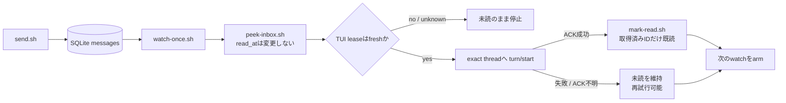
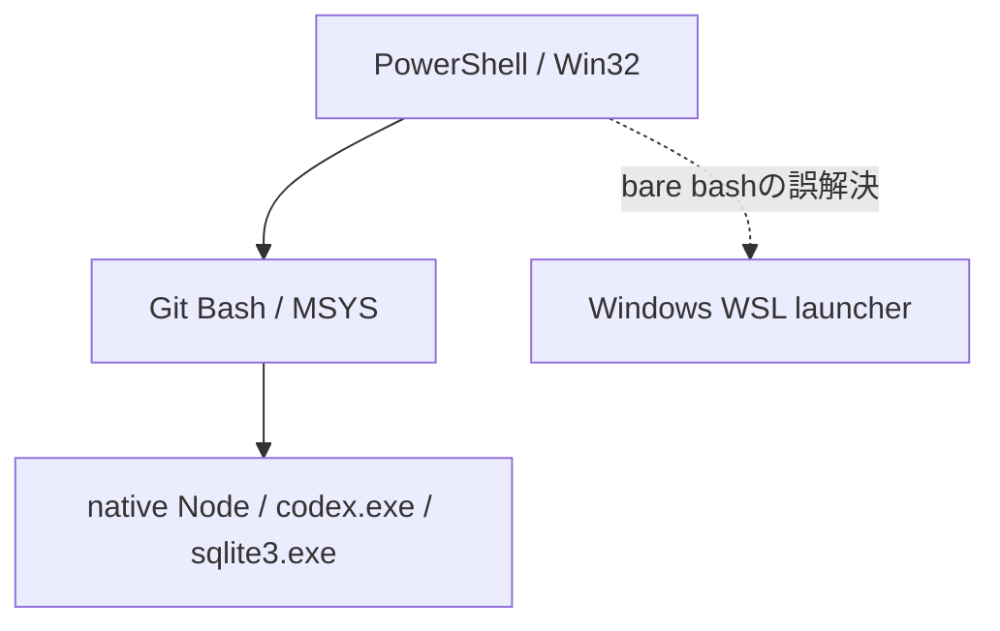

# Windows版agmsg monitor障害 — 調査・設計・実装・検証の統合報告

最終更新: 2026-07-15  
対象: `E:\Project\agmsg`、Windows / PowerShell 7 / Git for Windows、agmsg 1.1.7  
対象branch: `codex/monitor-teardown`（`v1.1.7` / `baa064e`以後のlocal stack）

この文書は、Windows上で発生したClaude Code watcherとCodex monitorの障害を、技術者以外にも追える形で統合した報告書である。詳細な実測ログと初期調査は[Windows障害の調査・修正記録](agmsg-codex-monitor-windows-investigation-ja.md)、恒久対策の設計過程は[monitor終了処理の設計書](agmsg-monitor-teardown-design-ja.md)、現行Codex monitorの利用・内部仕様は[Codex Monitor Beta](codex-monitor-beta.md)を参照する。

> **重要:** 本書は「当時の仮説」「設計だけ存在する案」「現在のsourceへ実装済みの機能」「実機で直接確認した結果」を区別する。設計書に書かれているだけでは、修正済みとは扱わない。

> **後続実測の一次記録:** watcher PID `42364` / `13416`、`2 alive, 4 stale pidfiles`から`0 alive, 0 stale pidfiles`へのcleanup、旧runner PID `64368`と子Node PID `52164`、`whoami.sh`の約18秒、Git Bash失敗後のWSL launcher表示・停止は、既存の詳細調査文書を書いた後に同じtaskで追加観測した。本書がこれらの値の最初のrepository内記録である。PIDと所要時間はその時点の実測値で、一般的な固定値ではない。

## 1. エグゼクティブサマリー

今回の問題は一つではなく、主に次の四系統だった。

1. **Codexへの配送先が古いtask/threadを指した。** `hameln/codex1`のseatが現在表示中とは別のCodex threadへ結び付いていたため、bridgeがaliveでも現在画面にはturnが出なかった。
2. **メッセージ取得と既読化の順序が安全でなかった。** 旧経路では、Codexへの`turn/start`が確実に受理されたと分かる前にメッセージを消費し、失敗時に再配送できない危険があった。
3. **Windows固有のshell、path、PID、sandbox差で診断・起動・終了判定が壊れた。** bare `bash`がWSL launcherを選ぶ、MSYS PIDとnative Windows PIDを混同する、native `sqlite3.exe`がsandboxから拒否される、といった独立した問題が重なった。
4. **TUI終了後にバックグラウンドprocessが残った。** Codex側はlease/ref/lifecycleで大幅に対策した。Claude Code側も今回、MSYS→native二段階ancestor walkとtyped owner livenessをsourceへ実装し、native Claude PIDを持つcomposite watcherがClaude終了後に自己終了することをWindows上の自動testで確認した。CIM等が使えずbare UUIDへfallbackする環境では、誤kill防止のため従来どおり自動回収しない制約が残る。

Codex側では、exact thread routing、TUI lease、shared app-server ref、取得と既読確定の分離、ACK後のexact-ID既読化、at-least-once配送、Windows PID三値判定、health表示、Git Bash固定などをlocal sourceへ実装した。2026-07-15には、既存調査文書の執筆後の追加作業として、そのbranchを`./install.sh --update`でインストール済みagmsgへ反映し、`hameln-hozon`のCodex monitor hookも再登録した。GitHubへのpushやPR作成は行っていない。

実機では`claude1`から`hameln/codex1`への自動配送と、`codex1`から`claude1`への公式`send.sh`送信を確認した。また、閉じたClaude Code session由来のwatcher 2本と、古いCodex sandbox runner 1系統を特定・停止した。ただしprocessの手動整理は運用上の復旧であり、Claude watcherの再発防止実装ではない。

### 1.1 現在の判定

| 領域 | 判定 | 意味 |
|---|---|---|
| Codexの誤thread配送 | 実装済み・targeted実機確認済み | 新TUIはserialized loaded-set delta、resumeはexact SessionStart ID。古いloaded threadを推測しない |
| Codexのサイレントロス対策 | 実装済み・自動testあり | peek→`turn/start` ACK→exact-ID mark-read。ACK不明は未読保持 |
| Codex TUI/app-server終了処理 | 実装済み、既知の狭い制約あり | lease/ref集合とlifecycle lockで管理。複数TUIを保護 |
| Windows Git Bash / WSL誤起動 | 実装済み | `Git\bin\bash.exe -lc`を標準化し、WSL fallbackを禁止 |
| Windows sqlite sandbox拒否 | 実装済み | installer管理の`~/.agents/bin/sqlite3.exe`を優先 |
| Claude watcherのbare UUID孤立 | **主要経路を実装・Windows自動test済み** | native Claudeを解決できればcomposite化して自己終了。CIM不能時のbare backstopは安全な所有証拠がなく未解決 |
| 全platform/full suite | 未完 | targeted testは成功。local branchをpushしていないためGitHub Actions未実行 |

## 2. agmsgの基本的な仕組み

### 2.1 メッセージとidentity

agmsgはdaemonや外部serviceではなく、SQLite DBとshell scriptでagent間メッセージを扱う。

- **team**: 通信グループ。今回の例は`hameln`。
- **agent**: team内の名前。今回のCodexは`codex1`、Claude Codeは`claude1`。
- **registration**: `(project, agent type)`とteam/agentの対応。
- **seat**: roleを再開すべきClaude/Codex sessionまたはCodex threadの記録。
- **thread/session**: Claude CodeやCodex自身が持つ会話単位。agent名とは別の識別子である。
- **read state**: 各受信rowの`read_at`。`history.sh`は履歴を表示し、`inbox.sh`は未読取得と既読化を行う。

したがって、「`codex1`として登録されている」「bridge PIDがalive」「正しいCodex threadへ配送できる」は別々の条件である。

### 2.2 delivery mode

| mode | 動作 | 主な用途 |
|---|---|---|
| `turn` | assistant turnの終了時にhookでinboxを確認 | 常時bridgeを持たない簡易配送 |
| `monitor` | Claude Codeは`watch.sh`、Codexはapp-server bridgeで未読を監視 | リアルタイムに近い自動配送 |
| `off` | 自動配送なし。公式scriptによる手動確認のみ | 復旧・切り分け・自動配送不要時 |

Claude Codeのmonitorは、SessionStart/Monitor経路から`watch.sh`を起動し、SQLiteをpollして受信をClaude sessionへ流す。Codexには同等のMonitor toolがないため、`codex-monitor.sh`がshared app-serverを起動し、`codex-bridge.js`が`watch-once.sh`をapp-server経由でarmし、未読時に対象threadへ`turn/start`する。

### 2.3 現行Codex配送フロー



この順序は「一度だけ」を常に保証するexactly-onceではない。ACKが失われた場合は、実際にはturnが始まっていてもrowを未読に保つため重複する可能性がある。これは**サイレントロスより重複を選ぶat-least-once**の設計である。

## 3. なぜWindowsで問題が起きるのか

### 3.1 shellが三層に分かれる

今回の標準経路はPowerShell→Git Bash→native Node/Codexである。WindowsにはさらにWSL launcherも存在するため、単に`bash`と書くだけではGit Bashが選ばれる保証がない。



実機では`C:\Program Files\Git\usr\bin\bash.exe --noprofile --norc`を使うとGit Bashの`/usr/bin`が`PATH`に入らず、nested `bash`が`C:\Windows\System32\bash.exe`へ解決された。WSL distributionがない環境では文字化けしたinstall案内を出し、処理が長時間停止した。標準入口は`C:\Program Files\Git\bin\bash.exe -lc`である。

### 3.2 MSYS PIDとnative Windows PIDは別物

Git Bashの`$$`や`$!`はMSYS PID、Task ManagerやCIMのPIDはWINPIDであり、数値空間が異なる。MSYS PIDへ`tasklist`を使う、native PIDへGit Bashの`kill -0`だけを使う、といった混同は誤判定を生む。

現行Codex lifecycleはPID domainを明示し、native側は`tasklist`→CIM、MSYS側は`kill -0`を使う。native照会結果は`alive / dead / unknown`の三値で扱い、照会失敗をdeadとみなしてprocessをkillしない。

### 3.3 MSYS→native ancestor境界

Claude Code watcherのinstance IDは本来`<session UUID>.<Claude PID>`である。しかしWindows実機ではGit Bashの`ps -l -p $$`がPPID 1を返す境界があり、単純なMSYS PPID walkではnative `claude.exe`へ到達できない。

修正前は`scripts/lib/compat.sh`に`compat_msys_pid_to_winpid()`と`compat_native_parent_pid()`が存在しても、`agmsg_agent_pid()`は`compat_get_ppid()`だけを繰り返し、native ancestor walkへ切り替えていなかった。今回、parentとidentityを同一`Win32_Process` snapshotから取得するPhase 2を接続した。なおCIM等が利用不能ならbare UUID fallback自体は残る。

### 3.4 native sqlite3とsandbox

native `sqlite3.exe`はMSYS形式の`/c/...`をそのまま開けない場合があり、`cygpath -m`等の変換が必要である。またCodex sandboxではWinGet package配下の`sqlite3.exe`が`Permission denied`になった一方、installerが管理する`~/.agents/bin/sqlite3.exe`は実行できた。

commit `2d2955c`はWindows install時にsandbox-safe copyを作り、`scripts/lib/storage.sh`がそれを`PATH`の先頭で優先する。

### 3.5 Codex CLIの実process構造

Gate G2/G2bでは、実Codex CLIが概ねNode wrapper→native `codex.exe`という階層を作ることを確認した。通常終了とnative `codex.exe`単体強制終了ではwrapperも追随した。一方、terminal window終了を`conhost.exe`強制終了で近似するとNode/Codex/cmdが10秒後もorphanのまま残った。PID監視だけでなく、lease timeoutと起動時GCが必要な根拠である。

## 4. 観測された症状と原因

| 症状 | 確認した原因・状態 | 現在の扱い |
|---|---|---|
| `history.sh`にはあるが`inbox.sh`は空、現在のCodexにturnが出ない | bridgeがrowを消費し、seatが古いCodex threadを指していた事例を確認 | seat再記録とexact routingを実施。新配送はACK後mark-read |
| bridgeがaliveなのに配送されない | PID aliveだけではthread、lease、app-server、watch phaseを保証しない | 複合health表示へ変更 |
| 古い／別threadへ接続する | 旧実装が同じcwdのloaded/rolloutや古いseatに依存 | 新TUIはroute lock下のloaded-set差分、resumeはexact hook ID |
| 別team/agentの未読を巻き込む懸念 | 旧identity解決にteam一覧×agent一覧のcross-product危険 | exact pairまたは唯一のpairだけを選択。曖昧なら未読のままfail-closed |
| 1回配送後にbridgeが反応しない | `turn/start` ACK欠落とwatchdog/rearm開始時点の問題 | request時にwatchdog開始。idle/completed/watchdogを単一終了経路へ統合 |
| `bash`失敗後にWSLを試す | skill指示と起動形式がGit Bashを固定していなかった | WSL fallback禁止、Git `bin\bash.exe -lc`固定 |
| `sqlite3: Permission denied` | sandboxがWinGet package executableを拒否 | installer-managed copyを優先 |
| TUIを閉じてもbashが残る | Claude watcherがbare UUIDで自己終了guard対象外 | native ancestor walkとtyped owner guardを実装。bare fallbackの安全な自動回収は未実装 |
| `codex-command-runner`とNodeが残る | 古いCodex App taskのorphan 1系統を確認 | 対象PIDだけ停止。現行Codex App配下は残した |

別teamの既読巻き込みは、今回の実データで独立した再現testを行ったという意味ではない。旧pair生成ロジックに対するコード上の危険として扱い、現在は曖昧identityをfail-closedにする自動testで保護している。

## 5. 調査と診断の変遷

### 5.1 初期段階

最初は「agmsg本体ではなくseatだけが古い」「再起動すれば直る」と考えられた。実際、古いseatは一つの直接原因であり、seatを現在threadへ記録し直すことで自動turnが現在画面へ届いた。しかし、その後もACK/rearm、Windows PID、shell、lifecycleという独立したsource-level不具合が確認されたため、「seatだけ」という総括は撤回された。

Claude watcherについても、当初は`agmsg_pid_is_agent()`内の素の`kill -0`がnative Claudeをdeadと誤判定すると推測した。再調査では、実際には`compat_get_ppid()`がMSYS境界でPPID 1を返し、`agmsg_pid_is_agent()`へ到達する前にwalkが終了していた。このため診断は「kill判定」から「祖先探索が境界を越えない」へ訂正された。

### 5.2 Gate G1: Claude Code実process tree

Claude Code session自身から読み取り専用でprocess treeを観測し、Git Bash中継を二段挟んでnative `claude.exe`へ到達する構造を確認した。Win32_Processの`ParentProcessId`を使うnative walkなら到達でき、Gate G1当時に検討していたhop上限12でも十分な観測結果だった。現行実装の既定上限は20であり、12は現行値ではない。ただし親が先に死亡すると`ParentProcessId` chainを後から完全復元できない窓がある。

### 5.3 Gate G2: Codex app-server実バイナリ

代替`cmd.exe`実験では、Git Bashの`exec`直後に`kill -0`からdeadに見えた。ところが実Codex CLIではNode wrapperがnative `codex.exe`をspawnし、native子を強制終了するとwrapperも追随終了した。代替実験をそのままCodexへ一般化できないことが判明し、foreground wrapperとleaseを組み合わせて実processを基準にする方向へ修正した。

### 5.4 Gate G2b: 実TUI

PowerShell `Start-Process`で実consoleを割り当て、次を確認した。

1. 起動時は`cmd.exe → node.exe → codex.exe`を含むtreeになる。
2. 正常終了近似では全processがcascade終了する。
3. native `codex.exe`単体強制終了でもwrapperが追随する。
4. `conhost.exe`強制終了近似ではNode/Codex/cmdがorphan化し、10秒待っても消えない。
5. 同一project相当の2 TUIの片方を終了しても、もう片方とshared app-serverは維持された。

この結果から、単純な親PID監視だけでも、leaseだけでも不十分で、TUIごとのlease、immutable ref集合、stale timeout、起動時GCを併用する設計になった。

### 5.5 役割分担

Claudeは主に仮説の反証、Gate G1/G2/G2b、lease/ref/ACK設計、§22の引継ぎ仕様、Codex実装差分のレビューを担当した。Codexはsource checkout上の実装、test追加、Windows実機診断、local commit、`install.sh --update`、end-to-end確認を担当した。

これは会話上の役割分担であり、Git authorだけから個々の行の執筆者を証明するものではない。installed copyだけに一時的に入った過去の変更は、残存Git履歴から初出担当を一意に復元できない。

## 6. 実装した修正とcommit

### 6.1 teardown基盤からhardeningまで

| commit | 目的・主な変更 | test・制約 |
|---|---|---|
| `acb0b83` | installed copy等で先行していたACK timeout/rearm、Windows status回復fixを4ファイルのlocal commitとして保全 | 146 insertions / 21 deletions。初出担当をGit履歴だけでは断定できない |
| `91b0e81` | `codex-lease.sh`、`peek-inbox.sh`、`mark-read.sh`を追加。lease schema、atomic write、exact-ID ACK primitive | lease/messaging Batsを追加。bridge統合前の基盤 |
| `5a60f5a` | `codex-bridge.js`とlauncherをlive TUI leaseへbind。peek→turn→mark-readを統合 | lease失効、ACK、retry testを追加 |
| `f6d5186` | shared app-server lifecycle、ref、monitor wrapper終了処理、設計・調査docs | 大規模初期実装。後続reviewでrace修正が必要になった |
| `54f7cd3` | 実装状態と設計文書の表現を整合 | docsのみ |
| `d69d76d` | launcher/bridge/leaseのteardown race windowを追加修正 | `a1fdcc6`のrace testsへ続く |
| `a1fdcc6` | lifecycle、starter異常終了、複数generation等のrace tests | hardening直前のrollback checkpoint |
| `b4d9744` | exact hook routing、ACK、identity scope、Windows health/PID、lease/ref/teardownを横断hardening | 15 source files、1,122 insertions。独立Node testと後続Batsで検証 |
| `07fefab` | Windows focus CI、bridge unit、lease/resume/delivery/messaging test、docs | test定義は増えたがlocal branch未pushのためActions未実行 |

### 6.2 実TUI routingとWindows運用の追加修正

| commit | 目的・主な変更 | test・制約 |
|---|---|---|
| `c660590` | 新TUIをserialized loaded-set deltaでprompt前にexact bind。resume hook、launcher、lease handshakeも強化 | `test_codex_monitor`、delivery、bridge unitを追加。旧「最初のprompt待ち」説明を更新 |
| `20958a2` | serialized TUI routingの文言・diagnosticを整理 | docs/comment中心 |
| `2d2955c` | Windows sandboxで実行可能な`sqlite3.exe`をinstaller管理copyとして優先 | install/storage testsを追加 |
| `82035c8` | skillにWSL禁止を明記、monitor identityをapp-server起動前にexport、Codexの遅いMSYS ancestor probeをskip、Windows dispatcherの古いmonitor拒否を削除 | resolve/dispatch/monitor static testsと実PowerShell確認 |
| `d04d13d` | PowerShell関数が`Git\usr\bin\bash.exe`を検出しても`Git\bin\bash.exe`へ正規化 | shim Batsでbackslash/normalized両方を確認 |
| `acac20c` | Windows monitor調査、teardown設計、実装・検証結果を本統合worklogへ集約 | docsのみ。過去の観測と未検証事項を区別 |
| `6b1817e` | Claude owner探索をMSYS→nativeの二段階walkへ拡張し、WINPID identityでcomposite watcherをbind | Windows ancestor/lifecycle testを新設。CIM不能時のbare fallbackは残存 |
| `228fb84` | native Claude watcher修正の根本原因、test結果、実Claude E2E未実施をworklogへ反映 | docsのみ |
| `fb78fe2` | grok-buildをMSYS PID domainへ戻し、Claude ownerへCreationDate generation sidecarを追加 | PID reuse、unknown、grok lifecycle、successor-safe cleanupをWindows testで確認 |
| `5b03de7` | generation hardening、hop上限12/20の区別、残存制約をworklogへ反映 | docsのみ |

`b4d9744`自身を1件目として`07fefab`、`c660590`、`20958a2`、`2d2955c`、`82035c8`、`d04d13d`までの連続7 commitは、2026-07-15に`./install.sh --update`でinstalled agmsgへ反映した。DBとteam設定はinstaller出力上preserveされ、`hameln-hozon`のCodex monitor hookを再登録した。これは既存の[Windows障害の調査・修正記録](agmsg-codex-monitor-windows-investigation-ja.md) §16.5が「今回の作業では実施していない」と記録した時点より**後の追加作業**であり、同文書は当時のsnapshot、本書はその後まで含む統合記録である。`acac20c`以降のClaude watcher関連commitはsource checkout上のlocal commitであり、installed copyへは未反映である。source commitとinstalled copyの反映は別操作であり、今後もinstalled copyを直接patchしてはならない。

## 7. GitHub PRとの関係

本作業ではnetwork照会、push、PR作成を行っていない。以下の「含まれる」はlocal Git履歴と`v1.1.7`のcommit messageで確認した意味であり、今回個別にcherry-pickしたという意味ではない。

| PR | local履歴で確認できる内容 | 今回との関係 |
|---|---|---|
| `#148` | `13815c1` Codex monitor bridge beta | app-server bridgeの基盤 |
| `#174` | `4eff740` Codex 0.141 WebSocket/loaded discovery | ws transportの基盤 |
| `#179` | `b897013` Git Bash compatibility | Windows shell互換の基盤 |
| `#226` | `58bd497` Windows向けDB path | native sqlite path対策 |
| `#232` | `f6a8bcb` delivery status bridge liveness | health表示の導入元 |
| `#237` | `2f94765` Codex 0.142 fail-open/stale app-server | compatibility patchの背景 |
| `#344` | `2f21afa` role-to-session affinity | seat/resumeの基盤。`v1.1.7`に含まれる |
| `#353` | `7b57d47` role記録threadへのbind | wrong task問題に直接関係 |
| `#358` | `af10ad0` MSYS prompt path conversion guard | Windows spawn対策 |
| `#359` | `8113d38` ancestor project過剰到達防止 | 別project/team誤解決対策 |
| `#363` | `c1554b9` psmuxを`bash -l`でwrap | Windows terminal起動対策 |
| `#376` | `baa064e` release 1.1.7 | 今回の基準tag |

既存調査文書は`#196`をclosed/unmergedと記録している。通常のHEAD履歴検索には`#196`を示すcommitがない一方、過去のfetchで得たlocal remote-tracking ref `origin/windows-liveness-pr196`は残っており、先端`5d36f4d`（`fix(windows): use tasklist for native pid liveness in agmsg_instance_alive (#134)`）を確認できた。このcommitは現在のHEADのancestorではない。今回は外部照会を禁止しているため、GitHub上の現在状態は**本書では再確認していない**。同等のnative PID liveness helperが別経路でsourceへ入っていることだけを確認した。

`acb0b83`から`d04d13d`までの今回のstackはlocal-onlyで、upstreamへpush/cherry-pick/PRされていない。branch構成上、`acb0b83`は`codex/preserve-monitor-local-fixes`で先行fixを保全した後、`codex/monitor-teardown`へ引き継がれたstack先頭である。

## 8. 配送信頼性の実装状態

| 要件 | 状態 | source上の根拠 |
|---|---|---|
| 取得と既読化を分離 | 実装済み | `peek-inbox.sh`、`mark-read.sh`、`fetchUnreadForPrompt()` |
| exact IDだけ既読化 | 実装済み | peek結果のIDをstdinで`mark-read.sh`へ渡す。入力を数値検証 |
| `turn/start` ACK後にmark | 実装済み | `tryStartTurn()`成功branchだけ`markFetchedRead()` |
| ACK timeoutで未読保持 | 実装済み | timeout branchはmarkせずIDをclearし、max IDをreset |
| 明示失敗でretry可能 | 実装済み | `delivery_failed`を記録し、未読のままlauncher restart |
| pre-consume gate | 実装済み | fetch前、fetch後/turn直前、armed watch中の独立lease timer |
| generation handshake | 実装済み | pending contract、TUI lease、bridge leaseにformat/generation |
| wrong old thread防止 | 実装済み | 新TUIはroute lock下のloaded-set delta、resumeはexact hook ID |
| stale explicit thread検証 | 実装済み | bound IDだけをloaded APIで検証。baselineから選ばない |
| shared app-server lifecycle | 実装済み | starting/ready record、spawning marker、adopt、immutable refs |
| mutable refcountを使わない | 実装済み | ref file集合をlifecycle lock下で列挙 |
| 複数TUI共有 | 実装済み | 後発same-identityは`identity_conflict`、last refだけcleanup |
| spawn→marker間の完全回収 | 未実装・既知の制約 | marker書込み前にstarter死亡する極短い窓は追跡不能 |

## 9. Windows shellとidentityの修正

### 9.1 正しい実行入口

PowerShellから公式scriptを呼ぶ場合は次の形に統一する。

```powershell
& 'C:\Program Files\Git\bin\bash.exe' -lc 'exec "$@"' -- '/c/Users/<user>/.agents/skills/agmsg/scripts/<script>.sh' <args...>
```

禁止事項はbare `bash`、`sh`、`wsl`、`wsl.exe`、`C:\Windows\System32\bash.exe`へのfallback、および`Git\usr\bin\bash.exe --noprofile --norc`である。Git Bash呼出しが60秒を超えた場合はerrorとして停止し、WSLで再試行しない。

### 9.2 identity継承

`codex-monitor.sh`はsingle identityをshared app-server起動前に解決し、`AGMSG_CODEX_TEAM`、`AGMSG_CODEX_NAME`、`AGMSG_TEAM`、`AGMSG_AGENT`をexportする。remote TUIのtool subprocessはapp-serverから生成されるため、この順序でないと各`$agmsg`が遅い`whoami.sh`を繰り返す。

実機で明示的な`whoami.sh`は約18秒かかった。monitor TUIは継承済みidentityを使い、この探索を通常経路から外す。

### 9.3 PowerShell profile関数

`codex-shim-install.sh powershell-function`は、検出値が`Git\usr\bin\bash.exe`でも`Git\bin\bash.exe`へ正規化する。Codex CLI本体には`--team`や`--name` optionがないため、明示seatは`AGMSG_CODEX_TEAM` / `AGMSG_CODEX_NAME`またはmonitor wrapper optionで渡す。

## 10. 自動testと実機検証

### 10.1 repositoryに存在する主な自動test

- `tests/test_codex_bridge_unit.js`: ACK成功、明示失敗、ACK timeout、log redaction、Git Bash、WebSocket close、single-instance、identity reuse。
- `tests/test_codex_bridge.bats`: lease失効、exact ACK、overlapping generation、rearm、thread validation、timeout、failure limit。
- `tests/test_codex_bridge_launcher.bats`: generation request、handshake、rebind、same-identity競合。
- `tests/test_codex_lease.bats`: atomic write、compare-delete、lock、immutable refs、provisional ref、unknown fail-closed。
- `tests/test_codex_monitor.bats`: wrapper、hook順序、identity export、serialized TUI route、stale/adopt/concurrent starter。
- `tests/test_codex_resume.bats`: seat移動、fresh generation thread、old same-cwd rollout拒否。
- `tests/test_messaging.bats`: peek、exact mark、idempotence、曖昧identity fail-closed。
- `tests/test_storage.bats`: Windows pathとsandbox-compatible sqlite copy。
- `tests/test_windows_claude_ancestor.bats`: POSIX互換、MSYS内/境界越えnative ancestor、Phase 1 fallback、複数bash中継、production identity matcher、CIM/CreationDate unknown、cycle/hop上限、WINPID composite、同一Claude PID generation reuse、parallel resume、実WINPID watcher終了、grok-build MSYS owner、bare fail-closed、status/`set off` cleanup。

### 10.2 実行記録として確認できる範囲

既存調査記録では、変更shellの`bash -n`、`codex-bridge.js`/unit testの`node --check`、当時6件だったbridge unit、`npm test`、Bats discovery 699件、Windows focus 7件、`git diff --check`、unknown fail-closedとref cleanupのmanual testが成功した。

2026-07-15の追加作業では、次のtargeted BatsをWindows上で成功確認した。

- Codexが不安定なagent-PID marker pathをskipすること。
- identity exportがapp-server起動より前であること。
- Codex skillがWSL fallbackを禁止すること。
- Windows dispatcherがCodex monitorを受け付けること。
- app-server起動失敗時にplain Codexへfail-openすること。
- SessionStart hookがapp-serverより先にinstallされること。
- PowerShell関数がGit Bashを固定し、`usr\bin`を`bin`へ正規化すること。

同日のClaude watcher恒久修正とreview追随では、`tests/test_windows_claude_ancestor.bats`を27件へ拡張し、Windowsで27 pass・0 skip、exit 0を通し確認した。決定論的process-table stubでproduction identity matcher、後続引数に`claude`があるだけのprocess拒否、Phase 1からPhase 2への安全な継続、CreationDate一致/不一致/取得不能、atomic sidecarのsuccessor-safe cleanupを検証した。追加した世代交代testは共有retire helper、`session-start.sh`、`delivery.sh`のproduction経路を通り、CreationDate不一致かつcmdlineが対象`watch.sh`の場合だけ旧watcherを停止して新directiveを出す。creation欠落、同一generation、cmdline不一致では既存watcher・pidfile・sidecarを温存し、duplicate directiveを抑止する。さらに`sleep.exe`の使い捨てcopyを`claude.exe`として起動する実WINPID/CIM lifecycle、実`watch.sh`のCIM unknown継続、grok-buildのMSYS PID lifecycle、bare watcher fail-closed、status分類、`delivery set off` cleanupを含む。テスト用processは各caseのteardownで停止・waitした。

今回のreview追随回帰では、`tests/test_instance_id.bats`は全41件を処理して37 pass・Windows既知skip 4、`tests/test_resolve_project.bats`は全25件を処理して23 pass・Windows既知skip 2、いずれもexit 0だった。`tests/test_watch.bats`はsession/dedup関連5件をfilter実行して1 pass・Windows既知skip 4、`tests/test_delivery.bats`はMonitor directive/dedup/`set off`関連10件をfilter実行して9 pass・Windows既知skip 1、いずれもexit 0だった。statusと`set off`の実process cleanupは27件のWindows専用suiteにも含めて成功した。変更shellの`bash -n`と`git diff --check`は成功した。ShellCheck実行ファイルはこの端末に存在せず、network禁止のため導入せず、今回の変更には**未実施**である。

full Batsは完走していない。Windows managed sandboxのnative executable制約と、各testのsetupが非常に遅い問題があった。途中でBatsを「終了した」と誤認した際、実際にはbackgroundで継続して複数bashを残したため、MSYS PIDとcommand lineを確認して、そのtest treeだけを停止した。その後、対象testを1件ずつ実行し、終了までsessionをpollし、残存がないことを確認した。

### 10.3 実機end-to-end

- `hameln/codex1`のseatを現在のexact Codex threadへ記録し直した。
- monitor経由の自己診断messageが現在表示中の同じCodex taskへ自動turnとして届くことを確認した。
- `claude1`からの受信がpromptへ反映されることを確認した。
- `codex1`から`claude1`へ公式`send.sh`で送信し、historyに記録されたことを確認した。
- watchdog後にbridgeが次のwatchへrearmする経路を確認した。
- `./install.sh --update`後もDB/teamがpreserveされたinstaller出力を確認した。

メッセージ本文や資格情報は本書へ記録しない。

### 10.4 未検証

- source checkout修正版をinstalled copyへ反映した上での、実Claude Code使い捨てsessionによる起動→正常終了E2E。今回は既存の使用中Claude processを保護し、install更新の事前許可も求めていないため、native `claude.exe` test doubleまでに留めた。
- Linux/macOSを含むfull suiteの最終green。
- push後のGitHub Actions。local-onlyのため未実行。
- 長時間の大量連続message、全sleep/resume/clock-change組合せ。
- Codex app-server experimental APIの将来version互換。
- console crash後にnative processが本当に生存し続ける全パターン。

## 11. 今回整理した孤立process

### 11.1 Claude Code watcher

Windows process情報と公式`delivery.sh status`を照合し、次を確認した。

| 当時のPID | command | 状態 |
|---|---|---|
| `42364` | `bash.exe .../watch.sh <bare UUID> /e/Project/hameln-hozon claude-code` | 親Claude消失後もalive |
| `13416` | 同上、別bare UUID | 親Claude消失後もalive |

statusは`watch processes: 2 alive, 4 stale pidfiles`だった。PowerShellから公式`delivery.sh set off claude-code /e/Project/hameln-hozon`を再実行し、終了後に`0 alive, 0 stale pidfiles`を確認した。

### 11.2 古いCodex sandbox tree

`codex-command-runner-0.144.0-alpha.4.exe` PID `64368`は2026-07-13から残り、親PIDは存在しなかった。その子`node.exe` PID `52164`も同時刻から残っていた。runnerだけをtargeted停止すると子Nodeも追随終了した。

一方、現在のCodex App配下の`codex.exe`、`codex-code-mode-host`、`codex-command-runner-0.144.2`、`codex-computer-use`、MCP/Playwright Node群はlive parent chainがCodex Appへつながっていたため停止しなかった。一時的なcommand runnerがtool実行中だけ増え、終了後に消えることも確認した。

ここに記載したPIDは当時の診断値であり、恒久的な識別子ではない。将来の停止判断では必ずprocess名、path、command line、parent、creation timeを再確認し、PID番号だけを再利用してはならない。

## 12. 現在も未解決の問題

### 12.1 Claude watcherの主要孤立経路は修正済み

実測した2本のwatcherは引数がbare UUIDだった。修正前sourceでは次の経路だった。

1. `agmsg_normalize_instance_id()`が`agmsg_agent_pid()`を呼ぶ。
2. `agmsg_agent_pid()`は`compat_get_ppid()`でMSYS PIDだけを上る。
3. Windows境界でPPID 1になりnative `claude.exe`へ届かない。
4. instance IDが`<UUID>.<PID>`ではなくbare `<UUID>`になる。
5. `watch.sh`のliveness guardは`agmsg_instance_is_composite`の場合だけ実行される。
6. bare watcherは親Claude終了後もpollを続ける。

今回のsource修正で`agmsg_agent_pid()`を二段階化した。Phase 1は従来のMSYS/POSIX parent walk、Phase 2は境界のMSYS PIDをWINPIDへ変換して`Win32_Process.ParentProcessId`を辿る。Windowsで返すPIDはMSYS内でagentを見つけた場合もWINPIDへ統一し、composite instance ID、`cc-instance`、project marker、owner livenessのPID domainを揃えた。native identityはName/ExecutablePath/CommandLineを一回のCIM queryで取得し、実行主体がClaudeである場合だけ採用する。hop上限、cycle、空値、不正PIDを拒否する。

`watch.sh`はtyped owner stateが`dead`の場合だけ終了する。native PIDが存在してもClaude identityと一致しなければPID reuse/mismatchとして終了し、tasklist/CIM/CreationDate照会失敗は`unknown`として継続する。起動時に同じ`Win32_Process` snapshotのCreationDate ticksを取得し、`watch.<instance>.owner`へwatcher PID・type・PID domainとともにatomic writeする。poll時はWINPID、Claude identity、CreationDateがすべて一致した場合だけ`alive`であり、同一UUID・同一WINPID・同じ`claude.exe`でもCreationDateが違えば旧ownerとして`dead`になる。世代交代時の明示retireも、両CreationDateが有効かつ不一致で、pidfileのprocess command lineが対象`watch.sh`と確認でき、TERMが成功した場合だけ成立する。それ以外は既存watcherとartifactを温存する。

sidecar writeは呼出し元のumaskへ波及しないsubshell内で`umask 077`を設定し、同じrun directory内のtmp→`mv`でatomic publishする。通常cleanupは記録されたwatcher PIDが自分と一致する場合だけ削除する。ただし`agmsg_watch_owner_remove_if_watcher()`の「内容を読む→pathを削除する」はshell filesystem操作だけでは単一のcompare-and-deleteにならず、その間にsuccessorが同じpathを置換する微小TOCTOUは残る。全write/deleteを跨ぐlock導入はadvisory sidecarに対して過大なため今回は追加しない。race時の影響はsidecarの一時消失に限定され、後続判定はowner `unknown`となって既存watcherを停止しないfail-closed方向である。

reviewで判明したgrok-build回帰も同時に修正した。grok-buildのcomposite IDが保持するPIDはMSYS domainなので、Windowsでも`compat_pid_alive_msys()`で判定し、tasklist/CIMへ渡さない。native identity/CreationDate検証は`agmsg_agent_pid()`がWINPIDを返すtypeに限定した。Phase 1のMSYS PID→WINPID変換や候補再検証が一時的に失敗した場合は、domainが確定している現在のMSYS PIDからPhase 2を試し、変換不能ならbareへfail-closedする。

### 12.2 bare watcherのbackstop

native ancestor walkが権限・race・policyで失敗する環境は残る。bare watcherを時間だけでkillするとlive sessionを誤停止し得るため、heartbeat単独をkill根拠にする初期案は撤回された。今回もbare IDはowner stateを`unknown`とし、自動停止・起動時kill GCを追加していない。独立したsession所有証拠をClaude Code側から取得できるまで、安全なbackstopは未解決である。

### 12.3 Codex側の既知制約

- app-server spawn成功からspawning marker書込み前までの極短い未追跡窓。
- native processがterminal crash後もliveな場合、誤kill防止のため自動cleanupが遅れる可能性。
- app-serverはexperimental APIでありversion更新時にrouting/ACKを再検証する必要。
- at-least-onceのため、ACK不明時の重複turnは許容される。

## 13. 正常状態と運用手順

### 13.1 Codex monitor

設定上の期待値は`SessionStart: 1 / SessionEnd: 1 / Stop: 0`だが、これだけではruntime正常を証明しない。新TUIはroute lock下でexact loaded-set deltaを取得し、`request_published (tui_loaded_delta)`→`bridge_starting`→`healthy`へ進む。resumeではSessionStart exact IDを使う。

初回導入時またはhook定義更新後は、Codex TUIの`/hooks`でagmsgのSessionStart/SessionEndを確認し、project hookをtrustする必要がある。未trustならCodexはhookを意図的にskipする。またapp-serverは起動時のhook設定を使うため、`delivery.sh set monitor`によるhook登録はapp-server起動より前でなければならない。既に開いている非monitor TUIへ後から設定だけ追加しても、そのTUIが自動的にremote monitorへ切り替わるわけではない。

`healthy`には少なくとも次が必要である。

- exact thread UUIDがある。
- 同じgenerationのfresh TUI leaseがある。
- shared app-server recordが`ready`でprocess/portがlive。
- bridge heartbeatがfresh。
- phaseが`watch_armed`または`delivering`。

TUIを全て閉じた後は`Codex bridge: not running`、project state `stopped`が正常である。複数TUI時は一つを閉じても残りのrefがshared serverを保護する。

### 13.2 Claude Code

`off`時の期待値は次である。

```text
mode: off
watch processes: 0 alive, 0 stale pidfiles
watch ownership: 0 verified composite, 0 bare weak, 0 owner unknown, 0 owner dead/mismatch
```

残存時はinstalled copyやDBを直接編集せず、公式scriptをGit Bash経由で再実行する。

```powershell
& 'C:\Program Files\Git\bin\bash.exe' -lc 'exec "$@"' -- '/c/Users/<user>/.agents/skills/agmsg/scripts/delivery.sh' set off claude-code '/e/Project/<project>'
```

### 13.3 異常時の安全な確認順序

1. `delivery.sh status <type> <project>`でmodeと公式runtime状態を確認する。
2. hook件数だけで正常と判定せず、thread、lease、app-server、phaseを見る。
3. processはPIDだけでなくcommand line、parent PID、creation time、executable pathを確認する。
4. current Codex App配下のrunner/Node/MCPを個別killしない。
5. old parentが消えたtargetだけを停止する。
6. source修正は`E:\Project\agmsg`で行い、test→commit→`./install.sh --update`の順にする。
7. `~/.agents/skills/agmsg`のinstalled copy、SQLite DB、team configを直接書き換えない。
8. Git Bash失敗時にWSLへfallbackしない。

## 14. 今後の推奨作業

| 優先度 | 作業 | 完了条件 |
|---|---|---|
| 完了 | Claude用Windows native ancestor walkを実装 | stub matrixと使い捨てnative `claude.exe`自動testでcomposite/liveness/終了を確認。実Claude Code E2Eは別途必要 |
| 完了 | watcher owner generationとgrok PID domainをhardening | CreationDate sidecarのatomic/compare cleanup、同一WINPID reuse、grok MSYS lifecycleをWindows自動testで確認 |
| P0 | bare watcherの安全なbackstop/GC | live watcherを誤killせず、親消失bare watcherを回収できるtest |
| P1 | Windows実機回帰matrix | normal exit、resume、window close、sleep/resume、CIM拒否を自動/半自動確認 |
| P1 | test timeoutとcleanup強化 | Bats中断・timeout後にbash/node/processとtemp artifactが残らない |
| P1 | monitor doctor表示 | seat/thread、lease generation、last ACK/rearm/errorを一画面で確認 |
| P2 | full suite/CI | Linux/macOS/Windowsを実行し、platform別skip理由を明示 |
| P2 | docsの旧記述整理 | 「最初のprompt待ち」等、後続commitで変わった説明へ注記 |

Claude watcher修正では、`compat.sh`にprimitiveを置き、Claude/Codexそれぞれの上位policyを分離する。Codex側のMSYS/native PID domain規則を、根拠なくClaude watcherへ流用してはならない。

## 15. 変更・外部影響の境界

- 今回の追記ではsource codeと自動testを変更した。DB、team登録、installed copyは変更していない。使い捨てtest processだけを起動し、終了・残存なしを確認した。
- 本件の実装commitはlocal branchにあり、GitHubへpush/PRしていない。
- 2026-07-15のruntime反映はuser許可のもと`install.sh --update`で行い、DB/team preserveを確認した。
- Claude watcherと古いrunnerの停止は、command lineとparentを確認したtargeted運用対応である。
- upstreamへ提案する場合は別途review、full test、userの明示許可が必要である。

## 16. 参照先

- [Windows障害の調査・修正記録](agmsg-codex-monitor-windows-investigation-ja.md)
- [monitor終了処理の設計書](agmsg-monitor-teardown-design-ja.md)
- [Codex Monitor Beta](codex-monitor-beta.md)
- [Codex bridge](../scripts/drivers/types/codex/codex-bridge.js)
- [Codex monitor wrapper](../scripts/drivers/types/codex/codex-monitor.sh)
- [Codex bridge launcher](../scripts/drivers/types/codex/codex-bridge-launcher.sh)
- [Codex lease library](../scripts/lib/codex-lease.sh)
- [Claude watcher](../scripts/watch.sh)
- [instance ID](../scripts/lib/instance-id.sh)
- [project/agent PID resolution](../scripts/lib/resolve-project.sh)
- [Windows compatibility helpers](../scripts/lib/compat.sh)
- [delivery control/status](../scripts/delivery.sh)
- [Codex tests](../tests/test_codex_bridge.bats)
