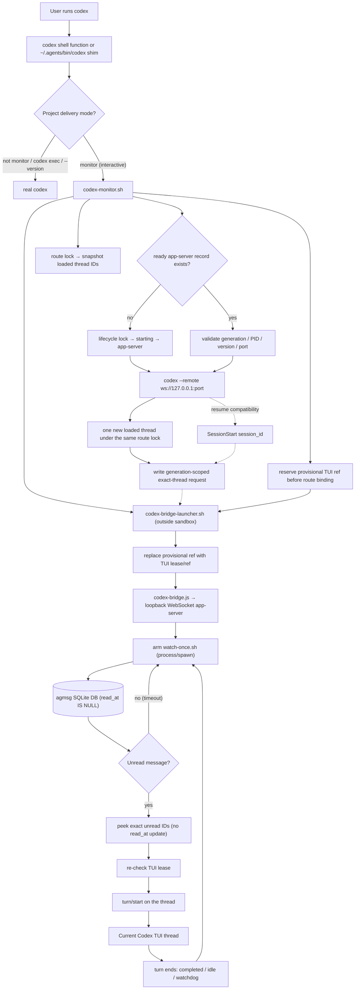

# Codex Monitor Beta

Codex does not expose Claude Code's Monitor tool. agmsg's Codex monitor beta
approximates the same experience by launching Codex through an app-server bridge.

> ⚠️ **Experimental beta — read before enabling.** This changes how Codex starts.
> Enabling monitor mode prints a shell function that makes `codex` route through
> agmsg's monitor shim in your interactive shell. In monitor-mode projects the
> shim re-routes interactive launches through an app-server bridge; everywhere
> else it passes straight through. **Only enable this if you are comfortable with
> the `codex` command being intercepted in that shell.** It also depends on Codex
> app-server behavior and may break as Codex changes. Known rough edges:
> enabling monitor takes effect only after you **restart Codex**. A new TUI
> launch is serialized per project and binds only the single thread added to the
> app-server's loaded set by that launch. It never chooses an already-loaded
> same-project thread. Resume flows retain the first-turn SessionStart
> `session_id` compatibility path. An
> already-running session stays unmonitored until you restart it (#151); the
> teardown after an abruptly closed terminal is lease-timeout based when the TUI
> process actually exits; if Windows leaves the native Codex process alive but
> inaccessible after a console-window crash, it cannot be distinguished safely
> from a live TUI and may require explicit cleanup. Projects with multiple Codex
> identities require an explicit active role (#150).

## Quick Start

Enable monitor mode in a project:

```bash
~/.agents/skills/agmsg/scripts/delivery.sh set monitor codex "$PWD"
```

The command:

1. Enables agmsg's Codex SessionStart/SessionEnd hooks for the project.
2. Prints a shell function that routes interactive `codex` launches through the
   monitor shim.

The Codex sandbox must allow writes to the installed skill's runtime state:

```text
~/.agents/skills/<cmd>/db
~/.agents/skills/<cmd>/teams
~/.agents/skills/<cmd>/run
```

`install.sh` and `install.sh --update` add these writable roots to
`~/.codex/config.toml` when that file exists.

Add the printed function to your shell profile. It looks like:

```bash
codex() {
  ~/.agents/skills/agmsg/scripts/drivers/types/codex/codex-shim.sh "$@"
}
```

On Windows, the enable command also prints a PowerShell-profile alternative.
You can reproduce it at any time from Git Bash with:

```bash
~/.agents/skills/<cmd>/scripts/drivers/types/codex/codex-shim-install.sh powershell-function
```

It pins the current Git for Windows `bash.exe` path, starts its login-shell
environment, and then execs `codex-shim.sh` with the original argument array.
PowerShell therefore never resolves the Windows WSL `bash` launcher by
accident, while Git's `usr/bin` tools remain available to the shim.

Restart the shell, then launch Codex normally:

```bash
codex
```

In monitor-mode projects, the function routes interactive Codex launches through
the bridge. Outside monitor-mode projects, it passes through to the real Codex.

## Optional PATH Shim

If you prefer the previous global PATH shim setup, install it explicitly:

```bash
~/.agents/skills/agmsg/scripts/drivers/types/codex/codex-shim-install.sh install
```

Then put `~/.agents/bin` before the real Codex binary on PATH:

```bash
export PATH="$HOME/.agents/bin:$PATH"
```

If `~/.agents/bin/codex` already exists and is not the agmsg shim, agmsg leaves
it untouched. You can either move that command aside and run the install command
again, or launch monitor sessions explicitly:

```bash
~/.agents/skills/agmsg/scripts/drivers/types/codex/codex-monitor.sh
```

For custom command names, replace `agmsg` with the installed skill name:

```bash
~/.agents/skills/<cmd>/scripts/drivers/types/codex/codex-monitor.sh
```

## What The Shim Does

The shell function and optional PATH shim only wrap interactive Codex TUI
launches:

```bash
codex
codex resume
codex "fix this bug"
```

Noninteractive subcommands pass through to the real Codex binary:

```bash
codex exec ...
codex app-server ...
codex login
codex logout
```

The shim also passes through when the current project is not in Codex monitor
mode.

## Bridge Mechanics

`codex-monitor.sh` starts (or reuses) an agmsg-managed Codex app-server socket
under `~/.agents/skills/<cmd>/run/`, starts the out-of-sandbox bridge launcher,
and then connects the Codex TUI to that socket with `--remote`.
It installs the project SessionStart/SessionEnd hooks before a new app-server
is started, because the app-server snapshots hook configuration at startup.
The hooks provide teardown and resume compatibility; new TUI routing does not
wait for a user-entered first prompt.

On Windows, `codex-monitor.sh` remains as a foreground Git Bash wrapper and
waits for the npm/node/native Codex child to exit. The launcher monitors that
stable wrapper PID rather than relying on an MSYS PID surviving an `exec`
across the native-process boundary. App-server shutdown still requires the
immutable reference-file set to be empty, so closing one of several TUIs does
not stop the server used by the others.

For a new TUI, `codex-monitor.sh` holds a project route lock, snapshots
`thread/loaded/list`, launches the TUI, and accepts only one newly loaded UUID as
that generation's route. Zero new IDs times out without consuming inbox rows;
multiple new IDs are ambiguous and fail closed. This delta is safe only because
the lock serializes monitor TUI startup for the project—it is not a guess from
the existing loaded set.

Codex fires SessionStart on the session's **first turn**, not when the TUI
opens. That hook remains a compatibility route for resume flows and publishes
the common hook-input `session_id`. `CODEX_THREAD_ID` remains only a
compatibility source; if both are present but disagree, routing fails closed.

Codex requires review and trust for new or changed project command hooks. On
first setup (and whenever an agmsg update changes the hook definition), open
`/hooks` in the TUI and trust the agmsg SessionStart/SessionEnd entries. Until
then Codex deliberately skips them; the TUI itself still answers ordinary
prompts, while agmsg remains in `waiting_first_turn`. Do not use
`--dangerously-bypass-hook-trust` as the normal fix because it bypasses review
for every enabled hook in that invocation.

The SessionStart hook is designed to **not** start the bridge directly — a
hook-launched process was observed to run inside the Codex sandbox and fail to
connect to the unix socket (EPERM). Instead:

> Note: this EPERM-avoidance design (the launcher + request-file rendezvous
> below) is under review — in practice the hook has been seen to launch a
> detached bridge directly and connect fine, suggesting the launcher layer may
> be redundant. See #153.

1. `codex-monitor.sh` creates one TUI generation, reserves the ready shared
   app-server with a provisional ref, and creates a request path unique to that
   generation. This pre-route ref closes the lifecycle gap where a TUI could be
   opened and closed before routing completed. A
   generation-scoped pending contract records the path, app-server URL, owner
   PID, and optional explicit identity before the TUI starts.
2. For a new launch, the monitor takes a separate project route lock, records
   the loaded-thread baseline, starts the TUI, and polls for the set difference.
   Exactly one new UUID publishes the generation-scoped request. No delta keeps
   messages unread; more than one delta fails closed as `thread_ambiguous`.
3. For resume compatibility, the shared `session-start.sh` reads hook stdin
   **before** invoking the Codex
   plug. Hooks execute under the shared app-server rather than inheriting the
   TUI generation directly, so the managed app-server generation resolves the
   request only when exactly one fresh, live pending TUI contract exists. The
   plug then publishes the current `session_id` as the exact thread. Multiple
   candidates fail closed instead of guessing. On Windows the hook sandbox may
   be unable to execute the external `sqlite3` binary; launcher mode therefore
   does not require a second DB identity lookup after the pending contract has
   passed its generation, path, app-server, owner-PID, and provisional-ref
   checks. The out-of-sandbox launcher still requires the request identity to
   match the identity it owns. A
   same-cwd rollout is **not** accepted as proof for a remote TUI: it may
   describe an older task. The request includes generation, type, `(team,
   agent)`, project, app-server, thread, and creation time.
4. `codex-bridge-launcher.sh`, started by `codex-monitor.sh` **outside** the
   sandbox, accepts only its own fresh request with every routing field matching,
   consumes it once, and starts `codex-bridge.js`. Project-global requests from
   older versions are ignored.
5. If no exact request is possible, the launcher stays in a waiting/error state
   and agmsg messages stay unread. It never selects an ID from the baseline
   loaded set. The bridge may use the loaded API only to confirm its already
   bound exact ID after a recoverable `thread/resume` response.
6. The bridge connects to the same app-server over loopback **WebSocket**,
   resumes the thread, and arms `watch-once.sh` via the app-server `process/spawn`
   API (which polls the agmsg DB for unread rows, `read_at IS NULL`).
7. On an unread message it peeks the exact rows without changing `read_at`,
   validates the TUI generation lease again, and inlines the text into a
   `turn/start`. Only a successful request acknowledgement marks those exact
   message IDs read. An ambiguous timeout leaves them unread, so delivery is
   at-least-once and may duplicate rather than silently lose data.

The launcher atomically replaces the provisional ref with a
generation-specific TUI lease/ref before starting the bridge. The bridge checks
that lease before arming, before fetching, immediately before `turn/start`, and
from an independent timer while `watch-once` is blocked. A normal TUI exit
deletes its lease/ref immediately—even before the first turn—and an abruptly
closed terminal stops refreshing it when the owning Codex process exits. The
bridge then kills its outstanding watch and exits after the bounded stale
timeout (15 seconds by default, configurable with
`AGMSG_CODEX_LEASE_TIMEOUT`). Shared app-servers are protected by the immutable
per-TUI ref set and a project lifecycle lock, and are stopped only after that
set is empty.

If two TUI generations target the same `(team, agent)`, a fresh generation that
already owns the bridge is not killed by the other launcher. The second TUI is
reported as `identity_conflict`; if the owner becomes stale, a surviving TUI may
take over. Different identities in one project are supported when selected
explicitly:

```bash
~/.agents/skills/<cmd>/scripts/drivers/types/codex/codex-monitor.sh \
  --team hameln --name codex1 --project "$PWD" --codex-command codex --
```

The equivalent environment variables are `AGMSG_CODEX_TEAM` and
`AGMSG_CODEX_NAME`.

Turns are serialized (one per thread): a message that arrives while a turn is
running stays unread and is delivered after the turn completes. The turn ends
via `turn/completed`, a `thread/status` idle, or a watchdog (the real app-server
does not reliably send `turn/completed`); only then is the next `watch-once`
armed. If acknowledgement is ambiguous, the same unread rows can be delivered
again. This at-least-once behavior is deliberate: duplicates are safer than a
message being marked read without reaching any Codex turn.



## Windows readiness and diagnosis

For PowerShell → Git Bash → Codex, the supported entry point is the printed
PowerShell function or an explicit Git Bash invocation. The monitor exports the
native path of the Git Bash executable to the Node bridge. On Windows the bridge
never falls back to a bare `bash`, because that can invoke WSL instead of Git for
Windows. Use Git for Windows' entry point
`C:\Program Files\Git\bin\bash.exe -lc`; do not substitute
`C:\Program Files\Git\usr\bin\bash.exe --noprofile --norc`. The latter omits
Git Bash's `/usr/bin` from `PATH`, so a nested bare `bash` can resolve to the
Windows WSL launcher. A failed Git Bash command must be reported rather than
retried through WSL.

The monitor also resolves a single registered Codex identity before starting
the shared app-server and exports `AGMSG_TEAM` / `AGMSG_AGENT` (plus their
Codex-specific equivalents). Consequently, agmsg tool calls in that TUI should
use the inherited seat instead of repeating Windows process-tree discovery.

`SessionStart: 1`, `SessionEnd: 1`, `Stop: 0` is the expected hook shape for
Codex monitor mode, but it proves only that configuration was installed. A new
monitor launch should bind without typing a first prompt. Inspect:

```bash
~/.agents/skills/<cmd>/scripts/delivery.sh status codex "$PWD"
```

`Codex route: ... healthy` requires all of the following, not just a live PID:

- the bridge heartbeat is fresh;
- its bound thread is an exact UUID, not unresolved `loaded`;
- a fresh TUI lease with the same generation exists;
- the shared app-server record is `ready` and its process is alive;
- the bridge phase is `watch_armed` or `delivering`.

Windows native PID checks are three-valued: `alive`, `dead`, or `unknown`.
`tasklist`/CIM failure is `unknown`, never proof of death. Startup ref GC,
launcher replacement, and `mode off` keep leases/records and refuse duplicate
startup or killing when identity cannot be verified. A retained unknown record
is intentionally less convenient than losing process ownership or targeting an
unrelated recycled PID.

When the bridge has not started, the latest monitor state explains common
stages such as `waiting_first_turn`, `route_lock_failed`, `thread_ambiguous`,
`waiting_identity`, `identity_ambiguous`, `waiting_thread`, `request_invalid`,
`route_identity_conflict`, and
`identity_conflict`. Launcher logs are
generation-specific under `run/codex-bridge-launcher.<project>.<generation>.log`;
they contain routing/error codes and IDs, not message bodies.

Immediately after opening a new TUI, a short `waiting_first_turn` interval is
normal while the loaded-set delta is discovered. It should progress through
`request_published (tui_loaded_delta)`/`bridge_starting` to `healthy` without a
manual prompt. `loaded_delta_timeout` means no unique new TUI thread appeared;
`thread_ambiguous` means more than one appeared and routing was intentionally
refused. For resume-specific failures, run `/hooks` and confirm that the agmsg
hooks are trusted. Never bypass either failure by choosing an old loaded thread.

## Source update, verification, and rollback

Do not patch `~/.agents/skills/<cmd>` directly. Make and test changes in the
agmsg source checkout; the installed copy contains runtime DB/team state and a
manual edit is both hard to reproduce and easy to overwrite.

After the source branch is committed and only with the user's explicit approval,
update the installed scripts from Git Bash:

```bash
cd /path/to/agmsg-source
./install.sh --update
```

`--update` preserves DB and team data. It may refresh the owned optional shim
and Codex writable-root configuration, so inspect its output. Then use a newly
opened profile-loaded PowerShell and verify in this order:

1. `Get-Command codex` resolves the intended function/shim.
2. `delivery.sh status codex <project>` says `mode: monitor`.
3. Open `codex`, send one ordinary first prompt, and wait for
   `Codex route: ... healthy` with an exact thread ID.
4. Send one uniquely identifiable test message from another agent. Confirm one
   automatic turn appears in this task, the exact row becomes read only after
   `turn/start` acknowledgement, and no other team/agent inbox changes.
5. Repeat with app-server disconnect/reconnect, a second same-project TUI, and a
   normal TUI exit. `identity_conflict`/fail-closed is acceptable; a wrong task
   receiving the message or an unread row disappearing is not.
6. Close a disposable console window abruptly and inspect status/processes.
   Windows may keep the native Codex process genuinely alive; do not auto-kill
   that residual unless PID, creation time, metadata, and cmdline all match.

Rollback immediately if a message is acknowledged without a turn, an old task
receives a turn, duplicate bridges appear, or `mode off` targets an unrelated
process:

```bash
~/.agents/skills/<cmd>/scripts/delivery.sh set off codex /path/to/project
cd /path/to/agmsg-source-at-known-good-commit
./install.sh --update
```

For this development line, `a1fdcc6` is the local checkpoint immediately before
the Windows routing/health hardening described here. Reinstalling from a clean
checkout/worktree at that commit restores the prior scripts while preserving
DB/team data. Removing the printed PowerShell function or optional PATH shim is
separate and is never done automatically.

## Worker Guardrails

> ⚠️ **Never poll agmsg by launching a full Codex/Claude session on a short
> interval.** Use a shell-only gate first and start the heavy agent only when
> there is actually something to handle.

### Case study: empty-poll OOM (#163)

A user wired an autonomous worker as a `cron` job (`FREQ=MINUTELY;INTERVAL=3`)
that launched a **full Codex session every 3 minutes** to check the agmsg inbox,
git state, GitHub issues, and so on. The approval/away-window had already
expired, so almost every tick returned `No new messages.` — yet each tick still
spun up a complete Codex session with a long prompt and project context.

About 60 Codex sessions were created in under three hours. Codex Desktop keeps a
transcript / trace / tool-output / local log DB per session, so the no-op runs
accumulated: `~/.codex/logs_2.sqlite` grew to ~2.2 GB (plus ~1.1 GB WAL), Codex
memory climbed to ~158 GB, and macOS hit a Low-Memory / jetsam state that forced
a hard restart.

This is **not** an agmsg transport or SQLite bug. The root cause is the worker
shape: a short-interval scheduler that runs a heavyweight agent as the poller,
with no cheap no-op path, so empty inboxes still pay the full cost — and Codex
Desktop's per-session UI/log accumulation amplifies it.

### Gate with `watch-once.sh`, launch the agent only on a hit

agmsg already ships the cheap gate this needs. `watch-once.sh` is a shell-only,
one-shot inbox oracle — no agent, no Codex turn. It is the same primitive the
Codex monitor bridge uses (see [Bridge Mechanics](#bridge-mechanics)) to avoid
starting a turn on an empty inbox.

```text
exit 0  unread inbound exists   (prints: status=pending count=<n> max_id=<id>)
exit 2  nothing pending          (prints: status=timeout)
exit 1  configuration / runtime error
```

Two-stage worker — the shell gate decides whether the expensive agent runs:

```bash
#!/usr/bin/env bash
set -euo pipefail
SKILL=~/.agents/skills/agmsg/scripts
PROJECT="/path/to/project"

# 1. Cheap shell-only check. --timeout 0 makes it a single poll, then exit.
#    --team/--name scope the gate to one identity (matches the single-flight
#    key below, and disambiguates when the same agent name exists in two teams).
if "$SKILL/watch-once.sh" "$PROJECT" codex --team myteam --name myagent --timeout 0; then
  # 2. Unread exists — only now pay for a full Codex/Claude session.
  codex exec "Handle the new agmsg messages for this project."
fi
# exit 2 (nothing pending) falls through and the worker ends cheaply.
```

### Defense in depth

For an unattended worker, layer these on top of the gate:

- **Single-flight lock per `(team, agent)`** so overlapping ticks don't stack
  concurrent agents:
  ```bash
  exec 9>"/tmp/agmsg-worker.myteam.myagent.lock"
  flock -n 9 || exit 0   # another tick is still running; skip this one
  ```
- **Approval / away-window expiry check before launch.** If the worker is only
  authorized for a window, verify it hasn't expired *before* starting the agent,
  and disable the worker (or exit) once it has — don't leave it `ACTIVE` past its
  window.
- **Exponential backoff on repeated no-ops.** After N consecutive empty gates,
  widen the interval so an idle worker stops hammering.
- **Max-run cap.** Bound total runs (e.g. `COUNT` for `cron`) and prefer
  intervals measured in minutes, not seconds.
- **Codex Desktop note.** Codex Desktop retains transcript / tool-output / trace
  per session and a local log DB (`~/.codex/logs_*.sqlite`). Even short no-op
  sessions accumulate there, so a high-frequency spawner is far heavier than the
  per-run wall-clock suggests. The shell gate above avoids creating those
  sessions at all on empty ticks.

### Emergency stop (runaway worker)

1. Make the worker inactive / unschedule the `cron` job so it stops spawning.
2. Back off delivery: `delivery.sh set turn codex "$PROJECT"` (or `off`) to stop
   monitor-driven launches.
3. Kill stale monitors / spawned sessions and any orphaned bridge
   (`mode off` tears the bridge down; see #149).
4. Inspect Codex Desktop log-DB bloat: `~/.codex/logs_*.sqlite` and its WAL.

## Related Details

- [Delivery modes](../README.md#delivery-modes)
- [Codex bridge implementation](../scripts/drivers/types/codex/codex-bridge.js)
- [Monitor launcher](../scripts/drivers/types/codex/codex-monitor.sh)
- [Codex shim](../scripts/drivers/types/codex/codex-shim.sh)
