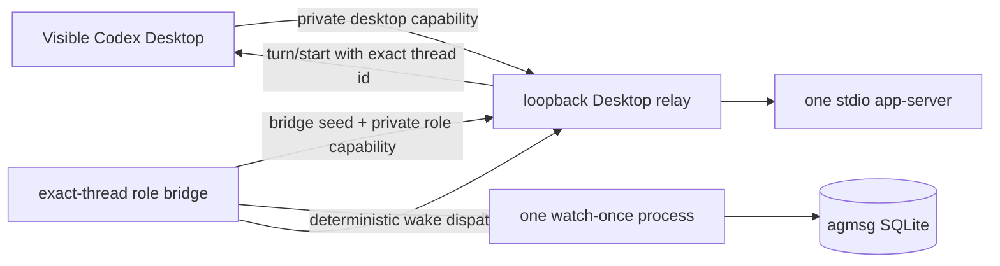

# Codex Monitor Beta

Codex does not expose Claude Code's Monitor tool.
agmsg therefore uses one authenticated loopback relay to let Codex Desktop and a role bridge share the same app-server.
An inbound wake starts a turn only in the exact visible Codex task selected by `actas`.

> **Experimental beta.** Monitor is active only while the Desktop relay and the exact-thread role bridge both report `ready`.
> If Desktop, the relay, or the bridge is unavailable, the requested mode remains `monitor`, the current task uses the visible turn fallback, and mail remains unread.

## Enable

```bash
~/.agents/skills/agmsg/scripts/delivery.sh set monitor codex "$PWD"
```

Then run `agmsg actas <role>` in the Codex task that should receive the role's messages.
The task must provide an exact `CODEX_THREAD_ID`; agmsg never guesses it from rollout files, a loaded-task list, or a newly created thread.

On macOS, enabling monitor mode installs the per-user Desktop relay LaunchAgent.
Restart Codex Desktop once so it inherits the relay endpoint.
Until Desktop reconnects, `actas-monitor.sh` reports a visible-turn fallback instead of claiming that monitoring is active.
Enabling this relay also disarms any lease state left by the earlier heartbeat/watchdog design, so both delivery paths cannot remain active for the same project.

The Codex sandbox must allow writes to the installed skill's runtime state:

```text
~/.agents/skills/<cmd>/db
~/.agents/skills/<cmd>/teams
~/.agents/skills/<cmd>/run
```

## Architecture



The relay listens only on `127.0.0.1`.
Desktop uses one private capability, while bridges require both a shared bridge seed and a random per-role capability.
The Desktop capability, bridge seed, role binding, and role endpoint are regular non-symlink `0600` files.
Capabilities are not written to plists, logs, health files, status output, or public bridge metadata.

The role binding fixes the canonical project, type, team, role, exact thread id, and role state key before the relay accepts a bridge connection.
Possession of the shared bridge seed alone cannot open a role connection.
Only one bridge may use a role binding at a time.

The bridge is scoped by that binding.
It may call only the relay methods needed to resume that thread, dispatch a deterministic wake, and manage its owned `watch-once.sh` process.
The relay rejects bridge attempts to create a thread, address another thread, override project roots or history, spawn another command, or kill another client's process.
Approval and other server requests are routed only to the visible Desktop client.

## Exact-task lease

An explicit `actas` stores the project, type, team, role, and exact thread id in a global `(team, role)` Codex seat.
It also claims the same atomic role-lock namespace used by generic `actas`, so a Claude and a Codex task cannot concurrently own the same inbox role.
SessionStart restores the role only when the current exact thread id equals the stored id.
A different or new Codex task cannot take the role implicitly and must run `actas` explicitly.
If another task still holds the role, that explicit claim is rejected until the original task ends or the role is dropped/reset.

SessionEnd, `drop`/`reset`, `mode turn`, and `mode off` stop the matching role bridge and release its lease.
Cleanup derives the launchd label from the project and role, so it still removes a job when a crash has already deleted `.meta` or `.pid`.
Project mode changes do not stop the global relay; uninstall or an explicit `codex-desktop-relayctl.sh disable` does.

## Unread and acknowledgement boundary

The bridge observes only unread count and `max_id` through `watch-once.sh`.
It does not read message bodies and never updates `read_at`.
The Codex Stop hook is also peek-only.

Only the official command below, run inside the visible task, acknowledges Codex mail:

```bash
~/.agents/skills/<cmd>/scripts/inbox.sh <team> <role>
```

The bridge starts a turn that instructs the visible task to run that command, handle the message, show progress and results in the same task, and send any reply through `send.sh`.

Each role and exact thread has a private `0600` wake-state file.
The bridge records `observed`, `accepted`, and `ack_confirmed` phases with an atomic rename and a file `fsync`.
The wake's `clientUserMessageId` is a deterministic SHA-256 marker derived from the role state key, exact thread, and unread `max_id`; it contains none of those raw values.

The relay keeps a separate private, directory-synced dispatch record.
It writes `dispatching` before `turn/start` and `accepted` after app-server accepts the turn.
After a relay or Desktop restart, an existing dispatch record permits history reconciliation only; it never permits a blind second `turn/start`.

Before the relay calls `turn/start`, it reads the exact thread history and checks that marker.
If the first response was lost after app-server accepted the turn, a retry returns only `reconciled`; it never exposes thread history to the bridge and never starts a second turn.

| Condition | Health/status | Automatic action | Unread handling |
| --- | --- | --- | --- |
| New `max_id` | `ready` → `observed` internally | Dispatch once with the deterministic marker | Remains unread |
| Dispatch response or history check is unavailable | `paused_ambiguous_wake` | Retry reconciliation with capped exponential delay and the same marker | Remains unread; no blind resend |
| The same accepted `max_id` is still unread | `waiting_for_ack` | Re-arm after a bounded delay without another dispatch | Remains unread |
| `watch-once.sh` reports no unread mail | `ready`; state becomes `ack_confirmed` | Continue watching | The visible task already acknowledged it through `inbox.sh` |
| Watcher fails below the configured limit | `waiting_watch_retry` | Retry with capped exponential delay | Remains unread |
| Watcher repeatedly fails | `paused_watch_failure` | Keep the bridge alive and continue bounded retries | Remains unread |
| app-server or relay connection is lost | `retrying_transient` | Reconnect in-process with capped exponential delay | Remains unread |
| Exact `thread/resume` is invalid | `terminal_thread_error` | Exit successfully and retain a tombstone | Remains unread |

`paused_ambiguous_wake` is a fail-closed transient state, not permission to resend.
The bridge stays attached and retries only the history reconciliation path.
It does not wait for another SessionStart or explicit `actas` to recover.

The role and relay LaunchAgents use `KeepAlive.SuccessfulExit=false`.
Unexpected crashes are restarted, while terminal thread errors and permanent configuration failures exit successfully so launchd does not loop.
The relay runner owns capped app-server retry backoff and passes its pid to the relay; if the runner disappears, the relay exits nonzero and reaps its app-server process group before launchd restarts the pair.

## Fallback behavior

Fallback is per task and does not rewrite the project's requested mode from `monitor` to `turn`.
This matters during the initial Desktop restart: a pre-restart fallback must be able to attach automatically on the next SessionStart of the same task.

Fallback writes a project/role-scoped visible status record and leaves unread rows untouched.
It never invokes `codex exec resume`, starts a hidden Codex session, creates a new app-server thread, scans rollout files, or schedules polling.

## Status and shutdown

```bash
~/.agents/skills/agmsg/scripts/delivery.sh status codex "$PWD"
~/.agents/skills/agmsg/scripts/delivery.sh set turn codex "$PWD"
~/.agents/skills/agmsg/scripts/delivery.sh set off codex "$PWD"
~/.agents/skills/agmsg/scripts/drivers/types/codex/codex-desktop-relayctl.sh status
~/.agents/skills/agmsg/scripts/drivers/types/codex/codex-desktop-relayctl.sh disable
```

A healthy monitor requires all of the following:

- relay health is `ready`;
- a visible Desktop client is connected and initialized;
- the role bridge process and its owned metadata are live;
- bridge health is `ready` for the stored exact thread;
- the role's private endpoint matches the relay's current private endpoint.

`mode turn` and `mode off` stop only bridges owned by the selected project.
Another project's bridge and the shared relay remain running.

## Prohibited worker shape

Do not combine `watch-once.sh` with cron, heartbeat, scheduled automation, or `codex exec resume`.
That pattern creates heavyweight Codex sessions even when no useful work is visible, can consume mail outside the user's task, and previously caused runaway task and log-database growth.

`watch-once.sh` is only a shell gate used by the exact visible bridge:

```text
exit 0  unread inbound exists (status=pending count=<n> max_id=<id>)
exit 2  nothing pending
exit 1  configuration or runtime error
```

## Related files

- [Desktop relay](../scripts/drivers/types/codex/codex-desktop-relay.js)
- [Relay controller](../scripts/drivers/types/codex/codex-desktop-relayctl.sh)
- [Role bridge](../scripts/drivers/types/codex/codex-bridge.js)
- [Role binding](../scripts/drivers/types/codex/actas-monitor.sh)
